# Entity Relationship Diagrams

> Exported: 2026-02-23T18:55:42.560Z

## Diagram 1

```mermaid
erDiagram
    Account }o--o{ Account : "MasterRecordId"
    Account }o--o{ Account : "ParentId"
    User }o--o{ Account : "OwnerId"
    User }o--o{ Account : "CreatedById"
    User }o--o{ Account : "LastModifiedById"
    Contact }o--o{ Account : "PersonContactId"
    User }o--o{ APXT_CongaSign__CongaSign_Settings__c : "SetupOwnerId"
    User }o--o{ APXT_CongaSign__CongaSign_Settings__c : "CreatedById"
    User }o--o{ APXT_CongaSign__CongaSign_Settings__c : "LastModifiedById"
    Group }o--o{ APXT_CongaSign__Document__c : "OwnerId"
    User }o--o{ APXT_CongaSign__Document__c : "OwnerId"
    User }o--o{ APXT_CongaSign__Document__c : "CreatedById"
    User }o--o{ APXT_CongaSign__Document__c : "LastModifiedById"
    APXT_CongaSign__Transaction__c }o--o{ APXT_CongaSign__Document__c : "APXT_CongaSign__Transaction__c"
    User }o--o{ APXT_CongaSign__Recipient__c : "CreatedById"
    User }o--o{ APXT_CongaSign__Recipient__c : "LastModifiedById"
    APXT_CongaSign__Transaction__c ||--o{ APXT_CongaSign__Recipient__c : "APXT_CongaSign__Transaction__c"
    Group }o--o{ APXT_CongaSign__Transaction__c : "OwnerId"
    User }o--o{ APXT_CongaSign__Transaction__c : "OwnerId"
    User }o--o{ APXT_CongaSign__Transaction__c : "CreatedById"
    User }o--o{ APXT_CongaSign__Transaction__c : "LastModifiedById"
    Contact }o--o{ APXT_CongaSign__Transaction__c : "Parent_003__c"
    Opportunity }o--o{ APXT_CongaSign__Transaction__c : "Parent_006__c"
    Order }o--o{ APXT_CongaSign__Transaction__c : "Parent_801__c"
    Lead }o--o{ APXT_CongaSign__Transaction__c : "Parent_00Q__c"
    Account }o--o{ APXT_CongaSign__Transaction__c : "Parent_001__c"
    Quote }o--o{ APXT_CongaSign__Transaction__c : "Parent_0Q0__c"
    bpmpro3__Sales_Document__c }o--o{ APXT_CongaSign__Transaction__c : "Parent_a1Z__c"
    Group }o--o{ APXTConga4__Composer_Host_Override__c : "OwnerId"
    User }o--o{ APXTConga4__Composer_Host_Override__c : "OwnerId"
    User }o--o{ APXTConga4__Composer_Host_Override__c : "CreatedById"
    User }o--o{ APXTConga4__Composer_Host_Override__c : "LastModifiedById"
    Group }o--o{ APXTConga4__Composer_QuickMerge__c : "OwnerId"
    User }o--o{ APXTConga4__Composer_QuickMerge__c : "OwnerId"
    User }o--o{ APXTConga4__Composer_QuickMerge__c : "CreatedById"
    User }o--o{ APXTConga4__Composer_QuickMerge__c : "LastModifiedById"
    APXTConga4__Conga_Solution__c }o--o{ APXTConga4__Composer_QuickMerge__c : "APXTConga4__Conga_Solution__c"
    APXTConga4__Connected_App_Setting__mdt }o--o{ APXTConga4__Composer_Setting__mdt : "APXTConga4__Connected_App_Setting__c"
    Group }o--o{ APXTConga4__Conga_Collection__c : "OwnerId"
    User }o--o{ APXTConga4__Conga_Collection__c : "OwnerId"
    User }o--o{ APXTConga4__Conga_Collection__c : "CreatedById"
    User }o--o{ APXTConga4__Conga_Collection__c : "LastModifiedById"
    User }o--o{ APXTConga4__Conga_Collection_Solution__c : "CreatedById"
    User }o--o{ APXTConga4__Conga_Collection_Solution__c : "LastModifiedById"
    APXTConga4__Conga_Collection__c ||--o{ APXTConga4__Conga_Collection_Solution__c : "APXTConga4__Conga_Collection__c"
    APXTConga4__Conga_Solution__c }o--o{ APXTConga4__Conga_Collection_Solution__c : "APXTConga4__Conga_Solution__c"
    User }o--o{ APXTConga4__Conga_Composer_Settings__c : "SetupOwnerId"
    User }o--o{ APXTConga4__Conga_Composer_Settings__c : "CreatedById"
    User }o--o{ APXTConga4__Conga_Composer_Settings__c : "LastModifiedById"
    Group }o--o{ APXTConga4__Conga_Email_Staging__c : "OwnerId"
    User }o--o{ APXTConga4__Conga_Email_Staging__c : "OwnerId"
    User }o--o{ APXTConga4__Conga_Email_Staging__c : "CreatedById"
    User }o--o{ APXTConga4__Conga_Email_Staging__c : "LastModifiedById"
    Group }o--o{ APXTConga4__Conga_Email_Template__c : "OwnerId"
    User }o--o{ APXTConga4__Conga_Email_Template__c : "OwnerId"
    User }o--o{ APXTConga4__Conga_Email_Template__c : "CreatedById"
    User }o--o{ APXTConga4__Conga_Email_Template__c : "LastModifiedById"
    Group }o--o{ APXTConga4__Conga_Merge_Query__c : "OwnerId"
    User }o--o{ APXTConga4__Conga_Merge_Query__c : "OwnerId"
    User }o--o{ APXTConga4__Conga_Merge_Query__c : "CreatedById"
    User }o--o{ APXTConga4__Conga_Merge_Query__c : "LastModifiedById"
    Group }o--o{ APXTConga4__Conga_Solution__c : "OwnerId"
    User }o--o{ APXTConga4__Conga_Solution__c : "OwnerId"
    User }o--o{ APXTConga4__Conga_Solution__c : "CreatedById"
    User }o--o{ APXTConga4__Conga_Solution__c : "LastModifiedById"

    Account {
        boolean IsDeleted
        uuid MasterRecordId
        varchar_255_ Name
        varchar_80_ LastName
        varchar_40_ FirstName
        text Salutation
        varchar_40_ MiddleName
        varchar_40_ Suffix
    }
    APXT_CongaSign__CongaSign_Settings__c {
        boolean IsDeleted
        varchar_38_ Name
        uuid SetupOwnerId
        timestamptz CreatedDate
        uuid CreatedById
        timestamptz LastModifiedDate
        uuid LastModifiedById
        varchar_255_ APXT_CongaSign__Value__c
    }
    APXT_CongaSign__Document__c {
        uuid OwnerId
        boolean IsDeleted
        varchar_80_ Name
        timestamptz CreatedDate
        uuid CreatedById
        timestamptz LastModifiedDate
        uuid LastModifiedById
        varchar_18_ APXT_CongaSign__ContentDocumentId__c
    }
    APXT_CongaSign__Recipient__c {
        boolean IsDeleted
        varchar_80_ Name
        timestamptz CreatedDate
        uuid CreatedById
        timestamptz LastModifiedDate
        uuid LastModifiedById
        timestamptz LastViewedDate
        timestamptz LastReferencedDate
    }
    APXT_CongaSign__Transaction__c {
        uuid OwnerId
        boolean IsDeleted
        varchar_80_ Name
        timestamptz CreatedDate
        uuid CreatedById
        timestamptz LastModifiedDate
        uuid LastModifiedById
        timestamptz LastViewedDate
    }
    APXTConga4__Composer_Host_Override__c {
        uuid OwnerId
        boolean IsDeleted
        varchar_80_ Name
        timestamptz CreatedDate
        uuid CreatedById
        timestamptz LastModifiedDate
        uuid LastModifiedById
        varchar_255_ APXTConga4__Hostname__c
    }
    APXTConga4__Composer_QuickMerge__c {
        uuid OwnerId
        boolean IsDeleted
        varchar_80_ Name
        timestamptz CreatedDate
        uuid CreatedById
        timestamptz LastModifiedDate
        uuid LastModifiedById
        date LastActivityDate
    }
    APXTConga4__Composer_Setting__mdt {
        varchar_40_ DeveloperName
        varchar_40_ MasterLabel
        text Language
        varchar_15_ NamespacePrefix
        varchar_40_ Label
        varchar_70_ QualifiedApiName
        uuid APXTConga4__Connected_App_Setting__c
        boolean APXTConga4__Enable_Key_Generation__c
    }
    APXTConga4__Conga_Collection__c {
        uuid OwnerId
        boolean IsDeleted
        varchar_80_ Name
        timestamptz CreatedDate
        uuid CreatedById
        timestamptz LastModifiedDate
        uuid LastModifiedById
        text APXTConga4__Description__c
    }
    APXTConga4__Conga_Collection_Solution__c {
        boolean IsDeleted
        varchar_80_ Name
        timestamptz CreatedDate
        uuid CreatedById
        timestamptz LastModifiedDate
        uuid LastModifiedById
        uuid APXTConga4__Conga_Collection__c
        uuid APXTConga4__Conga_Solution__c
    }
    APXTConga4__Conga_Composer_Settings__c {
        boolean IsDeleted
        varchar_38_ Name
        uuid SetupOwnerId
        timestamptz CreatedDate
        uuid CreatedById
        timestamptz LastModifiedDate
        uuid LastModifiedById
        text APXTConga4__Comments__c
    }
    APXTConga4__Conga_Email_Staging__c {
        uuid OwnerId
        boolean IsDeleted
        varchar_80_ Name
        timestamptz CreatedDate
        uuid CreatedById
        timestamptz LastModifiedDate
        uuid LastModifiedById
        date LastActivityDate
    }
    APXTConga4__Conga_Email_Template__c {
        uuid OwnerId
        boolean IsDeleted
        varchar_80_ Name
        timestamptz CreatedDate
        uuid CreatedById
        timestamptz LastModifiedDate
        uuid LastModifiedById
        date LastActivityDate
    }
    APXTConga4__Conga_Merge_Query__c {
        uuid OwnerId
        boolean IsDeleted
        varchar_80_ Name
        timestamptz CreatedDate
        uuid CreatedById
        timestamptz LastModifiedDate
        uuid LastModifiedById
        timestamptz LastViewedDate
    }
    APXTConga4__Conga_Solution__c {
        uuid OwnerId
        boolean IsDeleted
        varchar_80_ Name
        timestamptz CreatedDate
        uuid CreatedById
        timestamptz LastModifiedDate
        uuid LastModifiedById
        timestamptz LastViewedDate
    }
```



## Diagram 2

```mermaid
erDiagram
    User }o--o{ APXTConga4__Conga_Solution_Email_Template__c : "CreatedById"
    User }o--o{ APXTConga4__Conga_Solution_Email_Template__c : "LastModifiedById"
    APXTConga4__Conga_Solution__c ||--o{ APXTConga4__Conga_Solution_Email_Template__c : "APXTConga4__Conga_Solution__c"
    APXTConga4__Conga_Email_Template__c }o--o{ APXTConga4__Conga_Solution_Email_Template__c : "APXTConga4__Conga_Email_Template__c"
    APXTConga4__Conga_Solution_Export_Environment__mdt }o--o{ APXTConga4__Conga_Solution_Export_Setting__mdt : "APXTConga4__Conga_Solution_Export_Environment__c"
    User }o--o{ APXTConga4__Conga_Solution_Parameter__c : "CreatedById"
    User }o--o{ APXTConga4__Conga_Solution_Parameter__c : "LastModifiedById"
    APXTConga4__Conga_Solution__c ||--o{ APXTConga4__Conga_Solution_Parameter__c : "APXTConga4__Conga_Solution__c"
    User }o--o{ APXTConga4__Conga_Solution_Query__c : "CreatedById"
    User }o--o{ APXTConga4__Conga_Solution_Query__c : "LastModifiedById"
    APXTConga4__Conga_Solution__c ||--o{ APXTConga4__Conga_Solution_Query__c : "APXTConga4__Conga_Solution__c"
    APXTConga4__Conga_Merge_Query__c }o--o{ APXTConga4__Conga_Solution_Query__c : "APXTConga4__Conga_Query__c"
    User }o--o{ APXTConga4__Conga_Solution_Report__c : "CreatedById"
    User }o--o{ APXTConga4__Conga_Solution_Report__c : "LastModifiedById"
    APXTConga4__Conga_Solution__c ||--o{ APXTConga4__Conga_Solution_Report__c : "APXTConga4__Conga_Solution__c"
    User }o--o{ APXTConga4__Conga_Solution_Template__c : "CreatedById"
    User }o--o{ APXTConga4__Conga_Solution_Template__c : "LastModifiedById"
    APXTConga4__Conga_Solution__c ||--o{ APXTConga4__Conga_Solution_Template__c : "APXTConga4__Conga_Solution__c"
    APXTConga4__Conga_Template__c }o--o{ APXTConga4__Conga_Solution_Template__c : "APXTConga4__Conga_Template__c"
    User }o--o{ APXTConga4__Conga_Solutions_Settings__c : "SetupOwnerId"
    User }o--o{ APXTConga4__Conga_Solutions_Settings__c : "CreatedById"
    User }o--o{ APXTConga4__Conga_Solutions_Settings__c : "LastModifiedById"
    Group }o--o{ APXTConga4__Conga_Template__c : "OwnerId"
    User }o--o{ APXTConga4__Conga_Template__c : "OwnerId"
    User }o--o{ APXTConga4__Conga_Template__c : "CreatedById"
    User }o--o{ APXTConga4__Conga_Template__c : "LastModifiedById"
    Group }o--o{ APXTConga4__Document_History__c : "OwnerId"
    User }o--o{ APXTConga4__Document_History__c : "OwnerId"
    User }o--o{ APXTConga4__Document_History__c : "CreatedById"
    User }o--o{ APXTConga4__Document_History__c : "LastModifiedById"
    APXTConga4__Conga_Solution__c }o--o{ APXTConga4__Document_History__c : "APXTConga4__Conga_Solution__c"
    User }o--o{ APXTConga4__Document_History_Detail__c : "CreatedById"
    User }o--o{ APXTConga4__Document_History_Detail__c : "LastModifiedById"
    APXTConga4__Document_History__c ||--o{ APXTConga4__Document_History_Detail__c : "APXTConga4__Document_History__c"
    Group }o--o{ APXTConga4__EventData__c : "OwnerId"
    User }o--o{ APXTConga4__EventData__c : "OwnerId"
    User }o--o{ APXTConga4__EventData__c : "CreatedById"
    User }o--o{ APXTConga4__EventData__c : "LastModifiedById"
    Group }o--o{ APXTConga4__VersionedData__c : "OwnerId"
    User }o--o{ APXTConga4__VersionedData__c : "OwnerId"
    User }o--o{ APXTConga4__VersionedData__c : "CreatedById"
    User }o--o{ APXTConga4__VersionedData__c : "LastModifiedById"
    Contact }o--o{ Asset : "ContactId"
    Account }o--o{ Asset : "AccountId"
    Asset }o--o{ Asset : "ParentId"
    Asset }o--o{ Asset : "RootAssetId"
    Product2 }o--o{ Asset : "Product2Id"
    User }o--o{ Asset : "CreatedById"
    User }o--o{ Asset : "LastModifiedById"
    User }o--o{ Asset : "OwnerId"
    Account }o--o{ Asset : "AssetProvidedById"
    Account }o--o{ Asset : "AssetServicedById"

    APXTConga4__Conga_Solution_Email_Template__c {
        boolean IsDeleted
        varchar_80_ Name
        timestamptz CreatedDate
        uuid CreatedById
        timestamptz LastModifiedDate
        uuid LastModifiedById
        uuid APXTConga4__Conga_Solution__c
        text APXTConga4__Comments__c
    }
    APXTConga4__Conga_Solution_Export_Environment__mdt {
        varchar_40_ DeveloperName
        varchar_40_ MasterLabel
        text Language
        varchar_15_ NamespacePrefix
        varchar_40_ Label
        varchar_70_ QualifiedApiName
        varchar_255_ APXTConga4__Export_Endpoint__c
    }
    APXTConga4__Conga_Solution_Export_Setting__mdt {
        varchar_40_ DeveloperName
        varchar_40_ MasterLabel
        text Language
        varchar_15_ NamespacePrefix
        varchar_40_ Label
        varchar_70_ QualifiedApiName
        uuid APXTConga4__Conga_Solution_Export_Environment__c
    }
    APXTConga4__Conga_Solution_Parameter__c {
        boolean IsDeleted
        varchar_80_ Name
        timestamptz CreatedDate
        uuid CreatedById
        timestamptz LastModifiedDate
        uuid LastModifiedById
        uuid APXTConga4__Conga_Solution__c
        text APXTConga4__Comments__c
    }
    APXTConga4__Conga_Solution_Query__c {
        boolean IsDeleted
        varchar_80_ Name
        timestamptz CreatedDate
        uuid CreatedById
        timestamptz LastModifiedDate
        uuid LastModifiedById
        uuid APXTConga4__Conga_Solution__c
        varchar_20_ APXTConga4__Alias__c
    }
    APXTConga4__Conga_Solution_Report__c {
        boolean IsDeleted
        varchar_80_ Name
        timestamptz CreatedDate
        uuid CreatedById
        timestamptz LastModifiedDate
        uuid LastModifiedById
        uuid APXTConga4__Conga_Solution__c
        varchar_20_ APXTConga4__Alias__c
    }
    APXTConga4__Conga_Solution_Template__c {
        boolean IsDeleted
        varchar_80_ Name
        timestamptz CreatedDate
        uuid CreatedById
        timestamptz LastModifiedDate
        uuid LastModifiedById
        uuid APXTConga4__Conga_Solution__c
        text APXTConga4__Comments__c
    }
    APXTConga4__Conga_Solutions_Settings__c {
        boolean IsDeleted
        varchar_38_ Name
        uuid SetupOwnerId
        timestamptz CreatedDate
        uuid CreatedById
        timestamptz LastModifiedDate
        uuid LastModifiedById
        boolean APXTConga4__Enable_Button_To_Solution__c
    }
    APXTConga4__Conga_Template__c {
        uuid OwnerId
        boolean IsDeleted
        varchar_80_ Name
        timestamptz CreatedDate
        uuid CreatedById
        timestamptz LastModifiedDate
        uuid LastModifiedById
        timestamptz LastViewedDate
    }
    APXTConga4__Connected_App_Setting__mdt {
        varchar_40_ DeveloperName
        varchar_40_ MasterLabel
        text Language
        varchar_15_ NamespacePrefix
        varchar_40_ Label
        varchar_70_ QualifiedApiName
        varchar_50_ APXTConga4__Connected_App_Name_SF1__c
        varchar_50_ APXTConga4__Connected_App_Name__c
    }
    APXTConga4__Document_History__c {
        uuid OwnerId
        boolean IsDeleted
        varchar_80_ Name
        timestamptz CreatedDate
        uuid CreatedById
        timestamptz LastModifiedDate
        uuid LastModifiedById
        timestamptz LastViewedDate
    }
    APXTConga4__Document_History_Detail__c {
        boolean IsDeleted
        varchar_80_ Name
        timestamptz CreatedDate
        uuid CreatedById
        timestamptz LastModifiedDate
        uuid LastModifiedById
        uuid APXTConga4__Document_History__c
        text APXTConga4__Document_Status__c
    }
    APXTConga4__EventData__c {
        uuid OwnerId
        boolean IsDeleted
        varchar_80_ Name
        timestamptz CreatedDate
        uuid CreatedById
        timestamptz LastModifiedDate
        uuid LastModifiedById
        varchar_255_ APXTConga4__Kind__c
    }
    APXTConga4__VersionedData__c {
        uuid OwnerId
        boolean IsDeleted
        varchar_80_ Name
        timestamptz CreatedDate
        uuid CreatedById
        timestamptz LastModifiedDate
        uuid LastModifiedById
        varchar_255_ APXTConga4__Key__c
    }
    Asset {
        uuid ContactId
        uuid AccountId
        uuid ParentId
        uuid RootAssetId
        uuid Product2Id
        varchar_255_ ProductCode
        boolean IsCompetitorProduct
        timestamptz CreatedDate
    }
```



## Diagram 3

```mermaid
erDiagram
    APXTConga4__Composer_Host_Override__c }o--o{ Attachment : "ParentId"
    APXTConga4__Composer_QuickMerge__c }o--o{ Attachment : "ParentId"
    APXTConga4__Conga_Collection_Solution__c }o--o{ Attachment : "ParentId"
    APXTConga4__Conga_Collection__c }o--o{ Attachment : "ParentId"
    APXTConga4__Conga_Email_Staging__c }o--o{ Attachment : "ParentId"
    APXTConga4__Conga_Email_Template__c }o--o{ Attachment : "ParentId"
    APXTConga4__Conga_Merge_Query__c }o--o{ Attachment : "ParentId"
    APXTConga4__Conga_Solution_Email_Template__c }o--o{ Attachment : "ParentId"
    APXTConga4__Conga_Solution_Parameter__c }o--o{ Attachment : "ParentId"
    APXTConga4__Conga_Solution_Query__c }o--o{ Attachment : "ParentId"
    APXTConga4__Conga_Solution_Report__c }o--o{ Attachment : "ParentId"
    APXTConga4__Conga_Solution_Template__c }o--o{ Attachment : "ParentId"
    APXTConga4__Conga_Solution__c }o--o{ Attachment : "ParentId"
    APXTConga4__Conga_Template__c }o--o{ Attachment : "ParentId"
    APXTConga4__Document_History_Detail__c }o--o{ Attachment : "ParentId"
    APXTConga4__Document_History__c }o--o{ Attachment : "ParentId"
    APXTConga4__EventData__c }o--o{ Attachment : "ParentId"
    APXTConga4__VersionedData__c }o--o{ Attachment : "ParentId"
    APXT_CongaSign__Document__c }o--o{ Attachment : "ParentId"
    APXT_CongaSign__Recipient__c }o--o{ Attachment : "ParentId"
    APXT_CongaSign__Transaction__c }o--o{ Attachment : "ParentId"
    Account }o--o{ Attachment : "ParentId"
    Asset }o--o{ Attachment : "ParentId"
    BirdeyeCheckin__Automation_Failed_Record__c }o--o{ Attachment : "ParentId"
    BirdeyeCheckin__Automation__c }o--o{ Attachment : "ParentId"
    BirdeyeCheckin__Connector__c }o--o{ Attachment : "ParentId"
    Campaign }o--o{ Attachment : "ParentId"
    Case }o--o{ Attachment : "ParentId"
    Contact }o--o{ Attachment : "ParentId"
    Contract }o--o{ Attachment : "ParentId"
    Event }o--o{ Attachment : "ParentId"
    Lead }o--o{ Attachment : "ParentId"
    Opportunity }o--o{ Attachment : "ParentId"
    Order }o--o{ Attachment : "ParentId"
    Product2 }o--o{ Attachment : "ParentId"
    Quote }o--o{ Attachment : "ParentId"
    Solution }o--o{ Attachment : "ParentId"
    Task }o--o{ Attachment : "ParentId"
    bpmpro3__A2_Labor_Only_Item__c }o--o{ Attachment : "ParentId"
    bpmpro3__A3_LaborItems__c }o--o{ Attachment : "ParentId"
    bpmpro3__AddOn_Product__c }o--o{ Attachment : "ParentId"
    bpmpro3__Add_On_CPI__c }o--o{ Attachment : "ParentId"
    bpmpro3__Back_Charge__c }o--o{ Attachment : "ParentId"
    bpmpro3__Building_Material__c }o--o{ Attachment : "ParentId"
    bpmpro3__Building_Permit_c__c }o--o{ Attachment : "ParentId"
    bpmpro3__CPI_AddOn_Product_Catalog__c }o--o{ Attachment : "ParentId"
    bpmpro3__CPI_Configure_Pricing_Items__c }o--o{ Attachment : "ParentId"
    bpmpro3__CPI_Preset_Product_Add_On__c }o--o{ Attachment : "ParentId"
    bpmpro3__Company_Settings__c }o--o{ Attachment : "ParentId"
    bpmpro3__Contact_CSV_Import__c }o--o{ Attachment : "ParentId"
    bpmpro3__Deal_Sheet__c }o--o{ Attachment : "ParentId"
    bpmpro3__Dealer_Item__c }o--o{ Attachment : "ParentId"
    bpmpro3__Inspections__c }o--o{ Attachment : "ParentId"
    bpmpro3__Invoice_Payment__c }o--o{ Attachment : "ParentId"
    bpmpro3__LaborItem_AddOn_Junction__c }o--o{ Attachment : "ParentId"
    bpmpro3__Labor_Charge__c }o--o{ Attachment : "ParentId"
    bpmpro3__Labor_Ticket__c }o--o{ Attachment : "ParentId"
    bpmpro3__Material__c }o--o{ Attachment : "ParentId"
    bpmpro3__Orders__c }o--o{ Attachment : "ParentId"
    bpmpro3__PP_Preset_Product__c }o--o{ Attachment : "ParentId"
    bpmpro3__PaymentBPM__c }o--o{ Attachment : "ParentId"
    bpmpro3__Permit_Fee__c }o--o{ Attachment : "ParentId"
    bpmpro3__ProductItem__c }o--o{ Attachment : "ParentId"
    bpmpro3__Project_Contact_Role__c }o--o{ Attachment : "ParentId"
    bpmpro3__Project_Invoice__c }o--o{ Attachment : "ParentId"
    bpmpro3__Project_Stage_Assignment_Team_Member__c }o--o{ Attachment : "ParentId"
    bpmpro3__Project_Stage_Assignment__c }o--o{ Attachment : "ParentId"
    bpmpro3__Project_Stage_Team_Member__c }o--o{ Attachment : "ParentId"
    bpmpro3__Project_Stage__c }o--o{ Attachment : "ParentId"
    bpmpro3__Project__c }o--o{ Attachment : "ParentId"
    bpmpro3__Property__c }o--o{ Attachment : "ParentId"
    bpmpro3__Prospect__c }o--o{ Attachment : "ParentId"
    bpmpro3__Reimbursement__c }o--o{ Attachment : "ParentId"
    bpmpro3__SalesDoc_Clauses__c }o--o{ Attachment : "ParentId"
    bpmpro3__SalesDoc_Credit_Memo__c }o--o{ Attachment : "ParentId"
    bpmpro3__SalesDoc_Invoice__c }o--o{ Attachment : "ParentId"
    bpmpro3__Sales_Commission_Payout__c }o--o{ Attachment : "ParentId"
    bpmpro3__Sales_Commission_Table__c }o--o{ Attachment : "ParentId"
    bpmpro3__Sales_Commission__c }o--o{ Attachment : "ParentId"
    bpmpro3__Sales_Document__c }o--o{ Attachment : "ParentId"
    bpmpro3__Service_Ticket__c }o--o{ Attachment : "ParentId"
    bpmpro3__SpecialtyItem__c }o--o{ Attachment : "ParentId"
    bpmpro3__Time_Entry__c }o--o{ Attachment : "ParentId"
    bpmpro3__Timesheet__c }o--o{ Attachment : "ParentId"
    bpmpro3__Warehouse_Log__c }o--o{ Attachment : "ParentId"
    bpmpro3__Work_Assignment__c }o--o{ Attachment : "ParentId"
    dfsle__AgreementConfiguration__c }o--o{ Attachment : "ParentId"
    dfsle__BulkList__c }o--o{ Attachment : "ParentId"
    dfsle__BulkStatus__c }o--o{ Attachment : "ParentId"
    dfsle__CustomParameterMap__c }o--o{ Attachment : "ParentId"
    dfsle__CustomRecipient__c }o--o{ Attachment : "ParentId"
    dfsle__Document__c }o--o{ Attachment : "ParentId"
    dfsle__EnvelopeConfigurationDocument__c }o--o{ Attachment : "ParentId"
    dfsle__EnvelopeConfigurationRecipient__c }o--o{ Attachment : "ParentId"
    dfsle__EnvelopeConfiguration__c }o--o{ Attachment : "ParentId"
    dfsle__EnvelopeLocalization__c }o--o{ Attachment : "ParentId"
    dfsle__EnvelopeStatus__c }o--o{ Attachment : "ParentId"
    dfsle__Envelope__c }o--o{ Attachment : "ParentId"
    dfsle__GenTemplate__c }o--o{ Attachment : "ParentId"
    dfsle__Jobs__c }o--o{ Attachment : "ParentId"
    dfsle__Log__c }o--o{ Attachment : "ParentId"
    dfsle__RecipientStatus__c }o--o{ Attachment : "ParentId"
    dfsle__Recipient__c }o--o{ Attachment : "ParentId"
    inov8__PMT_Error_Log__c }o--o{ Attachment : "ParentId"
    inov8__PMT_Phase__c }o--o{ Attachment : "ParentId"
    inov8__PMT_Program__c }o--o{ Attachment : "ParentId"
    inov8__PMT_Project__c }o--o{ Attachment : "ParentId"
    inov8__PMT_Resource_Allocation__c }o--o{ Attachment : "ParentId"
    inov8__PMT_Resource_Availability__c }o--o{ Attachment : "ParentId"
    inov8__PMT_Task__c }o--o{ Attachment : "ParentId"
    User }o--o{ Attachment : "OwnerId"
    User }o--o{ Attachment : "CreatedById"
    User }o--o{ Attachment : "LastModifiedById"
    Group }o--o{ BirdeyeCheckin__Automation__c : "OwnerId"
    User }o--o{ BirdeyeCheckin__Automation__c : "OwnerId"
    User }o--o{ BirdeyeCheckin__Automation__c : "CreatedById"
    User }o--o{ BirdeyeCheckin__Automation__c : "LastModifiedById"
    BirdeyeCheckin__Connector__c }o--o{ BirdeyeCheckin__Automation__c : "BirdeyeCheckin__Connector__c"
    Group }o--o{ BirdeyeCheckin__Automation_Failed_Record__c : "OwnerId"
    User }o--o{ BirdeyeCheckin__Automation_Failed_Record__c : "OwnerId"
    User }o--o{ BirdeyeCheckin__Automation_Failed_Record__c : "CreatedById"
    User }o--o{ BirdeyeCheckin__Automation_Failed_Record__c : "LastModifiedById"
    BirdeyeCheckin__Automation__c }o--o{ BirdeyeCheckin__Automation_Failed_Record__c : "BirdeyeCheckin__Automation__c"
    User }o--o{ BirdeyeCheckin__Checkin_Config__c : "SetupOwnerId"
    User }o--o{ BirdeyeCheckin__Checkin_Config__c : "CreatedById"
    User }o--o{ BirdeyeCheckin__Checkin_Config__c : "LastModifiedById"
    Group }o--o{ BirdeyeCheckin__Connector__c : "OwnerId"
    User }o--o{ BirdeyeCheckin__Connector__c : "OwnerId"
    User }o--o{ BirdeyeCheckin__Connector__c : "CreatedById"
    User }o--o{ BirdeyeCheckin__Connector__c : "LastModifiedById"
    User }o--o{ bpmpro3__A2_Labor_Only_Item__c : "CreatedById"
    User }o--o{ bpmpro3__A2_Labor_Only_Item__c : "LastModifiedById"
    bpmpro3__Sales_Document__c ||--o{ bpmpro3__A2_Labor_Only_Item__c : "bpmpro3__SalesDoc_A2__c"
    User }o--o{ bpmpro3__A3_LaborItems__c : "CreatedById"
    User }o--o{ bpmpro3__A3_LaborItems__c : "LastModifiedById"
    bpmpro3__Sales_Document__c ||--o{ bpmpro3__A3_LaborItems__c : "bpmpro3__SalesDoc_A3__c"
    bpmpro3__AddOn_Product__c }o--o{ bpmpro3__A3_LaborItems__c : "bpmpro3__A3_AddOnProductItem_Rel__c"
    bpmpro3__Dealer_Item__c }o--o{ bpmpro3__A3_LaborItems__c : "bpmpro3__A3_DealerItem_Rel__c"
    Account }o--o{ bpmpro3__A3_LaborItems__c : "bpmpro3__A3_Vendor__c"
    Group }o--o{ bpmpro3__Add_On_CPI__c : "OwnerId"
    User }o--o{ bpmpro3__Add_On_CPI__c : "OwnerId"
    User }o--o{ bpmpro3__Add_On_CPI__c : "CreatedById"
    User }o--o{ bpmpro3__Add_On_CPI__c : "LastModifiedById"
    bpmpro3__CPI_Configure_Pricing_Items__c }o--o{ bpmpro3__Add_On_CPI__c : "bpmpro3__AOC_Configure_Pricing_Items__c"
    bpmpro3__CPI_AddOn_Product_Catalog__c }o--o{ bpmpro3__Add_On_CPI__c : "bpmpro3__AOCPI_Add_On_Product__c"
    Group }o--o{ bpmpro3__AddOn_Product__c : "OwnerId"
    User }o--o{ bpmpro3__AddOn_Product__c : "OwnerId"
    User }o--o{ bpmpro3__AddOn_Product__c : "CreatedById"
    User }o--o{ bpmpro3__AddOn_Product__c : "LastModifiedById"
    Account }o--o{ bpmpro3__AddOn_Product__c : "bpmpro3__AOP_Vendor__c"
    User }o--o{ bpmpro3__Back_Charge__c : "CreatedById"
    User }o--o{ bpmpro3__Back_Charge__c : "LastModifiedById"
    bpmpro3__Labor_Ticket__c ||--o{ bpmpro3__Back_Charge__c : "bpmpro3__LaborTicket_BackCharge_Rel__c"
    Group }o--o{ bpmpro3__Building_Material__c : "OwnerId"
    User }o--o{ bpmpro3__Building_Material__c : "OwnerId"
    User }o--o{ bpmpro3__Building_Material__c : "CreatedById"
    User }o--o{ bpmpro3__Building_Material__c : "LastModifiedById"
    User }o--o{ bpmpro3__Building_Permit_c__c : "CreatedById"
    User }o--o{ bpmpro3__Building_Permit_c__c : "LastModifiedById"
    bpmpro3__Project__c ||--o{ bpmpro3__Building_Permit_c__c : "bpmpro3__BP_Project__c"
    Account }o--o{ bpmpro3__Building_Permit_c__c : "bpmpro3__BP_HOA__c"
    Account }o--o{ bpmpro3__Building_Permit_c__c : "bpmpro3__BP_Municipality__c"
    Group }o--o{ bpmpro3__Company_Settings__c : "OwnerId"
    User }o--o{ bpmpro3__Company_Settings__c : "OwnerId"
    User }o--o{ bpmpro3__Company_Settings__c : "CreatedById"
    User }o--o{ bpmpro3__Company_Settings__c : "LastModifiedById"
    Account }o--o{ bpmpro3__Company_Settings__c : "bpmpro3__SOS_Owning_Entity__c"
    Group }o--o{ bpmpro3__Contact_CSV_Import__c : "OwnerId"
    User }o--o{ bpmpro3__Contact_CSV_Import__c : "OwnerId"
    User }o--o{ bpmpro3__Contact_CSV_Import__c : "CreatedById"
    User }o--o{ bpmpro3__Contact_CSV_Import__c : "LastModifiedById"

    Attachment {
        boolean IsDeleted
        uuid ParentId
        varchar_255_ Name
        boolean IsPrivate
        varchar_120_ ContentType
        int4 BodyLength
        bytea Body
        uuid OwnerId
    }
    BirdeyeCheckin__API_Config__mdt {
        varchar_40_ DeveloperName
        varchar_40_ MasterLabel
        text Language
        varchar_15_ NamespacePrefix
        varchar_40_ Label
        varchar_70_ QualifiedApiName
        varchar_255_ BirdeyeCheckin__API_DevURL__c
        text BirdeyeCheckin__API_URL__c
    }
    BirdeyeCheckin__Automation__c {
        uuid OwnerId
        boolean IsDeleted
        varchar_80_ Name
        timestamptz CreatedDate
        uuid CreatedById
        timestamptz LastModifiedDate
        uuid LastModifiedById
        uuid BirdeyeCheckin__Connector__c
    }
    BirdeyeCheckin__Automation_Failed_Record__c {
        uuid OwnerId
        boolean IsDeleted
        varchar_80_ Name
        timestamptz CreatedDate
        uuid CreatedById
        timestamptz LastModifiedDate
        uuid LastModifiedById
        uuid BirdeyeCheckin__Automation__c
    }
    BirdeyeCheckin__Checkin_Config__c {
        boolean IsDeleted
        varchar_38_ Name
        uuid SetupOwnerId
        timestamptz CreatedDate
        uuid CreatedById
        timestamptz LastModifiedDate
        uuid LastModifiedById
        boolean BirdeyeCheckin__AvoidRecursive__c
    }
    BirdeyeCheckin__Connector__c {
        uuid OwnerId
        boolean IsDeleted
        varchar_80_ Name
        timestamptz CreatedDate
        uuid CreatedById
        timestamptz LastModifiedDate
        uuid LastModifiedById
        varchar_255_ BirdeyeCheckin__API_Key__c
    }
    bpmpro3__A2_Labor_Only_Item__c {
        boolean IsDeleted
        varchar_80_ Name
        timestamptz CreatedDate
        uuid CreatedById
        timestamptz LastModifiedDate
        uuid LastModifiedById
        timestamptz LastViewedDate
        timestamptz LastReferencedDate
    }
    bpmpro3__A3_LaborItems__c {
        boolean IsDeleted
        varchar_80_ Name
        timestamptz CreatedDate
        uuid CreatedById
        timestamptz LastModifiedDate
        uuid LastModifiedById
        timestamptz LastViewedDate
        timestamptz LastReferencedDate
    }
    bpmpro3__Add_On_CPI__c {
        uuid OwnerId
        boolean IsDeleted
        varchar_80_ Name
        timestamptz CreatedDate
        uuid CreatedById
        timestamptz LastModifiedDate
        uuid LastModifiedById
        timestamptz LastViewedDate
    }
    bpmpro3__AddOn_Product__c {
        uuid OwnerId
        boolean IsDeleted
        varchar_80_ Name
        timestamptz CreatedDate
        uuid CreatedById
        timestamptz LastModifiedDate
        uuid LastModifiedById
        timestamptz LastViewedDate
    }
    bpmpro3__Back_Charge__c {
        boolean IsDeleted
        varchar_80_ Name
        timestamptz CreatedDate
        uuid CreatedById
        timestamptz LastModifiedDate
        uuid LastModifiedById
        timestamptz LastViewedDate
        timestamptz LastReferencedDate
    }
    bpmpro3__Building_Material__c {
        uuid OwnerId
        boolean IsDeleted
        varchar_80_ Name
        timestamptz CreatedDate
        uuid CreatedById
        timestamptz LastModifiedDate
        uuid LastModifiedById
        timestamptz LastViewedDate
    }
    bpmpro3__Building_Permit_c__c {
        boolean IsDeleted
        varchar_80_ Name
        timestamptz CreatedDate
        uuid CreatedById
        timestamptz LastModifiedDate
        uuid LastModifiedById
        date LastActivityDate
        timestamptz LastViewedDate
    }
    bpmpro3__Company_Settings__c {
        uuid OwnerId
        boolean IsDeleted
        varchar_80_ Name
        timestamptz CreatedDate
        uuid CreatedById
        timestamptz LastModifiedDate
        uuid LastModifiedById
        timestamptz LastViewedDate
    }
    bpmpro3__Contact_CSV_Import__c {
        uuid OwnerId
        boolean IsDeleted
        varchar_80_ Name
        timestamptz CreatedDate
        uuid CreatedById
        timestamptz LastModifiedDate
        uuid LastModifiedById
        date LastActivityDate
    }
```



## Diagram 4

```mermaid
erDiagram
    Group }o--o{ bpmpro3__CPI_AddOn_Product_Catalog__c : "OwnerId"
    User }o--o{ bpmpro3__CPI_AddOn_Product_Catalog__c : "OwnerId"
    User }o--o{ bpmpro3__CPI_AddOn_Product_Catalog__c : "CreatedById"
    User }o--o{ bpmpro3__CPI_AddOn_Product_Catalog__c : "LastModifiedById"
    User }o--o{ bpmpro3__CPI_Configure_Pricing_Items__c : "CreatedById"
    User }o--o{ bpmpro3__CPI_Configure_Pricing_Items__c : "LastModifiedById"
    bpmpro3__Sales_Document__c ||--o{ bpmpro3__CPI_Configure_Pricing_Items__c : "bpmpro3__CPI_Sales_Document__c"
    bpmpro3__PP_Preset_Product__c }o--o{ bpmpro3__CPI_Configure_Pricing_Items__c : "bpmpro3__CPI_Preset_Product__c"
    Group }o--o{ bpmpro3__CPI_Preset_Product_Add_On__c : "OwnerId"
    User }o--o{ bpmpro3__CPI_Preset_Product_Add_On__c : "OwnerId"
    User }o--o{ bpmpro3__CPI_Preset_Product_Add_On__c : "CreatedById"
    User }o--o{ bpmpro3__CPI_Preset_Product_Add_On__c : "LastModifiedById"
    bpmpro3__CPI_AddOn_Product_Catalog__c }o--o{ bpmpro3__CPI_Preset_Product_Add_On__c : "bpmpro3__CPIPPAO_Add_On_Product__c"
    bpmpro3__PP_Preset_Product__c }o--o{ bpmpro3__CPI_Preset_Product_Add_On__c : "bpmpro3__CPIPPAO_Preset_Product__c"
    Group }o--o{ bpmpro3__Deal_Sheet__c : "OwnerId"
    User }o--o{ bpmpro3__Deal_Sheet__c : "OwnerId"
    User }o--o{ bpmpro3__Deal_Sheet__c : "CreatedById"
    User }o--o{ bpmpro3__Deal_Sheet__c : "LastModifiedById"
    bpmpro3__Project_Contact_Role__c }o--o{ bpmpro3__Deal_Sheet__c : "bpmpro3__DS_ProjectContactRole__c"
    bpmpro3__Project__c }o--o{ bpmpro3__Deal_Sheet__c : "bpmpro3__DS_Project__c"
    bpmpro3__Sales_Document__c }o--o{ bpmpro3__Deal_Sheet__c : "bpmpro3__DS_SalesDocument__c"
    Contact }o--o{ bpmpro3__Deal_Sheet__c : "bpmpro3__DS_SalesRep__c"
    Group }o--o{ bpmpro3__Dealer_Item__c : "OwnerId"
    User }o--o{ bpmpro3__Dealer_Item__c : "OwnerId"
    User }o--o{ bpmpro3__Dealer_Item__c : "CreatedById"
    User }o--o{ bpmpro3__Dealer_Item__c : "LastModifiedById"
    bpmpro3__Building_Material__c }o--o{ bpmpro3__Dealer_Item__c : "bpmpro3__DI_Caulking_Selection__c"
    bpmpro3__Building_Material__c }o--o{ bpmpro3__Dealer_Item__c : "bpmpro3__DI_Flashing_Selection__c"
    bpmpro3__Building_Material__c }o--o{ bpmpro3__Dealer_Item__c : "bpmpro3__DI_Product_Screw_Selection__c"
    bpmpro3__Building_Material__c }o--o{ bpmpro3__Dealer_Item__c : "bpmpro3__DI_WB_Screw_Selection__c"
    bpmpro3__Building_Material__c }o--o{ bpmpro3__Dealer_Item__c : "bpmpro3__DI_WB_Selection__c"
    User }o--o{ bpmpro3__Inspections__c : "CreatedById"
    User }o--o{ bpmpro3__Inspections__c : "LastModifiedById"
    bpmpro3__Building_Permit_c__c ||--o{ bpmpro3__Inspections__c : "bpmpro3__Building_Permit__c"
    Contact }o--o{ bpmpro3__Inspections__c : "bpmpro3__IN_Person_Present__c"
    Contact }o--o{ bpmpro3__Inspections__c : "bpmpro3__IN_Scheduled_By__c"
    Group }o--o{ bpmpro3__Invoice_Payment__c : "OwnerId"
    User }o--o{ bpmpro3__Invoice_Payment__c : "OwnerId"
    User }o--o{ bpmpro3__Invoice_Payment__c : "CreatedById"
    User }o--o{ bpmpro3__Invoice_Payment__c : "LastModifiedById"
    bpmpro3__SalesDoc_Invoice__c }o--o{ bpmpro3__Invoice_Payment__c : "bpmpro3__IP_SalesDoc_Invoice__c"
    User }o--o{ bpmpro3__Labor_Charge__c : "CreatedById"
    User }o--o{ bpmpro3__Labor_Charge__c : "LastModifiedById"
    bpmpro3__Labor_Ticket__c ||--o{ bpmpro3__Labor_Charge__c : "bpmpro3__LC_LaborTicketNumber__c"
    bpmpro3__Project__c }o--o{ bpmpro3__Labor_Charge__c : "bpmpro3__Project__c"
    Group }o--o{ bpmpro3__Labor_Ticket__c : "OwnerId"
    User }o--o{ bpmpro3__Labor_Ticket__c : "OwnerId"
    User }o--o{ bpmpro3__Labor_Ticket__c : "CreatedById"
    User }o--o{ bpmpro3__Labor_Ticket__c : "LastModifiedById"
    Account }o--o{ bpmpro3__Labor_Ticket__c : "bpmpro3__LT_Subcontractor_Company__c"
    Group }o--o{ bpmpro3__LaborItem_AddOn_Junction__c : "OwnerId"
    User }o--o{ bpmpro3__LaborItem_AddOn_Junction__c : "OwnerId"
    User }o--o{ bpmpro3__LaborItem_AddOn_Junction__c : "CreatedById"
    User }o--o{ bpmpro3__LaborItem_AddOn_Junction__c : "LastModifiedById"
    bpmpro3__AddOn_Product__c }o--o{ bpmpro3__LaborItem_AddOn_Junction__c : "bpmpro3__AOPS_AddOn_Product__c"
    bpmpro3__A3_LaborItems__c }o--o{ bpmpro3__LaborItem_AddOn_Junction__c : "bpmpro3__AOPS_Product_Labor_Item__c"
    User }o--o{ bpmpro3__Material__c : "CreatedById"
    User }o--o{ bpmpro3__Material__c : "LastModifiedById"
    bpmpro3__Project__c ||--o{ bpmpro3__Material__c : "bpmpro3__Project__c"
    User }o--o{ bpmpro3__Orders__c : "CreatedById"
    User }o--o{ bpmpro3__Orders__c : "LastModifiedById"
    bpmpro3__Project__c ||--o{ bpmpro3__Orders__c : "bpmpro3__PO_Project__c"
    Account }o--o{ bpmpro3__Orders__c : "bpmpro3__PO_Vendor__c"
    User }o--o{ bpmpro3__PaymentBPM__c : "CreatedById"
    User }o--o{ bpmpro3__PaymentBPM__c : "LastModifiedById"
    bpmpro3__Project__c ||--o{ bpmpro3__PaymentBPM__c : "bpmpro3__Project__c"
    User }o--o{ bpmpro3__Permit_Fee__c : "CreatedById"
    User }o--o{ bpmpro3__Permit_Fee__c : "LastModifiedById"
    bpmpro3__Building_Permit_c__c ||--o{ bpmpro3__Permit_Fee__c : "bpmpro3__PF_Building_Permit__c"

    bpmpro3__CPI_AddOn_Product_Catalog__c {
        uuid OwnerId
        boolean IsDeleted
        varchar_80_ Name
        timestamptz CreatedDate
        uuid CreatedById
        timestamptz LastModifiedDate
        uuid LastModifiedById
        date LastActivityDate
    }
    bpmpro3__CPI_Configure_Pricing_Items__c {
        boolean IsDeleted
        varchar_80_ Name
        timestamptz CreatedDate
        uuid CreatedById
        timestamptz LastModifiedDate
        uuid LastModifiedById
        uuid bpmpro3__CPI_Sales_Document__c
        numeric_18_2_ bpmpro3__CPI_AddOnCost_Unit__c
    }
    bpmpro3__CPI_Preset_Product_Add_On__c {
        uuid OwnerId
        boolean IsDeleted
        varchar_80_ Name
        timestamptz CreatedDate
        uuid CreatedById
        timestamptz LastModifiedDate
        uuid LastModifiedById
        uuid bpmpro3__CPIPPAO_Add_On_Product__c
    }
    bpmpro3__Deal_Sheet__c {
        uuid OwnerId
        boolean IsDeleted
        varchar_80_ Name
        timestamptz CreatedDate
        uuid CreatedById
        timestamptz LastModifiedDate
        uuid LastModifiedById
        date LastActivityDate
    }
    bpmpro3__Dealer_Item__c {
        uuid OwnerId
        boolean IsDeleted
        varchar_80_ Name
        timestamptz CreatedDate
        uuid CreatedById
        timestamptz LastModifiedDate
        uuid LastModifiedById
        timestamptz LastViewedDate
    }
    bpmpro3__Inspections__c {
        boolean IsDeleted
        varchar_80_ Name
        timestamptz CreatedDate
        uuid CreatedById
        timestamptz LastModifiedDate
        uuid LastModifiedById
        timestamptz LastViewedDate
        timestamptz LastReferencedDate
    }
    bpmpro3__Invoice_Payment__c {
        uuid OwnerId
        boolean IsDeleted
        varchar_80_ Name
        timestamptz CreatedDate
        uuid CreatedById
        timestamptz LastModifiedDate
        uuid LastModifiedById
        timestamptz LastViewedDate
    }
    bpmpro3__Labor_Charge__c {
        boolean IsDeleted
        varchar_80_ Name
        timestamptz CreatedDate
        uuid CreatedById
        timestamptz LastModifiedDate
        uuid LastModifiedById
        date LastActivityDate
        timestamptz LastViewedDate
    }
    bpmpro3__Labor_Ticket__c {
        uuid OwnerId
        boolean IsDeleted
        varchar_80_ Name
        timestamptz CreatedDate
        uuid CreatedById
        timestamptz LastModifiedDate
        uuid LastModifiedById
        date LastActivityDate
    }
    bpmpro3__LaborItem_AddOn_Junction__c {
        uuid OwnerId
        boolean IsDeleted
        varchar_80_ Name
        timestamptz CreatedDate
        uuid CreatedById
        timestamptz LastModifiedDate
        uuid LastModifiedById
        uuid bpmpro3__AOPS_AddOn_Product__c
    }
    bpmpro3__Material__c {
        boolean IsDeleted
        varchar_80_ Name
        timestamptz CreatedDate
        uuid CreatedById
        timestamptz LastModifiedDate
        uuid LastModifiedById
        date LastActivityDate
        timestamptz LastViewedDate
    }
    bpmpro3__Orders__c {
        boolean IsDeleted
        varchar_80_ Name
        timestamptz CreatedDate
        uuid CreatedById
        timestamptz LastModifiedDate
        uuid LastModifiedById
        date LastActivityDate
        timestamptz LastViewedDate
    }
    bpmpro3__Org_Info__mdt {
        varchar_40_ DeveloperName
        varchar_40_ MasterLabel
        text Language
        varchar_15_ NamespacePrefix
        varchar_40_ Label
        varchar_70_ QualifiedApiName
        varchar_80_ bpmpro3__Org_Abbreviation__c
        varchar_100_ bpmpro3__Org_City__c
    }
    bpmpro3__PaymentBPM__c {
        boolean IsDeleted
        varchar_80_ Name
        timestamptz CreatedDate
        uuid CreatedById
        timestamptz LastModifiedDate
        uuid LastModifiedById
        date LastActivityDate
        timestamptz LastViewedDate
    }
    bpmpro3__Permit_Fee__c {
        boolean IsDeleted
        varchar_80_ Name
        timestamptz CreatedDate
        uuid CreatedById
        timestamptz LastModifiedDate
        uuid LastModifiedById
        timestamptz LastViewedDate
        timestamptz LastReferencedDate
    }
```



## Diagram 5

```mermaid
erDiagram
    Group }o--o{ bpmpro3__PP_Preset_Product__c : "OwnerId"
    User }o--o{ bpmpro3__PP_Preset_Product__c : "OwnerId"
    User }o--o{ bpmpro3__PP_Preset_Product__c : "CreatedById"
    User }o--o{ bpmpro3__PP_Preset_Product__c : "LastModifiedById"
    User }o--o{ bpmpro3__ProductItem__c : "CreatedById"
    User }o--o{ bpmpro3__ProductItem__c : "LastModifiedById"
    bpmpro3__Sales_Document__c ||--o{ bpmpro3__ProductItem__c : "bpmpro3__SalesDoc_A1__c"
    Account }o--o{ bpmpro3__ProductItem__c : "bpmpro3__A1_Vendor__c"
    User }o--o{ bpmpro3__Project__c : "CreatedById"
    User }o--o{ bpmpro3__Project__c : "LastModifiedById"
    Account ||--o{ bpmpro3__Project__c : "bpmpro3__PJ_Account__c"
    Contact }o--o{ bpmpro3__Project__c : "bpmpro3__PJ_Project_Manager__c"
    Contact }o--o{ bpmpro3__Project__c : "bpmpro3__PJ_Sales_Person__c"
    Contact }o--o{ bpmpro3__Project__c : "bpmpro3__Referring_Party__c"
    Group }o--o{ bpmpro3__Project_Contact_Role__c : "OwnerId"
    User }o--o{ bpmpro3__Project_Contact_Role__c : "OwnerId"
    User }o--o{ bpmpro3__Project_Contact_Role__c : "CreatedById"
    User }o--o{ bpmpro3__Project_Contact_Role__c : "LastModifiedById"
    Contact }o--o{ bpmpro3__Project_Contact_Role__c : "bpmpro3__PCR_Contact__c"
    bpmpro3__Project__c }o--o{ bpmpro3__Project_Contact_Role__c : "bpmpro3__PCR_Project__c"
    User }o--o{ bpmpro3__Project_Invoice__c : "CreatedById"
    User }o--o{ bpmpro3__Project_Invoice__c : "LastModifiedById"
    bpmpro3__Project__c ||--o{ bpmpro3__Project_Invoice__c : "bpmpro3__PI_Project__c"
    Group }o--o{ bpmpro3__Project_Stage__c : "OwnerId"
    User }o--o{ bpmpro3__Project_Stage__c : "OwnerId"
    User }o--o{ bpmpro3__Project_Stage__c : "CreatedById"
    User }o--o{ bpmpro3__Project_Stage__c : "LastModifiedById"
    User }o--o{ bpmpro3__Project_Stage_Assignment__c : "CreatedById"
    User }o--o{ bpmpro3__Project_Stage_Assignment__c : "LastModifiedById"
    bpmpro3__Project__c ||--o{ bpmpro3__Project_Stage_Assignment__c : "bpmpro3__PSA_Project__c"
    bpmpro3__Project_Stage__c ||--o{ bpmpro3__Project_Stage_Assignment__c : "bpmpro3__PSA_Project_Stage__c"
    User }o--o{ bpmpro3__Project_Stage_Assignment__c : "bpmpro3__PSA_Assigned_By__c"
    User }o--o{ bpmpro3__Project_Stage_Assignment__c : "bpmpro3__PSA_Assigned_To__c"
    User }o--o{ bpmpro3__Project_Stage_Assignment__c : "bpmpro3__PSA_Completed_By__c"
    Group }o--o{ bpmpro3__Project_Stage_Assignment_Team_Member__c : "OwnerId"
    User }o--o{ bpmpro3__Project_Stage_Assignment_Team_Member__c : "OwnerId"
    User }o--o{ bpmpro3__Project_Stage_Assignment_Team_Member__c : "CreatedById"
    User }o--o{ bpmpro3__Project_Stage_Assignment_Team_Member__c : "LastModifiedById"
    bpmpro3__Project_Stage_Assignment__c }o--o{ bpmpro3__Project_Stage_Assignment_Team_Member__c : "bpmpro3__PSATM_Project_Stage_Assignment__c"
    User }o--o{ bpmpro3__Project_Stage_Assignment_Team_Member__c : "bpmpro3__PSATM_Team_Member__c"
    User }o--o{ bpmpro3__Project_Stage_Team_Member__c : "CreatedById"
    User }o--o{ bpmpro3__Project_Stage_Team_Member__c : "LastModifiedById"
    bpmpro3__Project_Stage__c ||--o{ bpmpro3__Project_Stage_Team_Member__c : "bpmpro3__PSTM_Project_Stage__c"
    User }o--o{ bpmpro3__Project_Stage_Team_Member__c : "bpmpro3__PSTM_Team_Member__c"
    Group }o--o{ bpmpro3__Property__c : "OwnerId"
    User }o--o{ bpmpro3__Property__c : "OwnerId"
    User }o--o{ bpmpro3__Property__c : "CreatedById"
    User }o--o{ bpmpro3__Property__c : "LastModifiedById"
    Account }o--o{ bpmpro3__Property__c : "bpmpro3__PTY_Promoted_Client_Account__c"
    Account }o--o{ bpmpro3__Property__c : "bpmpro3__PTY_PropertyMgmtCompany__c"
    Contact }o--o{ bpmpro3__Property__c : "bpmpro3__PTY_Property_Manager__c"
    Group }o--o{ bpmpro3__Prospect__c : "OwnerId"
    User }o--o{ bpmpro3__Prospect__c : "OwnerId"
    User }o--o{ bpmpro3__Prospect__c : "CreatedById"
    User }o--o{ bpmpro3__Prospect__c : "LastModifiedById"
    Account }o--o{ bpmpro3__Prospect__c : "bpmpro3__PRT_Converted_Account__c"
    Contact }o--o{ bpmpro3__Prospect__c : "bpmpro3__PRT_Converted_Contact__c"
    User }o--o{ bpmpro3__Prospect__c : "bpmpro3__PRT_Rainmaker__c"
    User }o--o{ bpmpro3__Reimbursement__c : "CreatedById"
    User }o--o{ bpmpro3__Reimbursement__c : "LastModifiedById"
    bpmpro3__Labor_Ticket__c ||--o{ bpmpro3__Reimbursement__c : "bpmpro3__Labor_Ticket_Reimbursement__c"
    User }o--o{ bpmpro3__Sales_Commission__c : "CreatedById"
    User }o--o{ bpmpro3__Sales_Commission__c : "LastModifiedById"
    bpmpro3__Project__c ||--o{ bpmpro3__Sales_Commission__c : "bpmpro3__Project__c"
    Group }o--o{ bpmpro3__Sales_Commission_Payout__c : "OwnerId"
    User }o--o{ bpmpro3__Sales_Commission_Payout__c : "OwnerId"
    User }o--o{ bpmpro3__Sales_Commission_Payout__c : "CreatedById"
    User }o--o{ bpmpro3__Sales_Commission_Payout__c : "LastModifiedById"
    bpmpro3__Deal_Sheet__c }o--o{ bpmpro3__Sales_Commission_Payout__c : "bpmpro3__SCP_DealSheet__c"
    User }o--o{ bpmpro3__Sales_Commission_Payout__c : "bpmpro3__SCP_PaidBy__c"
    Contact }o--o{ bpmpro3__Sales_Commission_Payout__c : "bpmpro3__SCP_Sales_Rep__c"
    Group }o--o{ bpmpro3__Sales_Commission_Table__c : "OwnerId"
    User }o--o{ bpmpro3__Sales_Commission_Table__c : "OwnerId"
    User }o--o{ bpmpro3__Sales_Commission_Table__c : "CreatedById"
    User }o--o{ bpmpro3__Sales_Commission_Table__c : "LastModifiedById"

    bpmpro3__PP_Preset_Product__c {
        uuid OwnerId
        boolean IsDeleted
        varchar_80_ Name
        timestamptz CreatedDate
        uuid CreatedById
        timestamptz LastModifiedDate
        uuid LastModifiedById
        timestamptz LastViewedDate
    }
    bpmpro3__ProductItem__c {
        boolean IsDeleted
        varchar_80_ Name
        timestamptz CreatedDate
        uuid CreatedById
        timestamptz LastModifiedDate
        uuid LastModifiedById
        date LastActivityDate
        timestamptz LastViewedDate
    }
    bpmpro3__Project__c {
        boolean IsDeleted
        varchar_80_ Name
        timestamptz CreatedDate
        uuid CreatedById
        timestamptz LastModifiedDate
        uuid LastModifiedById
        date LastActivityDate
        timestamptz LastViewedDate
    }
    bpmpro3__Project_Contact_Role__c {
        uuid OwnerId
        boolean IsDeleted
        varchar_80_ Name
        timestamptz CreatedDate
        uuid CreatedById
        timestamptz LastModifiedDate
        uuid LastModifiedById
        timestamptz LastViewedDate
    }
    bpmpro3__Project_Invoice__c {
        boolean IsDeleted
        varchar_80_ Name
        timestamptz CreatedDate
        uuid CreatedById
        timestamptz LastModifiedDate
        uuid LastModifiedById
        date LastActivityDate
        timestamptz LastViewedDate
    }
    bpmpro3__Project_Stage__c {
        uuid OwnerId
        boolean IsDeleted
        varchar_80_ Name
        timestamptz CreatedDate
        uuid CreatedById
        timestamptz LastModifiedDate
        uuid LastModifiedById
        timestamptz LastViewedDate
    }
    bpmpro3__Project_Stage_Assignment__c {
        boolean IsDeleted
        varchar_80_ Name
        timestamptz CreatedDate
        uuid CreatedById
        timestamptz LastModifiedDate
        uuid LastModifiedById
        timestamptz LastViewedDate
        timestamptz LastReferencedDate
    }
    bpmpro3__Project_Stage_Assignment_Team_Member__c {
        uuid OwnerId
        boolean IsDeleted
        varchar_80_ Name
        timestamptz CreatedDate
        uuid CreatedById
        timestamptz LastModifiedDate
        uuid LastModifiedById
        date LastActivityDate
    }
    bpmpro3__Project_Stage_Team_Member__c {
        boolean IsDeleted
        varchar_80_ Name
        timestamptz CreatedDate
        uuid CreatedById
        timestamptz LastModifiedDate
        uuid LastModifiedById
        date LastActivityDate
        uuid bpmpro3__PSTM_Project_Stage__c
    }
    bpmpro3__Property__c {
        uuid OwnerId
        boolean IsDeleted
        varchar_80_ Name
        timestamptz CreatedDate
        uuid CreatedById
        timestamptz LastModifiedDate
        uuid LastModifiedById
        date LastActivityDate
    }
    bpmpro3__Prospect__c {
        uuid OwnerId
        boolean IsDeleted
        varchar_80_ Name
        timestamptz CreatedDate
        uuid CreatedById
        timestamptz LastModifiedDate
        uuid LastModifiedById
        date LastActivityDate
    }
    bpmpro3__Reimbursement__c {
        boolean IsDeleted
        varchar_80_ Name
        timestamptz CreatedDate
        uuid CreatedById
        timestamptz LastModifiedDate
        uuid LastModifiedById
        timestamptz LastViewedDate
        timestamptz LastReferencedDate
    }
    bpmpro3__Sales_Commission__c {
        boolean IsDeleted
        varchar_80_ Name
        timestamptz CreatedDate
        uuid CreatedById
        timestamptz LastModifiedDate
        uuid LastModifiedById
        timestamptz LastViewedDate
        timestamptz LastReferencedDate
    }
    bpmpro3__Sales_Commission_Payout__c {
        uuid OwnerId
        boolean IsDeleted
        varchar_80_ Name
        timestamptz CreatedDate
        uuid CreatedById
        timestamptz LastModifiedDate
        uuid LastModifiedById
        timestamptz LastViewedDate
    }
    bpmpro3__Sales_Commission_Table__c {
        uuid OwnerId
        boolean IsDeleted
        varchar_80_ Name
        timestamptz CreatedDate
        uuid CreatedById
        timestamptz LastModifiedDate
        uuid LastModifiedById
        timestamptz LastViewedDate
    }
```



## Diagram 6

```mermaid
erDiagram
    User }o--o{ bpmpro3__Sales_Document__c : "CreatedById"
    User }o--o{ bpmpro3__Sales_Document__c : "LastModifiedById"
    bpmpro3__Project__c ||--o{ bpmpro3__Sales_Document__c : "bpmpro3__Project__c"
    Account }o--o{ bpmpro3__Sales_Document__c : "bpmpro3__SD_Municipality__c"
    Group }o--o{ bpmpro3__SalesDoc_Clauses__c : "OwnerId"
    User }o--o{ bpmpro3__SalesDoc_Clauses__c : "OwnerId"
    User }o--o{ bpmpro3__SalesDoc_Clauses__c : "CreatedById"
    User }o--o{ bpmpro3__SalesDoc_Clauses__c : "LastModifiedById"
    Group }o--o{ bpmpro3__SalesDoc_Credit_Memo__c : "OwnerId"
    User }o--o{ bpmpro3__SalesDoc_Credit_Memo__c : "OwnerId"
    User }o--o{ bpmpro3__SalesDoc_Credit_Memo__c : "CreatedById"
    User }o--o{ bpmpro3__SalesDoc_Credit_Memo__c : "LastModifiedById"
    bpmpro3__SalesDoc_Invoice__c }o--o{ bpmpro3__SalesDoc_Credit_Memo__c : "bpmpro3__SDCM_Applied_To_Invoice__c"
    bpmpro3__Sales_Document__c }o--o{ bpmpro3__SalesDoc_Credit_Memo__c : "bpmpro3__SDCM_Sales_Document__c"
    User }o--o{ bpmpro3__SalesDoc_Invoice__c : "CreatedById"
    User }o--o{ bpmpro3__SalesDoc_Invoice__c : "LastModifiedById"
    bpmpro3__Project_Invoice__c ||--o{ bpmpro3__SalesDoc_Invoice__c : "bpmpro3__SDI_Project_Invoice__c"
    bpmpro3__Sales_Document__c }o--o{ bpmpro3__SalesDoc_Invoice__c : "bpmpro3__SDI_Sales_Document__c"
    Group }o--o{ bpmpro3__Service_Ticket__c : "OwnerId"
    User }o--o{ bpmpro3__Service_Ticket__c : "OwnerId"
    User }o--o{ bpmpro3__Service_Ticket__c : "CreatedById"
    User }o--o{ bpmpro3__Service_Ticket__c : "LastModifiedById"
    Account }o--o{ bpmpro3__Service_Ticket__c : "bpmpro3__SVC_Account__c"
    User }o--o{ bpmpro3__Service_Ticket__c : "bpmpro3__SVC_Assigned_To__c"
    User }o--o{ bpmpro3__Service_Ticket__c : "bpmpro3__SVC_Created_by_User__c"
    Contact }o--o{ bpmpro3__Service_Ticket__c : "bpmpro3__SVC_Primary_Contact__c"
    User }o--o{ bpmpro3__SpecialtyItem__c : "CreatedById"
    User }o--o{ bpmpro3__SpecialtyItem__c : "LastModifiedById"
    bpmpro3__Sales_Document__c ||--o{ bpmpro3__SpecialtyItem__c : "bpmpro3__SalesDoc_C__c"
    Account }o--o{ bpmpro3__SpecialtyItem__c : "bpmpro3__C_Vendor__c"
    User }o--o{ bpmpro3__Time_Entry__c : "CreatedById"
    User }o--o{ bpmpro3__Time_Entry__c : "LastModifiedById"
    bpmpro3__Timesheet__c ||--o{ bpmpro3__Time_Entry__c : "bpmpro3__TE_Timesheet__c"
    bpmpro3__Project__c }o--o{ bpmpro3__Time_Entry__c : "bpmpro3__TE_Project__c"
    Group }o--o{ bpmpro3__Timesheet__c : "OwnerId"
    User }o--o{ bpmpro3__Timesheet__c : "OwnerId"
    User }o--o{ bpmpro3__Timesheet__c : "CreatedById"
    User }o--o{ bpmpro3__Timesheet__c : "LastModifiedById"
    Contact }o--o{ bpmpro3__Timesheet__c : "bpmpro3__TS_Employee_Name__c"
    Contact }o--o{ bpmpro3__Timesheet__c : "bpmpro3__TS_Supervisor__c"
    User }o--o{ bpmpro3__Warehouse_Log__c : "CreatedById"
    User }o--o{ bpmpro3__Warehouse_Log__c : "LastModifiedById"
    bpmpro3__Orders__c ||--o{ bpmpro3__Warehouse_Log__c : "bpmpro3__WL_Product_Order__c"
    Contact }o--o{ bpmpro3__Warehouse_Log__c : "bpmpro3__WL_Handled_By__c"
    User }o--o{ bpmpro3__Work_Assignment__c : "CreatedById"
    User }o--o{ bpmpro3__Work_Assignment__c : "LastModifiedById"
    bpmpro3__Project__c ||--o{ bpmpro3__Work_Assignment__c : "bpmpro3__WA_Project__c"
    Contact }o--o{ bpmpro3__Work_Assignment__c : "bpmpro3__WA_Assignment_Coordinator__c"
    Contact }o--o{ bpmpro3__Work_Assignment__c : "bpmpro3__WA_Resource_Name__c"
    Campaign }o--o{ Campaign : "ParentId"
    User }o--o{ Campaign : "OwnerId"
    User }o--o{ Campaign : "CreatedById"
    User }o--o{ Campaign : "LastModifiedById"
    Campaign }o--o{ CampaignMember : "CampaignId"
    Lead }o--o{ CampaignMember : "LeadId"
    Contact }o--o{ CampaignMember : "ContactId"
    User }o--o{ CampaignMember : "CreatedById"
    User }o--o{ CampaignMember : "LastModifiedById"
    Account }o--o{ CampaignMember : "LeadOrContactId"
    Contact }o--o{ CampaignMember : "LeadOrContactId"
    Lead }o--o{ CampaignMember : "LeadOrContactId"
    Group }o--o{ CampaignMember : "LeadOrContactOwnerId"
    User }o--o{ CampaignMember : "LeadOrContactOwnerId"
    Case }o--o{ Case : "MasterRecordId"
    Contact }o--o{ Case : "ContactId"
    Account }o--o{ Case : "AccountId"
    Case }o--o{ Case : "ParentId"
    Group }o--o{ Case : "OwnerId"
    User }o--o{ Case : "OwnerId"
    User }o--o{ Case : "CreatedById"
    User }o--o{ Case : "LastModifiedById"
    inov8__PMT_Project__c }o--o{ Case : "inov8__PMT_Project__c"
    Contact }o--o{ Contact : "MasterRecordId"
    Account }o--o{ Contact : "AccountId"
    Contact }o--o{ Contact : "ReportsToId"
    User }o--o{ Contact : "OwnerId"
    User }o--o{ Contact : "CreatedById"
    User }o--o{ Contact : "LastModifiedById"
    User }o--o{ ContentDocument : "CreatedById"
    User }o--o{ ContentDocument : "LastModifiedById"
    User }o--o{ ContentDocument : "ArchivedById"
    User }o--o{ ContentDocument : "OwnerId"
    ContentVersion }o--o{ ContentDocument : "LatestPublishedVersionId"

    bpmpro3__Sales_Document__c {
        boolean IsDeleted
        varchar_80_ Name
        timestamptz CreatedDate
        uuid CreatedById
        timestamptz LastModifiedDate
        uuid LastModifiedById
        date LastActivityDate
        timestamptz LastViewedDate
    }
    bpmpro3__SalesDoc_Clauses__c {
        uuid OwnerId
        boolean IsDeleted
        varchar_80_ Name
        timestamptz CreatedDate
        uuid CreatedById
        timestamptz LastModifiedDate
        uuid LastModifiedById
        timestamptz LastViewedDate
    }
    bpmpro3__SalesDoc_Credit_Memo__c {
        uuid OwnerId
        boolean IsDeleted
        varchar_80_ Name
        timestamptz CreatedDate
        uuid CreatedById
        timestamptz LastModifiedDate
        uuid LastModifiedById
        timestamptz LastViewedDate
    }
    bpmpro3__SalesDoc_Invoice__c {
        boolean IsDeleted
        varchar_80_ Name
        timestamptz CreatedDate
        uuid CreatedById
        timestamptz LastModifiedDate
        uuid LastModifiedById
        timestamptz LastViewedDate
        timestamptz LastReferencedDate
    }
    bpmpro3__Service_Ticket__c {
        uuid OwnerId
        boolean IsDeleted
        varchar_80_ Name
        timestamptz CreatedDate
        uuid CreatedById
        timestamptz LastModifiedDate
        uuid LastModifiedById
        date LastActivityDate
    }
    bpmpro3__SpecialtyItem__c {
        boolean IsDeleted
        varchar_80_ Name
        timestamptz CreatedDate
        uuid CreatedById
        timestamptz LastModifiedDate
        uuid LastModifiedById
        timestamptz LastViewedDate
        timestamptz LastReferencedDate
    }
    bpmpro3__Time_Entry__c {
        boolean IsDeleted
        varchar_80_ Name
        timestamptz CreatedDate
        uuid CreatedById
        timestamptz LastModifiedDate
        uuid LastModifiedById
        timestamptz LastViewedDate
        timestamptz LastReferencedDate
    }
    bpmpro3__Timesheet__c {
        uuid OwnerId
        boolean IsDeleted
        varchar_80_ Name
        timestamptz CreatedDate
        uuid CreatedById
        timestamptz LastModifiedDate
        uuid LastModifiedById
        date LastActivityDate
    }
    bpmpro3__Warehouse_Log__c {
        boolean IsDeleted
        varchar_80_ Name
        timestamptz CreatedDate
        uuid CreatedById
        timestamptz LastModifiedDate
        uuid LastModifiedById
        timestamptz LastViewedDate
        timestamptz LastReferencedDate
    }
    bpmpro3__Work_Assignment__c {
        boolean IsDeleted
        varchar_80_ Name
        timestamptz CreatedDate
        uuid CreatedById
        timestamptz LastModifiedDate
        uuid LastModifiedById
        date LastActivityDate
        timestamptz LastViewedDate
    }
    Campaign {
        boolean IsDeleted
        varchar_80_ Name
        uuid ParentId
        text Type
        text Status
        date StartDate
        date EndDate
        numeric_18_2_ ExpectedRevenue
    }
    CampaignMember {
        boolean IsDeleted
        uuid CampaignId
        uuid LeadId
        uuid ContactId
        text Status
        boolean HasResponded
        timestamptz CreatedDate
        uuid CreatedById
    }
    Case {
        boolean IsDeleted
        uuid MasterRecordId
        varchar_30_ CaseNumber
        uuid ContactId
        uuid AccountId
        uuid ParentId
        varchar_80_ SuppliedName
        text SuppliedEmail
    }
    Contact {
        boolean IsDeleted
        uuid MasterRecordId
        uuid AccountId
        boolean IsPersonAccount
        varchar_80_ LastName
        varchar_40_ FirstName
        text Salutation
        varchar_40_ MiddleName
    }
    ContentDocument {
        uuid CreatedById
        timestamptz CreatedDate
        uuid LastModifiedById
        timestamptz LastModifiedDate
        boolean IsArchived
        uuid ArchivedById
        date ArchivedDate
        boolean IsDeleted
    }
```



## Diagram 7

```mermaid
erDiagram
    ContentDocument }o--o{ ContentVersion : "ContentDocumentId"
    User }o--o{ ContentVersion : "ContentModifiedById"
    User }o--o{ ContentVersion : "OwnerId"
    User }o--o{ ContentVersion : "CreatedById"
    User }o--o{ ContentVersion : "LastModifiedById"
    APXTConga4__Composer_Host_Override__c }o--o{ ContentVersion : "FirstPublishLocationId"
    APXTConga4__Composer_QuickMerge__c }o--o{ ContentVersion : "FirstPublishLocationId"
    APXTConga4__Conga_Collection_Solution__c }o--o{ ContentVersion : "FirstPublishLocationId"
    APXTConga4__Conga_Collection__c }o--o{ ContentVersion : "FirstPublishLocationId"
    APXTConga4__Conga_Composer_Settings__c }o--o{ ContentVersion : "FirstPublishLocationId"
    APXTConga4__Conga_Email_Staging__c }o--o{ ContentVersion : "FirstPublishLocationId"
    APXTConga4__Conga_Email_Template__c }o--o{ ContentVersion : "FirstPublishLocationId"
    APXTConga4__Conga_Merge_Query__c }o--o{ ContentVersion : "FirstPublishLocationId"
    APXTConga4__Conga_Solution_Email_Template__c }o--o{ ContentVersion : "FirstPublishLocationId"
    APXTConga4__Conga_Solution_Parameter__c }o--o{ ContentVersion : "FirstPublishLocationId"
    APXTConga4__Conga_Solution_Query__c }o--o{ ContentVersion : "FirstPublishLocationId"
    APXTConga4__Conga_Solution_Report__c }o--o{ ContentVersion : "FirstPublishLocationId"
    APXTConga4__Conga_Solution_Template__c }o--o{ ContentVersion : "FirstPublishLocationId"
    APXTConga4__Conga_Solution__c }o--o{ ContentVersion : "FirstPublishLocationId"
    APXTConga4__Conga_Solutions_Settings__c }o--o{ ContentVersion : "FirstPublishLocationId"
    APXTConga4__Conga_Template__c }o--o{ ContentVersion : "FirstPublishLocationId"
    APXTConga4__Document_History_Detail__c }o--o{ ContentVersion : "FirstPublishLocationId"
    APXTConga4__Document_History__c }o--o{ ContentVersion : "FirstPublishLocationId"
    APXTConga4__EventData__c }o--o{ ContentVersion : "FirstPublishLocationId"
    APXTConga4__VersionedData__c }o--o{ ContentVersion : "FirstPublishLocationId"
    APXT_CongaSign__CongaSign_Settings__c }o--o{ ContentVersion : "FirstPublishLocationId"
    APXT_CongaSign__Document__c }o--o{ ContentVersion : "FirstPublishLocationId"
    APXT_CongaSign__Recipient__c }o--o{ ContentVersion : "FirstPublishLocationId"
    APXT_CongaSign__Transaction__c }o--o{ ContentVersion : "FirstPublishLocationId"
    Account }o--o{ ContentVersion : "FirstPublishLocationId"
    Asset }o--o{ ContentVersion : "FirstPublishLocationId"
    BirdeyeCheckin__Automation_Failed_Record__c }o--o{ ContentVersion : "FirstPublishLocationId"
    BirdeyeCheckin__Automation__c }o--o{ ContentVersion : "FirstPublishLocationId"
    BirdeyeCheckin__Checkin_Config__c }o--o{ ContentVersion : "FirstPublishLocationId"
    BirdeyeCheckin__Connector__c }o--o{ ContentVersion : "FirstPublishLocationId"
    Campaign }o--o{ ContentVersion : "FirstPublishLocationId"
    Case }o--o{ ContentVersion : "FirstPublishLocationId"
    Contact }o--o{ ContentVersion : "FirstPublishLocationId"
    Contract }o--o{ ContentVersion : "FirstPublishLocationId"
    Event }o--o{ ContentVersion : "FirstPublishLocationId"
    In_App_Checklist_Settings__c }o--o{ ContentVersion : "FirstPublishLocationId"
    Lead }o--o{ ContentVersion : "FirstPublishLocationId"
    Opportunity }o--o{ ContentVersion : "FirstPublishLocationId"
    Order }o--o{ ContentVersion : "FirstPublishLocationId"
    OrderItem }o--o{ ContentVersion : "FirstPublishLocationId"
    Product2 }o--o{ ContentVersion : "FirstPublishLocationId"
    Quote }o--o{ ContentVersion : "FirstPublishLocationId"
    Solution }o--o{ ContentVersion : "FirstPublishLocationId"
    Task }o--o{ ContentVersion : "FirstPublishLocationId"
    User }o--o{ ContentVersion : "FirstPublishLocationId"
    bpmpro3__A2_Labor_Only_Item__c }o--o{ ContentVersion : "FirstPublishLocationId"
    bpmpro3__A3_LaborItems__c }o--o{ ContentVersion : "FirstPublishLocationId"
    bpmpro3__AddOn_Product__c }o--o{ ContentVersion : "FirstPublishLocationId"
    bpmpro3__Add_On_CPI__c }o--o{ ContentVersion : "FirstPublishLocationId"
    bpmpro3__Back_Charge__c }o--o{ ContentVersion : "FirstPublishLocationId"
    bpmpro3__Building_Material__c }o--o{ ContentVersion : "FirstPublishLocationId"
    bpmpro3__Building_Permit_c__c }o--o{ ContentVersion : "FirstPublishLocationId"
    bpmpro3__CPI_AddOn_Product_Catalog__c }o--o{ ContentVersion : "FirstPublishLocationId"
    bpmpro3__CPI_Configure_Pricing_Items__c }o--o{ ContentVersion : "FirstPublishLocationId"
    bpmpro3__CPI_Preset_Product_Add_On__c }o--o{ ContentVersion : "FirstPublishLocationId"
    bpmpro3__Company_Settings__c }o--o{ ContentVersion : "FirstPublishLocationId"
    bpmpro3__Contact_CSV_Import__c }o--o{ ContentVersion : "FirstPublishLocationId"
    bpmpro3__Deal_Sheet__c }o--o{ ContentVersion : "FirstPublishLocationId"
    bpmpro3__Dealer_Item__c }o--o{ ContentVersion : "FirstPublishLocationId"
    bpmpro3__Inspections__c }o--o{ ContentVersion : "FirstPublishLocationId"
    bpmpro3__Invoice_Payment__c }o--o{ ContentVersion : "FirstPublishLocationId"
    bpmpro3__LaborItem_AddOn_Junction__c }o--o{ ContentVersion : "FirstPublishLocationId"
    bpmpro3__Labor_Charge__c }o--o{ ContentVersion : "FirstPublishLocationId"
    bpmpro3__Labor_Ticket__c }o--o{ ContentVersion : "FirstPublishLocationId"
    bpmpro3__Material__c }o--o{ ContentVersion : "FirstPublishLocationId"
    bpmpro3__Orders__c }o--o{ ContentVersion : "FirstPublishLocationId"
    bpmpro3__PP_Preset_Product__c }o--o{ ContentVersion : "FirstPublishLocationId"
    bpmpro3__PaymentBPM__c }o--o{ ContentVersion : "FirstPublishLocationId"
    bpmpro3__Permit_Fee__c }o--o{ ContentVersion : "FirstPublishLocationId"
    bpmpro3__ProductItem__c }o--o{ ContentVersion : "FirstPublishLocationId"
    bpmpro3__Project_Contact_Role__c }o--o{ ContentVersion : "FirstPublishLocationId"
    bpmpro3__Project_Invoice__c }o--o{ ContentVersion : "FirstPublishLocationId"
    bpmpro3__Project_Stage_Assignment_Team_Member__c }o--o{ ContentVersion : "FirstPublishLocationId"
    bpmpro3__Project_Stage_Assignment__c }o--o{ ContentVersion : "FirstPublishLocationId"
    bpmpro3__Project_Stage_Team_Member__c }o--o{ ContentVersion : "FirstPublishLocationId"
    bpmpro3__Project_Stage__c }o--o{ ContentVersion : "FirstPublishLocationId"
    bpmpro3__Project__c }o--o{ ContentVersion : "FirstPublishLocationId"
    bpmpro3__Property__c }o--o{ ContentVersion : "FirstPublishLocationId"
    bpmpro3__Prospect__c }o--o{ ContentVersion : "FirstPublishLocationId"
    bpmpro3__Reimbursement__c }o--o{ ContentVersion : "FirstPublishLocationId"
    bpmpro3__SalesDoc_Clauses__c }o--o{ ContentVersion : "FirstPublishLocationId"
    bpmpro3__SalesDoc_Credit_Memo__c }o--o{ ContentVersion : "FirstPublishLocationId"
    bpmpro3__SalesDoc_Invoice__c }o--o{ ContentVersion : "FirstPublishLocationId"
    bpmpro3__Sales_Commission_Payout__c }o--o{ ContentVersion : "FirstPublishLocationId"
    bpmpro3__Sales_Commission_Table__c }o--o{ ContentVersion : "FirstPublishLocationId"
    bpmpro3__Sales_Commission__c }o--o{ ContentVersion : "FirstPublishLocationId"
    bpmpro3__Sales_Document__c }o--o{ ContentVersion : "FirstPublishLocationId"
    bpmpro3__Service_Ticket__c }o--o{ ContentVersion : "FirstPublishLocationId"
    bpmpro3__SpecialtyItem__c }o--o{ ContentVersion : "FirstPublishLocationId"
    bpmpro3__Time_Entry__c }o--o{ ContentVersion : "FirstPublishLocationId"
    bpmpro3__Timesheet__c }o--o{ ContentVersion : "FirstPublishLocationId"
    bpmpro3__Warehouse_Log__c }o--o{ ContentVersion : "FirstPublishLocationId"
    bpmpro3__Work_Assignment__c }o--o{ ContentVersion : "FirstPublishLocationId"
    dfsle__AgreementConfiguration__c }o--o{ ContentVersion : "FirstPublishLocationId"
    dfsle__BulkList__c }o--o{ ContentVersion : "FirstPublishLocationId"
    dfsle__BulkStatus__c }o--o{ ContentVersion : "FirstPublishLocationId"
    dfsle__CustomParameterMap__c }o--o{ ContentVersion : "FirstPublishLocationId"
    dfsle__CustomRecipient__c }o--o{ ContentVersion : "FirstPublishLocationId"
    dfsle__Document__c }o--o{ ContentVersion : "FirstPublishLocationId"
    dfsle__EOS_Type__c }o--o{ ContentVersion : "FirstPublishLocationId"
    dfsle__EnvelopeConfigurationDocument__c }o--o{ ContentVersion : "FirstPublishLocationId"
    dfsle__EnvelopeConfigurationRecipient__c }o--o{ ContentVersion : "FirstPublishLocationId"
    dfsle__EnvelopeConfiguration__c }o--o{ ContentVersion : "FirstPublishLocationId"
    dfsle__EnvelopeLocalization__c }o--o{ ContentVersion : "FirstPublishLocationId"
    dfsle__EnvelopeStatus__c }o--o{ ContentVersion : "FirstPublishLocationId"
    dfsle__Envelope__c }o--o{ ContentVersion : "FirstPublishLocationId"
    dfsle__GenTemplate__c }o--o{ ContentVersion : "FirstPublishLocationId"
    dfsle__Jobs__c }o--o{ ContentVersion : "FirstPublishLocationId"
    dfsle__Log__c }o--o{ ContentVersion : "FirstPublishLocationId"
    dfsle__RecipientStatus__c }o--o{ ContentVersion : "FirstPublishLocationId"
    dfsle__Recipient__c }o--o{ ContentVersion : "FirstPublishLocationId"
    inov8__PMT_Error_Log__c }o--o{ ContentVersion : "FirstPublishLocationId"
    inov8__PMT_Phase__c }o--o{ ContentVersion : "FirstPublishLocationId"
    inov8__PMT_Program__c }o--o{ ContentVersion : "FirstPublishLocationId"
    inov8__PMT_Project__c }o--o{ ContentVersion : "FirstPublishLocationId"
    inov8__PMT_Resource_Allocation__c }o--o{ ContentVersion : "FirstPublishLocationId"
    inov8__PMT_Resource_Availability__c }o--o{ ContentVersion : "FirstPublishLocationId"
    inov8__PMT_Task__c }o--o{ ContentVersion : "FirstPublishLocationId"
    Account }o--o{ Contract : "AccountId"
    Pricebook2 }o--o{ Contract : "Pricebook2Id"
    User }o--o{ Contract : "OwnerId"
    User }o--o{ Contract : "CompanySignedId"
    Contact }o--o{ Contract : "CustomerSignedId"
    User }o--o{ Contract : "ActivatedById"
    User }o--o{ Contract : "CreatedById"
    User }o--o{ Contract : "LastModifiedById"
    Group }o--o{ dfsle__AgreementConfiguration__c : "OwnerId"
    User }o--o{ dfsle__AgreementConfiguration__c : "OwnerId"
    User }o--o{ dfsle__AgreementConfiguration__c : "CreatedById"
    User }o--o{ dfsle__AgreementConfiguration__c : "LastModifiedById"
    Group }o--o{ dfsle__BulkList__c : "OwnerId"
    User }o--o{ dfsle__BulkList__c : "OwnerId"
    User }o--o{ dfsle__BulkList__c : "CreatedById"
    User }o--o{ dfsle__BulkList__c : "LastModifiedById"
    Group }o--o{ dfsle__BulkStatus__c : "OwnerId"
    User }o--o{ dfsle__BulkStatus__c : "OwnerId"
    User }o--o{ dfsle__BulkStatus__c : "CreatedById"
    User }o--o{ dfsle__BulkStatus__c : "LastModifiedById"
    User }o--o{ dfsle__CustomParameterMap__c : "CreatedById"
    User }o--o{ dfsle__CustomParameterMap__c : "LastModifiedById"
    dfsle__EnvelopeConfiguration__c ||--o{ dfsle__CustomParameterMap__c : "dfsle__EnvelopeConfiguration__c"
    User }o--o{ dfsle__CustomRecipient__c : "CreatedById"
    User }o--o{ dfsle__CustomRecipient__c : "LastModifiedById"
    dfsle__EnvelopeConfiguration__c ||--o{ dfsle__CustomRecipient__c : "dfsle__EnvelopeConfiguration__c"
    User }o--o{ dfsle__Document__c : "CreatedById"
    User }o--o{ dfsle__Document__c : "LastModifiedById"
    dfsle__Envelope__c ||--o{ dfsle__Document__c : "dfsle__Envelope__c"
    dfsle__Document__c }o--o{ dfsle__Document__c : "dfsle__Replacement__c"
    Group }o--o{ dfsle__Envelope__c : "OwnerId"
    User }o--o{ dfsle__Envelope__c : "OwnerId"
    User }o--o{ dfsle__Envelope__c : "CreatedById"
    User }o--o{ dfsle__Envelope__c : "LastModifiedById"
    dfsle__EnvelopeConfiguration__c }o--o{ dfsle__Envelope__c : "dfsle__EnvelopeConfiguration__c"
    User }o--o{ dfsle__Envelope__c : "dfsle__Sender__c"
    Group }o--o{ dfsle__EnvelopeConfiguration__c : "OwnerId"
    User }o--o{ dfsle__EnvelopeConfiguration__c : "OwnerId"
    User }o--o{ dfsle__EnvelopeConfiguration__c : "CreatedById"
    User }o--o{ dfsle__EnvelopeConfiguration__c : "LastModifiedById"
    User }o--o{ dfsle__EnvelopeConfiguration__c : "dfsle__Sender__c"
    User }o--o{ dfsle__EnvelopeConfigurationDocument__c : "CreatedById"
    User }o--o{ dfsle__EnvelopeConfigurationDocument__c : "LastModifiedById"
    dfsle__EnvelopeConfiguration__c ||--o{ dfsle__EnvelopeConfigurationDocument__c : "dfsle__EnvelopeConfiguration__c"
    User }o--o{ dfsle__EnvelopeConfigurationRecipient__c : "CreatedById"
    User }o--o{ dfsle__EnvelopeConfigurationRecipient__c : "LastModifiedById"
    dfsle__EnvelopeConfiguration__c ||--o{ dfsle__EnvelopeConfigurationRecipient__c : "dfsle__EnvelopeConfiguration__c"
    Group }o--o{ dfsle__EnvelopeLocalization__c : "OwnerId"
    User }o--o{ dfsle__EnvelopeLocalization__c : "OwnerId"
    User }o--o{ dfsle__EnvelopeLocalization__c : "CreatedById"
    User }o--o{ dfsle__EnvelopeLocalization__c : "LastModifiedById"
    Group }o--o{ dfsle__EnvelopeStatus__c : "OwnerId"
    User }o--o{ dfsle__EnvelopeStatus__c : "OwnerId"
    User }o--o{ dfsle__EnvelopeStatus__c : "CreatedById"
    User }o--o{ dfsle__EnvelopeStatus__c : "LastModifiedById"
    Account }o--o{ dfsle__EnvelopeStatus__c : "dfsle__Account__c"
    Case }o--o{ dfsle__EnvelopeStatus__c : "dfsle__Case__c"
    Contact }o--o{ dfsle__EnvelopeStatus__c : "dfsle__Contact__c"
    Contract }o--o{ dfsle__EnvelopeStatus__c : "dfsle__Contract__c"
    Lead }o--o{ dfsle__EnvelopeStatus__c : "dfsle__Lead__c"
    Opportunity }o--o{ dfsle__EnvelopeStatus__c : "dfsle__Opportunity__c"

    ContentVersion {
        uuid ContentDocumentId
        boolean IsLatest
        text ContentUrl
        uuid ContentBodyId
        varchar_20_ VersionNumber
        varchar_255_ Title
        text Description
        text ReasonForChange
    }
    Contract {
        uuid AccountId
        uuid Pricebook2Id
        text OwnerExpirationNotice
        date StartDate
        date EndDate
        text BillingStreet
        varchar_40_ BillingCity
        varchar_80_ BillingState
    }
    dfsle__AgreementConfiguration__c {
        uuid OwnerId
        boolean IsDeleted
        varchar_80_ Name
        timestamptz CreatedDate
        uuid CreatedById
        timestamptz LastModifiedDate
        uuid LastModifiedById
        date LastActivityDate
    }
    dfsle__AuthProvider__mdt {
        varchar_40_ DeveloperName
        varchar_40_ MasterLabel
        text Language
        varchar_15_ NamespacePrefix
        varchar_40_ Label
        varchar_70_ QualifiedApiName
    }
    dfsle__BulkList__c {
        uuid OwnerId
        boolean IsDeleted
        varchar_80_ Name
        timestamptz CreatedDate
        uuid CreatedById
        timestamptz LastModifiedDate
        uuid LastModifiedById
        date LastActivityDate
    }
    dfsle__BulkStatus__c {
        uuid OwnerId
        boolean IsDeleted
        varchar_80_ Name
        timestamptz CreatedDate
        uuid CreatedById
        timestamptz LastModifiedDate
        uuid LastModifiedById
        date LastActivityDate
    }
    dfsle__CustomParameterMap__c {
        boolean IsDeleted
        varchar_80_ Name
        timestamptz CreatedDate
        uuid CreatedById
        timestamptz LastModifiedDate
        uuid LastModifiedById
        date LastActivityDate
        uuid dfsle__EnvelopeConfiguration__c
    }
    dfsle__CustomRecipient__c {
        boolean IsDeleted
        varchar_80_ Name
        timestamptz CreatedDate
        uuid CreatedById
        timestamptz LastModifiedDate
        uuid LastModifiedById
        uuid dfsle__EnvelopeConfiguration__c
        varchar_255_ dfsle__AccessCode__c
    }
    dfsle__Document__c {
        boolean IsDeleted
        varchar_80_ Name
        timestamptz CreatedDate
        uuid CreatedById
        timestamptz LastModifiedDate
        uuid LastModifiedById
        uuid dfsle__Envelope__c
        varchar_20_ dfsle__Extension__c
    }
    dfsle__Envelope__c {
        uuid OwnerId
        boolean IsDeleted
        varchar_80_ Name
        timestamptz CreatedDate
        uuid CreatedById
        timestamptz LastModifiedDate
        uuid LastModifiedById
        timestamptz LastViewedDate
    }
    dfsle__EnvelopeConfiguration__c {
        uuid OwnerId
        boolean IsDeleted
        varchar_80_ Name
        timestamptz CreatedDate
        uuid CreatedById
        timestamptz LastModifiedDate
        uuid LastModifiedById
        date LastActivityDate
    }
    dfsle__EnvelopeConfigurationDocument__c {
        boolean IsDeleted
        varchar_80_ Name
        timestamptz CreatedDate
        uuid CreatedById
        timestamptz LastModifiedDate
        uuid LastModifiedById
        uuid dfsle__EnvelopeConfiguration__c
        varchar_20_ dfsle__Extension__c
    }
    dfsle__EnvelopeConfigurationRecipient__c {
        boolean IsDeleted
        varchar_80_ Name
        timestamptz CreatedDate
        uuid CreatedById
        timestamptz LastModifiedDate
        uuid LastModifiedById
        uuid dfsle__EnvelopeConfiguration__c
        varchar_255_ dfsle__AccessCode__c
    }
    dfsle__EnvelopeLocalization__c {
        uuid OwnerId
        boolean IsDeleted
        varchar_80_ Name
        timestamptz CreatedDate
        uuid CreatedById
        timestamptz LastModifiedDate
        uuid LastModifiedById
        text dfsle__EmailMessage__c
    }
    dfsle__EnvelopeStatus__c {
        uuid OwnerId
        boolean IsDeleted
        varchar_80_ Name
        timestamptz CreatedDate
        uuid CreatedById
        timestamptz LastModifiedDate
        uuid LastModifiedById
        date LastActivityDate
    }
```

## Diagram 8

```mermaid
erDiagram
    User }o--o{ dfsle__EOS_Type__c : "SetupOwnerId"
    User }o--o{ dfsle__EOS_Type__c : "CreatedById"
    User }o--o{ dfsle__EOS_Type__c : "LastModifiedById"
    Group }o--o{ dfsle__GenTemplate__c : "OwnerId"
    User }o--o{ dfsle__GenTemplate__c : "OwnerId"
    User }o--o{ dfsle__GenTemplate__c : "CreatedById"
    User }o--o{ dfsle__GenTemplate__c : "LastModifiedById"
    dfsle__EnvelopeConfiguration__c }o--o{ dfsle__GenTemplate__c : "dfsle__EnvelopeConfiguration__c"
    Group }o--o{ dfsle__Jobs__c : "OwnerId"
    User }o--o{ dfsle__Jobs__c : "OwnerId"
    User }o--o{ dfsle__Jobs__c : "CreatedById"
    User }o--o{ dfsle__Jobs__c : "LastModifiedById"
    Group }o--o{ dfsle__Log__c : "OwnerId"
    User }o--o{ dfsle__Log__c : "OwnerId"
    User }o--o{ dfsle__Log__c : "CreatedById"
    User }o--o{ dfsle__Log__c : "LastModifiedById"
    User }o--o{ dfsle__Recipient__c : "CreatedById"
    User }o--o{ dfsle__Recipient__c : "LastModifiedById"
    dfsle__Envelope__c ||--o{ dfsle__Recipient__c : "dfsle__Envelope__c"
    User }o--o{ dfsle__RecipientStatus__c : "CreatedById"
    User }o--o{ dfsle__RecipientStatus__c : "LastModifiedById"
    dfsle__EnvelopeStatus__c ||--o{ dfsle__RecipientStatus__c : "dfsle__EnvelopeStatus__c"
    Account }o--o{ dfsle__RecipientStatus__c : "dfsle__Account__c"
    Contact }o--o{ dfsle__RecipientStatus__c : "dfsle__Contact__c"
    Lead }o--o{ dfsle__RecipientStatus__c : "dfsle__Lead__c"
    Contact }o--o{ Event : "WhoId"
    Lead }o--o{ Event : "WhoId"
    APXTConga4__Composer_QuickMerge__c }o--o{ Event : "WhatId"
    APXTConga4__Conga_Email_Staging__c }o--o{ Event : "WhatId"
    APXTConga4__Conga_Email_Template__c }o--o{ Event : "WhatId"
    Account }o--o{ Event : "WhatId"
    Asset }o--o{ Event : "WhatId"
    Campaign }o--o{ Event : "WhatId"
    Case }o--o{ Event : "WhatId"
    Contract }o--o{ Event : "WhatId"
    Opportunity }o--o{ Event : "WhatId"
    Order }o--o{ Event : "WhatId"
    Product2 }o--o{ Event : "WhatId"
    Quote }o--o{ Event : "WhatId"
    Solution }o--o{ Event : "WhatId"
    bpmpro3__Building_Permit_c__c }o--o{ Event : "WhatId"
    bpmpro3__CPI_AddOn_Product_Catalog__c }o--o{ Event : "WhatId"
    bpmpro3__Contact_CSV_Import__c }o--o{ Event : "WhatId"
    bpmpro3__Deal_Sheet__c }o--o{ Event : "WhatId"
    bpmpro3__Labor_Charge__c }o--o{ Event : "WhatId"
    bpmpro3__Labor_Ticket__c }o--o{ Event : "WhatId"
    bpmpro3__Material__c }o--o{ Event : "WhatId"
    bpmpro3__Orders__c }o--o{ Event : "WhatId"
    bpmpro3__PaymentBPM__c }o--o{ Event : "WhatId"
    bpmpro3__ProductItem__c }o--o{ Event : "WhatId"
    bpmpro3__Project_Invoice__c }o--o{ Event : "WhatId"
    bpmpro3__Project_Stage_Assignment_Team_Member__c }o--o{ Event : "WhatId"
    bpmpro3__Project_Stage_Team_Member__c }o--o{ Event : "WhatId"
    bpmpro3__Project__c }o--o{ Event : "WhatId"
    bpmpro3__Property__c }o--o{ Event : "WhatId"
    bpmpro3__Prospect__c }o--o{ Event : "WhatId"
    bpmpro3__Sales_Document__c }o--o{ Event : "WhatId"
    bpmpro3__Service_Ticket__c }o--o{ Event : "WhatId"
    bpmpro3__Timesheet__c }o--o{ Event : "WhatId"
    bpmpro3__Work_Assignment__c }o--o{ Event : "WhatId"
    dfsle__AgreementConfiguration__c }o--o{ Event : "WhatId"
    dfsle__BulkList__c }o--o{ Event : "WhatId"
    dfsle__BulkStatus__c }o--o{ Event : "WhatId"
    dfsle__CustomParameterMap__c }o--o{ Event : "WhatId"
    dfsle__EnvelopeConfiguration__c }o--o{ Event : "WhatId"
    dfsle__EnvelopeStatus__c }o--o{ Event : "WhatId"
    dfsle__GenTemplate__c }o--o{ Event : "WhatId"
    dfsle__Log__c }o--o{ Event : "WhatId"
    dfsle__RecipientStatus__c }o--o{ Event : "WhatId"
    inov8__PMT_Error_Log__c }o--o{ Event : "WhatId"
    inov8__PMT_Project__c }o--o{ Event : "WhatId"
    inov8__PMT_Task__c }o--o{ Event : "WhatId"
    Account }o--o{ Event : "AccountId"
    User }o--o{ Event : "OwnerId"
    User }o--o{ Event : "CreatedById"
    User }o--o{ Event : "LastModifiedById"
    Event }o--o{ Event : "RecurrenceActivityId"
    Contact }o--o{ Event : "Project_Manager__c"
    User }o--o{ Group : "RelatedId"
    UserRole }o--o{ Group : "RelatedId"
    User }o--o{ Group : "OwnerId"
    User }o--o{ Group : "CreatedById"
    User }o--o{ Group : "LastModifiedById"
    User }o--o{ In_App_Checklist_Settings__c : "SetupOwnerId"
    User }o--o{ In_App_Checklist_Settings__c : "CreatedById"
    User }o--o{ In_App_Checklist_Settings__c : "LastModifiedById"
    Group }o--o{ inov8__PMT_Error_Log__c : "OwnerId"
    User }o--o{ inov8__PMT_Error_Log__c : "OwnerId"
    User }o--o{ inov8__PMT_Error_Log__c : "CreatedById"
    User }o--o{ inov8__PMT_Error_Log__c : "LastModifiedById"
    User }o--o{ inov8__PMT_Phase__c : "CreatedById"
    User }o--o{ inov8__PMT_Phase__c : "LastModifiedById"
    inov8__PMT_Project__c ||--o{ inov8__PMT_Phase__c : "inov8__Project__c"
    Group }o--o{ inov8__PMT_Program__c : "OwnerId"
    User }o--o{ inov8__PMT_Program__c : "OwnerId"
    User }o--o{ inov8__PMT_Program__c : "CreatedById"
    User }o--o{ inov8__PMT_Program__c : "LastModifiedById"
    Group }o--o{ inov8__PMT_Project__c : "OwnerId"
    User }o--o{ inov8__PMT_Project__c : "OwnerId"
    User }o--o{ inov8__PMT_Project__c : "CreatedById"
    User }o--o{ inov8__PMT_Project__c : "LastModifiedById"
    User }o--o{ inov8__PMT_Project__c : "inov8__PMO_Contact__c"
    inov8__PMT_Program__c }o--o{ inov8__PMT_Project__c : "inov8__Program__c"
    Account }o--o{ inov8__PMT_Project__c : "Account__c"
    User }o--o{ inov8__PMT_Project__c : "Installation_Person__c"
    Opportunity }o--o{ inov8__PMT_Project__c : "Opportunity__c"
    User }o--o{ inov8__PMT_Project__c : "Project_Manager__c"
    User }o--o{ inov8__PMT_Resource_Allocation__c : "CreatedById"
    User }o--o{ inov8__PMT_Resource_Allocation__c : "LastModifiedById"
    inov8__PMT_Resource_Availability__c ||--o{ inov8__PMT_Resource_Allocation__c : "inov8__Resource_Availability__c"
    inov8__PMT_Project__c ||--o{ inov8__PMT_Resource_Allocation__c : "inov8__Project__c"
    Group }o--o{ inov8__PMT_Resource_Availability__c : "OwnerId"
    User }o--o{ inov8__PMT_Resource_Availability__c : "OwnerId"
    User }o--o{ inov8__PMT_Resource_Availability__c : "CreatedById"
    User }o--o{ inov8__PMT_Resource_Availability__c : "LastModifiedById"
    User }o--o{ inov8__PMT_Resource_Availability__c : "inov8__User__c"

    dfsle__EOS_Type__c {
        boolean IsDeleted
        varchar_38_ Name
        uuid SetupOwnerId
        timestamptz CreatedDate
        uuid CreatedById
        timestamptz LastModifiedDate
        uuid LastModifiedById
        boolean dfsle__DoNotConvertSpecialCharacters__c
    }
    dfsle__GenTemplate__c {
        uuid OwnerId
        boolean IsDeleted
        varchar_80_ Name
        timestamptz CreatedDate
        uuid CreatedById
        timestamptz LastModifiedDate
        uuid LastModifiedById
        date LastActivityDate
    }
    dfsle__Jobs__c {
        uuid OwnerId
        boolean IsDeleted
        varchar_80_ Name
        timestamptz CreatedDate
        uuid CreatedById
        timestamptz LastModifiedDate
        uuid LastModifiedById
        timestamptz LastViewedDate
    }
    dfsle__Log__c {
        uuid OwnerId
        boolean IsDeleted
        varchar_80_ Name
        timestamptz CreatedDate
        uuid CreatedById
        timestamptz LastModifiedDate
        uuid LastModifiedById
        date LastActivityDate
    }
    dfsle__Recipient__c {
        boolean IsDeleted
        varchar_80_ Name
        timestamptz CreatedDate
        uuid CreatedById
        timestamptz LastModifiedDate
        uuid LastModifiedById
        uuid dfsle__Envelope__c
        varchar_255_ dfsle__AccessCode__c
    }
    dfsle__RecipientStatus__c {
        boolean IsDeleted
        varchar_80_ Name
        timestamptz CreatedDate
        uuid CreatedById
        timestamptz LastModifiedDate
        uuid LastModifiedById
        date LastActivityDate
        uuid dfsle__EnvelopeStatus__c
    }
    Event {
        uuid WhoId
        uuid WhatId
        int4 WhoCount
        int4 WhatCount
        text Subject
        varchar_255_ Location
        boolean IsAllDayEvent
        timestamptz ActivityDateTime
    }
    Group {
        varchar_40_ Name
        varchar_80_ DeveloperName
        uuid RelatedId
        text Type
        text Email
        uuid OwnerId
        boolean DoesSendEmailToMembers
        boolean DoesIncludeBosses
    }
    In_App_Checklist_Settings__c {
        boolean IsDeleted
        varchar_80_ Name
        uuid SetupOwnerId
        timestamptz CreatedDate
        uuid CreatedById
        timestamptz LastModifiedDate
        uuid LastModifiedById
        varchar_255_ ProfileKey__c
    }
    inov8__PMT_Error_Log__c {
        uuid OwnerId
        boolean IsDeleted
        varchar_80_ Name
        timestamptz CreatedDate
        uuid CreatedById
        timestamptz LastModifiedDate
        uuid LastModifiedById
        date LastActivityDate
    }
    inov8__PMT_Phase__c {
        boolean IsDeleted
        varchar_80_ Name
        timestamptz CreatedDate
        uuid CreatedById
        timestamptz LastModifiedDate
        uuid LastModifiedById
        timestamptz LastViewedDate
        timestamptz LastReferencedDate
    }
    inov8__PMT_Program__c {
        uuid OwnerId
        boolean IsDeleted
        varchar_80_ Name
        timestamptz CreatedDate
        uuid CreatedById
        timestamptz LastModifiedDate
        uuid LastModifiedById
        timestamptz LastViewedDate
    }
    inov8__PMT_Project__c {
        uuid OwnerId
        boolean IsDeleted
        varchar_80_ Name
        timestamptz CreatedDate
        uuid CreatedById
        timestamptz LastModifiedDate
        uuid LastModifiedById
        date LastActivityDate
    }
    inov8__PMT_Resource_Allocation__c {
        boolean IsDeleted
        varchar_80_ Name
        timestamptz CreatedDate
        uuid CreatedById
        timestamptz LastModifiedDate
        uuid LastModifiedById
        timestamptz LastViewedDate
        timestamptz LastReferencedDate
    }
    inov8__PMT_Resource_Availability__c {
        uuid OwnerId
        boolean IsDeleted
        varchar_80_ Name
        timestamptz CreatedDate
        uuid CreatedById
        timestamptz LastModifiedDate
        uuid LastModifiedById
        timestamptz LastViewedDate
    }
```



## Diagram 9

```mermaid
erDiagram
    User }o--o{ inov8__PMT_Task__c : "CreatedById"
    User }o--o{ inov8__PMT_Task__c : "LastModifiedById"
    inov8__PMT_Phase__c ||--o{ inov8__PMT_Task__c : "inov8__Phase__c"
    User }o--o{ inov8__PMT_Task__c : "inov8__Assigned_To1__c"
    Lead }o--o{ Lead : "MasterRecordId"
    Group }o--o{ Lead : "OwnerId"
    User }o--o{ Lead : "OwnerId"
    Account }o--o{ Lead : "ConvertedAccountId"
    Contact }o--o{ Lead : "ConvertedContactId"
    Opportunity }o--o{ Lead : "ConvertedOpportunityId"
    User }o--o{ Lead : "CreatedById"
    User }o--o{ Lead : "LastModifiedById"
    APXTConga4__Composer_Host_Override__c }o--o{ Note : "ParentId"
    APXTConga4__Composer_QuickMerge__c }o--o{ Note : "ParentId"
    APXTConga4__Conga_Collection_Solution__c }o--o{ Note : "ParentId"
    APXTConga4__Conga_Collection__c }o--o{ Note : "ParentId"
    APXTConga4__Conga_Email_Staging__c }o--o{ Note : "ParentId"
    APXTConga4__Conga_Email_Template__c }o--o{ Note : "ParentId"
    APXTConga4__Conga_Merge_Query__c }o--o{ Note : "ParentId"
    APXTConga4__Conga_Solution_Email_Template__c }o--o{ Note : "ParentId"
    APXTConga4__Conga_Solution_Parameter__c }o--o{ Note : "ParentId"
    APXTConga4__Conga_Solution_Query__c }o--o{ Note : "ParentId"
    APXTConga4__Conga_Solution_Report__c }o--o{ Note : "ParentId"
    APXTConga4__Conga_Solution_Template__c }o--o{ Note : "ParentId"
    APXTConga4__Conga_Solution__c }o--o{ Note : "ParentId"
    APXTConga4__Conga_Template__c }o--o{ Note : "ParentId"
    APXTConga4__Document_History_Detail__c }o--o{ Note : "ParentId"
    APXTConga4__Document_History__c }o--o{ Note : "ParentId"
    APXTConga4__EventData__c }o--o{ Note : "ParentId"
    APXTConga4__VersionedData__c }o--o{ Note : "ParentId"
    APXT_CongaSign__Document__c }o--o{ Note : "ParentId"
    APXT_CongaSign__Recipient__c }o--o{ Note : "ParentId"
    APXT_CongaSign__Transaction__c }o--o{ Note : "ParentId"
    Account }o--o{ Note : "ParentId"
    Asset }o--o{ Note : "ParentId"
    BirdeyeCheckin__Automation_Failed_Record__c }o--o{ Note : "ParentId"
    BirdeyeCheckin__Automation__c }o--o{ Note : "ParentId"
    BirdeyeCheckin__Connector__c }o--o{ Note : "ParentId"
    Contact }o--o{ Note : "ParentId"
    Contract }o--o{ Note : "ParentId"
    Lead }o--o{ Note : "ParentId"
    Opportunity }o--o{ Note : "ParentId"
    Order }o--o{ Note : "ParentId"
    Product2 }o--o{ Note : "ParentId"
    Quote }o--o{ Note : "ParentId"
    bpmpro3__A2_Labor_Only_Item__c }o--o{ Note : "ParentId"
    bpmpro3__A3_LaborItems__c }o--o{ Note : "ParentId"
    bpmpro3__AddOn_Product__c }o--o{ Note : "ParentId"
    bpmpro3__Add_On_CPI__c }o--o{ Note : "ParentId"
    bpmpro3__Back_Charge__c }o--o{ Note : "ParentId"
    bpmpro3__Building_Material__c }o--o{ Note : "ParentId"
    bpmpro3__Building_Permit_c__c }o--o{ Note : "ParentId"
    bpmpro3__CPI_AddOn_Product_Catalog__c }o--o{ Note : "ParentId"
    bpmpro3__CPI_Configure_Pricing_Items__c }o--o{ Note : "ParentId"
    bpmpro3__CPI_Preset_Product_Add_On__c }o--o{ Note : "ParentId"
    bpmpro3__Company_Settings__c }o--o{ Note : "ParentId"
    bpmpro3__Contact_CSV_Import__c }o--o{ Note : "ParentId"
    bpmpro3__Deal_Sheet__c }o--o{ Note : "ParentId"
    bpmpro3__Dealer_Item__c }o--o{ Note : "ParentId"
    bpmpro3__Inspections__c }o--o{ Note : "ParentId"
    bpmpro3__Invoice_Payment__c }o--o{ Note : "ParentId"
    bpmpro3__LaborItem_AddOn_Junction__c }o--o{ Note : "ParentId"
    bpmpro3__Labor_Charge__c }o--o{ Note : "ParentId"
    bpmpro3__Labor_Ticket__c }o--o{ Note : "ParentId"
    bpmpro3__Material__c }o--o{ Note : "ParentId"
    bpmpro3__Orders__c }o--o{ Note : "ParentId"
    bpmpro3__PP_Preset_Product__c }o--o{ Note : "ParentId"
    bpmpro3__PaymentBPM__c }o--o{ Note : "ParentId"
    bpmpro3__Permit_Fee__c }o--o{ Note : "ParentId"
    bpmpro3__ProductItem__c }o--o{ Note : "ParentId"
    bpmpro3__Project_Contact_Role__c }o--o{ Note : "ParentId"
    bpmpro3__Project_Invoice__c }o--o{ Note : "ParentId"
    bpmpro3__Project_Stage_Assignment_Team_Member__c }o--o{ Note : "ParentId"
    bpmpro3__Project_Stage_Assignment__c }o--o{ Note : "ParentId"
    bpmpro3__Project_Stage_Team_Member__c }o--o{ Note : "ParentId"
    bpmpro3__Project_Stage__c }o--o{ Note : "ParentId"
    bpmpro3__Project__c }o--o{ Note : "ParentId"
    bpmpro3__Property__c }o--o{ Note : "ParentId"
    bpmpro3__Prospect__c }o--o{ Note : "ParentId"
    bpmpro3__Reimbursement__c }o--o{ Note : "ParentId"
    bpmpro3__SalesDoc_Clauses__c }o--o{ Note : "ParentId"
    bpmpro3__SalesDoc_Credit_Memo__c }o--o{ Note : "ParentId"
    bpmpro3__SalesDoc_Invoice__c }o--o{ Note : "ParentId"
    bpmpro3__Sales_Commission_Payout__c }o--o{ Note : "ParentId"
    bpmpro3__Sales_Commission_Table__c }o--o{ Note : "ParentId"
    bpmpro3__Sales_Commission__c }o--o{ Note : "ParentId"
    bpmpro3__Sales_Document__c }o--o{ Note : "ParentId"
    bpmpro3__Service_Ticket__c }o--o{ Note : "ParentId"
    bpmpro3__SpecialtyItem__c }o--o{ Note : "ParentId"
    bpmpro3__Time_Entry__c }o--o{ Note : "ParentId"
    bpmpro3__Timesheet__c }o--o{ Note : "ParentId"
    bpmpro3__Warehouse_Log__c }o--o{ Note : "ParentId"
    bpmpro3__Work_Assignment__c }o--o{ Note : "ParentId"
    dfsle__AgreementConfiguration__c }o--o{ Note : "ParentId"
    dfsle__BulkList__c }o--o{ Note : "ParentId"
    dfsle__BulkStatus__c }o--o{ Note : "ParentId"
    dfsle__CustomParameterMap__c }o--o{ Note : "ParentId"
    dfsle__CustomRecipient__c }o--o{ Note : "ParentId"
    dfsle__Document__c }o--o{ Note : "ParentId"
    dfsle__EnvelopeConfigurationDocument__c }o--o{ Note : "ParentId"
    dfsle__EnvelopeConfigurationRecipient__c }o--o{ Note : "ParentId"
    dfsle__EnvelopeConfiguration__c }o--o{ Note : "ParentId"
    dfsle__EnvelopeLocalization__c }o--o{ Note : "ParentId"
    dfsle__EnvelopeStatus__c }o--o{ Note : "ParentId"
    dfsle__Envelope__c }o--o{ Note : "ParentId"
    dfsle__GenTemplate__c }o--o{ Note : "ParentId"
    dfsle__Jobs__c }o--o{ Note : "ParentId"
    dfsle__Log__c }o--o{ Note : "ParentId"
    dfsle__RecipientStatus__c }o--o{ Note : "ParentId"
    dfsle__Recipient__c }o--o{ Note : "ParentId"
    inov8__PMT_Error_Log__c }o--o{ Note : "ParentId"
    inov8__PMT_Phase__c }o--o{ Note : "ParentId"
    inov8__PMT_Program__c }o--o{ Note : "ParentId"
    inov8__PMT_Project__c }o--o{ Note : "ParentId"
    inov8__PMT_Resource_Allocation__c }o--o{ Note : "ParentId"
    inov8__PMT_Resource_Availability__c }o--o{ Note : "ParentId"
    inov8__PMT_Task__c }o--o{ Note : "ParentId"
    User }o--o{ Note : "OwnerId"
    User }o--o{ Note : "CreatedById"
    User }o--o{ Note : "LastModifiedById"
    Account }o--o{ Opportunity : "AccountId"
    Campaign }o--o{ Opportunity : "CampaignId"
    Pricebook2 }o--o{ Opportunity : "Pricebook2Id"
    User }o--o{ Opportunity : "OwnerId"
    User }o--o{ Opportunity : "CreatedById"
    User }o--o{ Opportunity : "LastModifiedById"
    Contact }o--o{ Opportunity : "ContactId"
    Quote }o--o{ Opportunity : "SyncedQuoteId"
    Contract }o--o{ Opportunity : "ContractId"
    Opportunity }o--o{ Opportunity__hd : "ParentId"
    User }o--o{ Opportunity__hd : "CreatedById"
    Opportunity }o--o{ OpportunityLineItem : "OpportunityId"
    PricebookEntry }o--o{ OpportunityLineItem : "PricebookEntryId"
    Product2 }o--o{ OpportunityLineItem : "Product2Id"
    User }o--o{ OpportunityLineItem : "CreatedById"
    User }o--o{ OpportunityLineItem : "LastModifiedById"
    Group }o--o{ Order : "OwnerId"
    User }o--o{ Order : "OwnerId"
    Contract }o--o{ Order : "ContractId"
    Account }o--o{ Order : "AccountId"
    Pricebook2 }o--o{ Order : "Pricebook2Id"
    Order }o--o{ Order : "OriginalOrderId"
    Contact }o--o{ Order : "CustomerAuthorizedById"
    User }o--o{ Order : "CompanyAuthorizedById"
    User }o--o{ Order : "ActivatedById"
    User }o--o{ Order : "CreatedById"
    User }o--o{ Order : "LastModifiedById"
    Product2 }o--o{ OrderItem : "Product2Id"
    Order }o--o{ OrderItem : "OrderId"
    PricebookEntry }o--o{ OrderItem : "PricebookEntryId"
    OrderItem }o--o{ OrderItem : "OriginalOrderItemId"
    User }o--o{ OrderItem : "CreatedById"
    User }o--o{ OrderItem : "LastModifiedById"
    User }o--o{ Pricebook2 : "CreatedById"
    User }o--o{ Pricebook2 : "LastModifiedById"
    Pricebook2 }o--o{ PricebookEntry : "Pricebook2Id"
    Product2 }o--o{ PricebookEntry : "Product2Id"
    User }o--o{ PricebookEntry : "CreatedById"
    User }o--o{ PricebookEntry : "LastModifiedById"
    User }o--o{ Product2 : "CreatedById"
    User }o--o{ Product2 : "LastModifiedById"
    Group }o--o{ Quote : "OwnerId"
    User }o--o{ Quote : "OwnerId"
    User }o--o{ Quote : "CreatedById"
    User }o--o{ Quote : "LastModifiedById"
    Opportunity }o--o{ Quote : "OpportunityId"
    Pricebook2 }o--o{ Quote : "Pricebook2Id"
    Contact }o--o{ Quote : "ContactId"
    Contract }o--o{ Quote : "ContractId"
    Account }o--o{ Quote : "AccountId"
    Account }o--o{ Quote : "QuoteAccountId"
    User }o--o{ QuoteLineItem : "CreatedById"
    User }o--o{ QuoteLineItem : "LastModifiedById"
    Quote }o--o{ QuoteLineItem : "QuoteId"
    PricebookEntry }o--o{ QuoteLineItem : "PricebookEntryId"
    OpportunityLineItem }o--o{ QuoteLineItem : "OpportunityLineItemId"
    Product2 }o--o{ QuoteLineItem : "Product2Id"
    User }o--o{ Solution : "OwnerId"
    User }o--o{ Solution : "CreatedById"
    User }o--o{ Solution : "LastModifiedById"

    inov8__PMT_Setting__mdt {
        varchar_40_ DeveloperName
        varchar_40_ MasterLabel
        text Language
        varchar_15_ NamespacePrefix
        varchar_40_ Label
        varchar_70_ QualifiedApiName
        boolean inov8__Allocation_Trigger_Status__c
        float8 inov8__Default_Availability_for_Scheduler__c
    }
    inov8__PMT_Task__c {
        boolean IsDeleted
        varchar_80_ Name
        timestamptz CreatedDate
        uuid CreatedById
        timestamptz LastModifiedDate
        uuid LastModifiedById
        date LastActivityDate
        timestamptz LastViewedDate
    }
    Lead {
        boolean IsDeleted
        uuid MasterRecordId
        varchar_80_ LastName
        varchar_40_ FirstName
        text Salutation
        varchar_40_ MiddleName
        varchar_40_ Suffix
        varchar_121_ Name
    }
    Note {
        boolean IsDeleted
        uuid ParentId
        varchar_80_ Title
        boolean IsPrivate
        text Body
        uuid OwnerId
        timestamptz CreatedDate
        uuid CreatedById
    }
    Opportunity {
        boolean IsDeleted
        uuid AccountId
        varchar_120_ Name
        text Description
        text StageName
        numeric_18_2_ Amount
        numeric_5_2_ Probability
        date CloseDate
    }
    Opportunity__hd {
        uuid ParentId
        boolean IsDeleted
        timestamptz ValidFromDate
        timestamptz ValidToDate
        timestamptz CreatedDate
        uuid CreatedById
        numeric_18_2_ Amount__hpr
        numeric_18_2_ Amount__hst
    }
    OpportunityLineItem {
        uuid OpportunityId
        int4 SortOrder
        uuid PricebookEntryId
        uuid Product2Id
        varchar_255_ ProductCode
        text Name
        numeric_12_2_ Quantity
        numeric_18_2_ TotalPrice
    }
    Order {
        uuid OwnerId
        uuid ContractId
        uuid AccountId
        uuid Pricebook2Id
        uuid OriginalOrderId
        date EffectiveDate
        date EndDate
        boolean IsReductionOrder
    }
    OrderItem {
        uuid Product2Id
        boolean IsDeleted
        uuid OrderId
        uuid PricebookEntryId
        uuid OriginalOrderItemId
        numeric_18_2_ AvailableQuantity
        numeric_18_2_ Quantity
        numeric_18_2_ UnitPrice
    }
    Pricebook2 {
        boolean IsDeleted
        varchar_255_ Name
        timestamptz CreatedDate
        uuid CreatedById
        timestamptz LastModifiedDate
        uuid LastModifiedById
        timestamptz LastViewedDate
        timestamptz LastReferencedDate
    }
    PricebookEntry {
        varchar_255_ Name
        uuid Pricebook2Id
        uuid Product2Id
        numeric_18_2_ UnitPrice
        boolean IsActive
        boolean UseStandardPrice
        timestamptz CreatedDate
        uuid CreatedById
    }
    Product2 {
        varchar_255_ Name
        varchar_255_ ProductCode
        text Description
        boolean IsActive
        timestamptz CreatedDate
        uuid CreatedById
        timestamptz LastModifiedDate
        uuid LastModifiedById
    }
    Quote {
        uuid OwnerId
        boolean IsDeleted
        varchar_255_ Name
        timestamptz CreatedDate
        uuid CreatedById
        timestamptz LastModifiedDate
        uuid LastModifiedById
        timestamptz LastViewedDate
    }
    QuoteLineItem {
        boolean IsDeleted
        varchar_255_ LineNumber
        timestamptz CreatedDate
        uuid CreatedById
        timestamptz LastModifiedDate
        uuid LastModifiedById
        timestamptz LastViewedDate
        timestamptz LastReferencedDate
    }
    Solution {
        boolean IsDeleted
        varchar_30_ SolutionNumber
        varchar_255_ SolutionName
        boolean IsPublished
        boolean IsPublishedInPublicKb
        text Status
        boolean IsReviewed
        text SolutionNote
    }
```



## Diagram 10

```mermaid
erDiagram
    Contact }o--o{ Task : "WhoId"
    Lead }o--o{ Task : "WhoId"
    APXTConga4__Composer_QuickMerge__c }o--o{ Task : "WhatId"
    APXTConga4__Conga_Email_Staging__c }o--o{ Task : "WhatId"
    APXTConga4__Conga_Email_Template__c }o--o{ Task : "WhatId"
    Account }o--o{ Task : "WhatId"
    Asset }o--o{ Task : "WhatId"
    Campaign }o--o{ Task : "WhatId"
    Case }o--o{ Task : "WhatId"
    Contract }o--o{ Task : "WhatId"
    Opportunity }o--o{ Task : "WhatId"
    Order }o--o{ Task : "WhatId"
    Product2 }o--o{ Task : "WhatId"
    Quote }o--o{ Task : "WhatId"
    Solution }o--o{ Task : "WhatId"
    bpmpro3__Building_Permit_c__c }o--o{ Task : "WhatId"
    bpmpro3__CPI_AddOn_Product_Catalog__c }o--o{ Task : "WhatId"
    bpmpro3__Contact_CSV_Import__c }o--o{ Task : "WhatId"
    bpmpro3__Deal_Sheet__c }o--o{ Task : "WhatId"
    bpmpro3__Labor_Charge__c }o--o{ Task : "WhatId"
    bpmpro3__Labor_Ticket__c }o--o{ Task : "WhatId"
    bpmpro3__Material__c }o--o{ Task : "WhatId"
    bpmpro3__Orders__c }o--o{ Task : "WhatId"
    bpmpro3__PaymentBPM__c }o--o{ Task : "WhatId"
    bpmpro3__ProductItem__c }o--o{ Task : "WhatId"
    bpmpro3__Project_Invoice__c }o--o{ Task : "WhatId"
    bpmpro3__Project_Stage_Assignment_Team_Member__c }o--o{ Task : "WhatId"
    bpmpro3__Project_Stage_Team_Member__c }o--o{ Task : "WhatId"
    bpmpro3__Project__c }o--o{ Task : "WhatId"
    bpmpro3__Property__c }o--o{ Task : "WhatId"
    bpmpro3__Prospect__c }o--o{ Task : "WhatId"
    bpmpro3__Sales_Document__c }o--o{ Task : "WhatId"
    bpmpro3__Service_Ticket__c }o--o{ Task : "WhatId"
    bpmpro3__Timesheet__c }o--o{ Task : "WhatId"
    bpmpro3__Work_Assignment__c }o--o{ Task : "WhatId"
    dfsle__AgreementConfiguration__c }o--o{ Task : "WhatId"
    dfsle__BulkList__c }o--o{ Task : "WhatId"
    dfsle__BulkStatus__c }o--o{ Task : "WhatId"
    dfsle__CustomParameterMap__c }o--o{ Task : "WhatId"
    dfsle__EnvelopeConfiguration__c }o--o{ Task : "WhatId"
    dfsle__EnvelopeStatus__c }o--o{ Task : "WhatId"
    dfsle__GenTemplate__c }o--o{ Task : "WhatId"
    dfsle__Log__c }o--o{ Task : "WhatId"
    dfsle__RecipientStatus__c }o--o{ Task : "WhatId"
    inov8__PMT_Error_Log__c }o--o{ Task : "WhatId"
    inov8__PMT_Project__c }o--o{ Task : "WhatId"
    inov8__PMT_Task__c }o--o{ Task : "WhatId"
    Group }o--o{ Task : "OwnerId"
    User }o--o{ Task : "OwnerId"
    Account }o--o{ Task : "AccountId"
    User }o--o{ Task : "CreatedById"
    User }o--o{ Task : "LastModifiedById"
    Task }o--o{ Task : "RecurrenceActivityId"
    Contact }o--o{ Task : "Project_Manager__c"
    UserRole }o--o{ User : "UserRoleId"
    Group }o--o{ User : "DelegatedApproverId"
    User }o--o{ User : "DelegatedApproverId"
    User }o--o{ User : "ManagerId"
    User }o--o{ User : "CreatedById"
    User }o--o{ User : "LastModifiedById"
    Contact }o--o{ User : "ContactId"
    Account }o--o{ User : "AccountId"
    UserRole }o--o{ UserRole : "ParentRoleId"
    User }o--o{ UserRole : "ForecastUserId"
    User }o--o{ UserRole : "LastModifiedById"
    Account }o--o{ UserRole : "PortalAccountId"
    User }o--o{ UserRole : "PortalAccountOwnerId"

    Task {
        uuid WhoId
        uuid WhatId
        int4 WhoCount
        int4 WhatCount
        text Subject
        date ActivityDate
        text Status
        text Priority
    }
    User {
        varchar_80_ Username
        varchar_80_ LastName
        varchar_40_ FirstName
        varchar_40_ MiddleName
        varchar_40_ Suffix
        varchar_121_ Name
        varchar_80_ CompanyName
        varchar_80_ Division
    }
    UserRole {
        varchar_80_ Name
        uuid ParentRoleId
        varchar_80_ RollupDescription
        text OpportunityAccessForAccountOwner
        text CaseAccessForAccountOwner
        text ContactAccessForAccountOwner
        uuid ForecastUserId
        boolean MayForecastManagerShare
    }
```


