# Entity Relationship Diagrams

> Exported: 2026-02-24T02:15:00.569Z

## Diagram 1

```mermaid
erDiagram
    Account }o--o{ Account : "MasterRecordId"
    Account }o--o{ Account : "ParentId"
    User }o--o{ Account : "OwnerId"
    User }o--o{ Account : "CreatedById"
    User }o--o{ Account : "LastModifiedById"
    Contact }o--o{ Account : "npe01__One2OneContact__c"
    npsp__Batch__c }o--o{ Account : "npsp__Batch__c"
    npsp__Level__c }o--o{ Account : "Level__c"
    npsp__Level__c }o--o{ Account : "Previous_Level__c"
    Group }o--o{ Application__c : "OwnerId"
    User }o--o{ Application__c : "OwnerId"
    User }o--o{ Application__c : "CreatedById"
    User }o--o{ Application__c : "LastModifiedById"
    Contact }o--o{ Application__c : "Contact__c"
    pmdm__ProgramEngagement__c }o--o{ Application__c : "Program_Engagement__c"
    Campaign }o--o{ Application__c : "Campaign__c"
    Contact }o--o{ Asset : "ContactId"
    Account }o--o{ Asset : "AccountId"
    Asset }o--o{ Asset : "ParentId"
    Asset }o--o{ Asset : "RootAssetId"
    Product2 }o--o{ Asset : "Product2Id"
    User }o--o{ Asset : "CreatedById"
    User }o--o{ Asset : "LastModifiedById"
    User }o--o{ Assignments__c : "CreatedById"
    User }o--o{ Assignments__c : "LastModifiedById"
    Contact ||--o{ Assignments__c : "Student__c"
    Program__c ||--o{ Assignments__c : "Program__c"
    Account }o--o{ Attachment : "ParentId"
    Application__c }o--o{ Attachment : "ParentId"
    Asset }o--o{ Attachment : "ParentId"
    Assignments__c }o--o{ Attachment : "ParentId"
    Attendance__c }o--o{ Attachment : "ParentId"
    Campaign }o--o{ Attachment : "ParentId"
    Candidates__c }o--o{ Attachment : "ParentId"
    Case }o--o{ Attachment : "ParentId"
    Coaches__c }o--o{ Attachment : "ParentId"
    Contact }o--o{ Attachment : "ParentId"
    Contract }o--o{ Attachment : "ParentId"
    Employment__c }o--o{ Attachment : "ParentId"
    Enrollment_Snapshot__c }o--o{ Attachment : "ParentId"
    Enrollment__c }o--o{ Attachment : "ParentId"
    Event }o--o{ Attachment : "ParentId"
    Form_Builder__Document_Comment__c }o--o{ Attachment : "ParentId"
    Form_Builder__Document_Tracking__c }o--o{ Attachment : "ParentId"
    Form_Builder__MySubmission__c }o--o{ Attachment : "ParentId"
    Form_Builder__Payment_Data__c }o--o{ Attachment : "ParentId"
    Form_Builder__TItan_Sign_Tracking__c }o--o{ Attachment : "ParentId"
    Form_Builder__Titan_Docgen_Log__c }o--o{ Attachment : "ParentId"
    Form_Builder__Titan_Sign_Document__c }o--o{ Attachment : "ParentId"
    Form_Builder__WorkFlowField__c }o--o{ Attachment : "ParentId"
    Form_Builder__WorkFlowLog__c }o--o{ Attachment : "ParentId"
    Form_Builder__WorkFlow__c }o--o{ Attachment : "ParentId"
    GW_Volunteers__Job_Recurrence_Schedule__c }o--o{ Attachment : "ParentId"
    GW_Volunteers__Volunteer_Hours__c }o--o{ Attachment : "ParentId"
    GW_Volunteers__Volunteer_Job__c }o--o{ Attachment : "ParentId"
    GW_Volunteers__Volunteer_Recurrence_Schedule__c }o--o{ Attachment : "ParentId"
    GW_Volunteers__Volunteer_Shift__c }o--o{ Attachment : "ParentId"
    Intake__c }o--o{ Attachment : "ParentId"
    Interview__c }o--o{ Attachment : "ParentId"
    Jotform_Integration__c }o--o{ Attachment : "ParentId"
    Lead }o--o{ Attachment : "ParentId"
    LearnUponP__LearnUponContactEnrollment__c }o--o{ Attachment : "ParentId"
    LearnUponP__LearnUponCustomData__c }o--o{ Attachment : "ParentId"
    LearnUponP__LearnUponEnrollment__c }o--o{ Attachment : "ParentId"
    LearnUponP__LearnUponLearningPathContactEnrollment__c }o--o{ Attachment : "ParentId"
    LearnUponP__LearnUponLearningPathEnrollment__c }o--o{ Attachment : "ParentId"
    LearnUponP__LearnUpon_API_Call_Logs__c }o--o{ Attachment : "ParentId"
    LearnUponP__LearnUpon_Portal_Membership__c }o--o{ Attachment : "ParentId"
    LearnUponP__LearnUpon_Portal__c }o--o{ Attachment : "ParentId"
    Opportunity }o--o{ Attachment : "ParentId"
    Order }o--o{ Attachment : "ParentId"
    Product2 }o--o{ Attachment : "ParentId"
    Program__c }o--o{ Attachment : "ParentId"
    Referral__c }o--o{ Attachment : "ParentId"
    Session__c }o--o{ Attachment : "ParentId"
    Solution }o--o{ Attachment : "ParentId"
    Survey__c }o--o{ Attachment : "ParentId"
    System_Changes__c }o--o{ Attachment : "ParentId"
    Task }o--o{ Attachment : "ParentId"
    Timesheet__c }o--o{ Attachment : "ParentId"
    User_Feedback__c }o--o{ Attachment : "ParentId"
    Weekly_Report__c }o--o{ Attachment : "ParentId"
    docebo_v3__CourseEnrollment__c }o--o{ Attachment : "ParentId"
    docebo_v3__Course__c }o--o{ Attachment : "ParentId"
    docebo_v3__DoceboUser__c }o--o{ Attachment : "ParentId"
    docebo_v3__LearningPlanCourseEnrollment__c }o--o{ Attachment : "ParentId"
    docebo_v3__LearningPlanCourse__c }o--o{ Attachment : "ParentId"
    docebo_v3__LearningPlanEnrollment__c }o--o{ Attachment : "ParentId"
    docebo_v3__LearningPlan__c }o--o{ Attachment : "ParentId"
    docebo_v3__SessionAttendance__c }o--o{ Attachment : "ParentId"
    docebo_v3__Session__c }o--o{ Attachment : "ParentId"
    hic_docmerge__Document_Email_Template_Solution__c }o--o{ Attachment : "ParentId"
    hic_docmerge__Document_Email_Template__c }o--o{ Attachment : "ParentId"
    hic_docmerge__Document_Global_Merge__c }o--o{ Attachment : "ParentId"
    hic_docmerge__Document_Query__c }o--o{ Attachment : "ParentId"
    hic_docmerge__Document_Solution_Parameter__c }o--o{ Attachment : "ParentId"
    hic_docmerge__Document_Solution_Query__c }o--o{ Attachment : "ParentId"
    hic_docmerge__Document_Solution__c }o--o{ Attachment : "ParentId"
    hic_docmerge__Document_Template_Solution__c }o--o{ Attachment : "ParentId"
    hic_docmerge__Document_Template__c }o--o{ Attachment : "ParentId"
    mone__Mailchimp_Account__c }o--o{ Attachment : "ParentId"
    mone__Mailchimp_Campaign__c }o--o{ Attachment : "ParentId"
    mone__Mailchimp_Email_Activity__c }o--o{ Attachment : "ParentId"
    mone__Mailchimp_Group_Category__c }o--o{ Attachment : "ParentId"
    mone__Mailchimp_Group__c }o--o{ Attachment : "ParentId"
    mone__Mailchimp_Import__c }o--o{ Attachment : "ParentId"
    mone__Mailchimp_List_History__c }o--o{ Attachment : "ParentId"
    mone__Mailchimp_List__c }o--o{ Attachment : "ParentId"
    mone__Mailchimp_Member__c }o--o{ Attachment : "ParentId"
    mone__Mailchimp_Queue_Item__c }o--o{ Attachment : "ParentId"
    npe01__OppPayment__c }o--o{ Attachment : "ParentId"
    npe03__Recurring_Donation__c }o--o{ Attachment : "ParentId"
    npe4__Relationship_Error__c }o--o{ Attachment : "ParentId"
    npe4__Relationship__c }o--o{ Attachment : "ParentId"
    npe5__Affiliation__c }o--o{ Attachment : "ParentId"
    npo02__Household__c }o--o{ Attachment : "ParentId"
    npsp__Account_Soft_Credit__c }o--o{ Attachment : "ParentId"
    npsp__Address__c }o--o{ Attachment : "ParentId"
    npsp__Allocation__c }o--o{ Attachment : "ParentId"
    npsp__Batch__c }o--o{ Attachment : "ParentId"
    npsp__DataImportBatch__c }o--o{ Attachment : "ParentId"
    npsp__DataImport__c }o--o{ Attachment : "ParentId"
    npsp__Engagement_Plan_Task__c }o--o{ Attachment : "ParentId"
    npsp__Engagement_Plan_Template__c }o--o{ Attachment : "ParentId"
    npsp__Engagement_Plan__c }o--o{ Attachment : "ParentId"
    npsp__Error__c }o--o{ Attachment : "ParentId"
    npsp__Form_Template__c }o--o{ Attachment : "ParentId"
    npsp__Fund__c }o--o{ Attachment : "ParentId"
    npsp__General_Accounting_Unit__c }o--o{ Attachment : "ParentId"
    npsp__GetStartedCompletionChecklistState__c }o--o{ Attachment : "ParentId"
    npsp__Grant_Deadline__c }o--o{ Attachment : "ParentId"
    npsp__Level__c }o--o{ Attachment : "ParentId"
    npsp__Partial_Soft_Credit__c }o--o{ Attachment : "ParentId"
    npsp__RecurringDonationChangeLog__c }o--o{ Attachment : "ParentId"
    npsp__Schedulable__c }o--o{ Attachment : "ParentId"
    npsp__Trigger_Handler__c }o--o{ Attachment : "ParentId"
    pmdm__ProgramCohort__c }o--o{ Attachment : "ParentId"
    pmdm__ProgramEngagement__c }o--o{ Attachment : "ParentId"
    pmdm__Program__c }o--o{ Attachment : "ParentId"
    pmdm__ServiceDelivery__c }o--o{ Attachment : "ParentId"
    pmdm__ServiceParticipant__c }o--o{ Attachment : "ParentId"
    pmdm__ServiceSchedule__c }o--o{ Attachment : "ParentId"
    pmdm__ServiceSession__c }o--o{ Attachment : "ParentId"
    pmdm__Service__c }o--o{ Attachment : "ParentId"
    User }o--o{ Attachment : "OwnerId"
    User }o--o{ Attachment : "CreatedById"
    User }o--o{ Attachment : "LastModifiedById"
    User }o--o{ Attendance__c : "CreatedById"
    User }o--o{ Attendance__c : "LastModifiedById"
    Session__c ||--o{ Attendance__c : "Session__c"
    Contact ||--o{ Attendance__c : "Student__c"
    Campaign }o--o{ Campaign : "ParentId"
    User }o--o{ Campaign : "OwnerId"
    User }o--o{ Campaign : "CreatedById"
    User }o--o{ Campaign : "LastModifiedById"
    Campaign }o--o{ CampaignMember : "CampaignId"
    Lead }o--o{ CampaignMember : "LeadId"
    Contact }o--o{ CampaignMember : "ContactId"
    User }o--o{ CampaignMember : "CreatedById"
    User }o--o{ CampaignMember : "LastModifiedById"
    Account }o--o{ CampaignMember : "LeadOrContactId"
    Contact }o--o{ CampaignMember : "LeadOrContactId"
    Lead }o--o{ CampaignMember : "LeadOrContactId"
    Group }o--o{ CampaignMember : "LeadOrContactOwnerId"
    User }o--o{ CampaignMember : "LeadOrContactOwnerId"
    pmdm__ProgramEngagement__c }o--o{ CampaignMember : "Program_Engagement__c"
    Group }o--o{ Candidates__c : "OwnerId"
    User }o--o{ Candidates__c : "OwnerId"
    User }o--o{ Candidates__c : "CreatedById"
    User }o--o{ Candidates__c : "LastModifiedById"
    Case }o--o{ Case : "MasterRecordId"
    Contact }o--o{ Case : "ContactId"
    Account }o--o{ Case : "AccountId"
    Case }o--o{ Case : "ParentId"
    Group }o--o{ Case : "OwnerId"
    User }o--o{ Case : "OwnerId"
    User }o--o{ Case : "CreatedById"
    User }o--o{ Case : "LastModifiedById"
    User }o--o{ Case : "Submitted_By__c"
    pmdm__ProgramEngagement__c }o--o{ Case : "Program_Engagement__c"
    User }o--o{ Coaches__c : "CreatedById"
    User }o--o{ Coaches__c : "LastModifiedById"
    Contact ||--o{ Coaches__c : "Coach__c"
    Program__c ||--o{ Coaches__c : "Program__c"
    Contact }o--o{ Contact : "MasterRecordId"
    Account }o--o{ Contact : "AccountId"
    Contact }o--o{ Contact : "ReportsToId"
    User }o--o{ Contact : "OwnerId"
    User }o--o{ Contact : "CreatedById"
    User }o--o{ Contact : "LastModifiedById"
    npo02__Household__c }o--o{ Contact : "npo02__Household__c"
    npsp__Batch__c }o--o{ Contact : "npsp__Batch__c"
    npsp__Address__c }o--o{ Contact : "npsp__Current_Address__c"
    Account }o--o{ Contact : "npsp__Primary_Affiliation__c"
    Account }o--o{ Contact : "Home_Church_Name__c"
    Account }o--o{ Contact : "Name_of_School__c"
    Program__c }o--o{ Contact : "Site_Selection__c"
    Contact }o--o{ Contact : "Spouse__c"
    Account }o--o{ Contact : "Church_Name_Lookup__c"
    Account }o--o{ Contact : "Employer_Name_Lookup__c"
    Account }o--o{ Contact : "Name_of_School_Intake__c"
    User }o--o{ ContentDocument : "CreatedById"
    User }o--o{ ContentDocument : "LastModifiedById"
    User }o--o{ ContentDocument : "ArchivedById"
    User }o--o{ ContentDocument : "OwnerId"
    ContentVersion }o--o{ ContentDocument : "LatestPublishedVersionId"
    ContentDocument }o--o{ ContentVersion : "ContentDocumentId"
    User }o--o{ ContentVersion : "ContentModifiedById"
    User }o--o{ ContentVersion : "OwnerId"
    User }o--o{ ContentVersion : "CreatedById"
    User }o--o{ ContentVersion : "LastModifiedById"
    Account }o--o{ ContentVersion : "FirstPublishLocationId"
    Application__c }o--o{ ContentVersion : "FirstPublishLocationId"
    Asset }o--o{ ContentVersion : "FirstPublishLocationId"
    Assignments__c }o--o{ ContentVersion : "FirstPublishLocationId"
    Attendance__c }o--o{ ContentVersion : "FirstPublishLocationId"
    Campaign }o--o{ ContentVersion : "FirstPublishLocationId"
    Candidates__c }o--o{ ContentVersion : "FirstPublishLocationId"
    Case }o--o{ ContentVersion : "FirstPublishLocationId"
    Coaches__c }o--o{ ContentVersion : "FirstPublishLocationId"
    Contact }o--o{ ContentVersion : "FirstPublishLocationId"
    Contract }o--o{ ContentVersion : "FirstPublishLocationId"
    Employment__c }o--o{ ContentVersion : "FirstPublishLocationId"
    Enrollment_Snapshot__c }o--o{ ContentVersion : "FirstPublishLocationId"
    Enrollment__c }o--o{ ContentVersion : "FirstPublishLocationId"
    Event }o--o{ ContentVersion : "FirstPublishLocationId"
    Form_Builder__Document_Comment__c }o--o{ ContentVersion : "FirstPublishLocationId"
    Form_Builder__Document_Tracking__c }o--o{ ContentVersion : "FirstPublishLocationId"
    Form_Builder__FormTitanPdfUrl__c }o--o{ ContentVersion : "FirstPublishLocationId"
    Form_Builder__MySubmission__c }o--o{ ContentVersion : "FirstPublishLocationId"
    Form_Builder__Payment_Data__c }o--o{ ContentVersion : "FirstPublishLocationId"
    Form_Builder__TItan_Sign_Tracking__c }o--o{ ContentVersion : "FirstPublishLocationId"
    Form_Builder__Titan_Docgen_Log__c }o--o{ ContentVersion : "FirstPublishLocationId"
    Form_Builder__Titan_Sign_Document__c }o--o{ ContentVersion : "FirstPublishLocationId"
    Form_Builder__WorkFlowField__c }o--o{ ContentVersion : "FirstPublishLocationId"
    Form_Builder__WorkFlowLog__c }o--o{ ContentVersion : "FirstPublishLocationId"
    Form_Builder__WorkFlow__c }o--o{ ContentVersion : "FirstPublishLocationId"
    GW_Volunteers__Job_Recurrence_Schedule__c }o--o{ ContentVersion : "FirstPublishLocationId"
    GW_Volunteers__Volunteer_Hours__c }o--o{ ContentVersion : "FirstPublishLocationId"
    GW_Volunteers__Volunteer_Job__c }o--o{ ContentVersion : "FirstPublishLocationId"
    GW_Volunteers__Volunteer_Recurrence_Schedule__c }o--o{ ContentVersion : "FirstPublishLocationId"
    GW_Volunteers__Volunteer_Shift__c }o--o{ ContentVersion : "FirstPublishLocationId"
    GW_Volunteers__Volunteers_Settings__c }o--o{ ContentVersion : "FirstPublishLocationId"
    Intake__c }o--o{ ContentVersion : "FirstPublishLocationId"
    Interview__c }o--o{ ContentVersion : "FirstPublishLocationId"
    Jotform_Integration__c }o--o{ ContentVersion : "FirstPublishLocationId"
    Lead }o--o{ ContentVersion : "FirstPublishLocationId"
    LearnUponP__LearnUponContactEnrollment__c }o--o{ ContentVersion : "FirstPublishLocationId"
    LearnUponP__LearnUponCustomData__c }o--o{ ContentVersion : "FirstPublishLocationId"
    LearnUponP__LearnUponEnrollment__c }o--o{ ContentVersion : "FirstPublishLocationId"
    LearnUponP__LearnUponLearningPathContactEnrollment__c }o--o{ ContentVersion : "FirstPublishLocationId"
    LearnUponP__LearnUponLearningPathEnrollment__c }o--o{ ContentVersion : "FirstPublishLocationId"
    LearnUponP__LearnUpon_API_Call_Logs__c }o--o{ ContentVersion : "FirstPublishLocationId"
    LearnUponP__LearnUpon_Portal_Membership__c }o--o{ ContentVersion : "FirstPublishLocationId"
    LearnUponP__LearnUpon_Portal__c }o--o{ ContentVersion : "FirstPublishLocationId"
    LearnUponP__LearnUpon_Setup__c }o--o{ ContentVersion : "FirstPublishLocationId"
    Opportunity }o--o{ ContentVersion : "FirstPublishLocationId"
    Order }o--o{ ContentVersion : "FirstPublishLocationId"
    OrderItem }o--o{ ContentVersion : "FirstPublishLocationId"
    Product2 }o--o{ ContentVersion : "FirstPublishLocationId"
    Program__c }o--o{ ContentVersion : "FirstPublishLocationId"
    Referral__c }o--o{ ContentVersion : "FirstPublishLocationId"
    Session__c }o--o{ ContentVersion : "FirstPublishLocationId"
    Solution }o--o{ ContentVersion : "FirstPublishLocationId"
    Survey__c }o--o{ ContentVersion : "FirstPublishLocationId"
    System_Changes__c }o--o{ ContentVersion : "FirstPublishLocationId"
    Task }o--o{ ContentVersion : "FirstPublishLocationId"
    Timesheet__c }o--o{ ContentVersion : "FirstPublishLocationId"
    User }o--o{ ContentVersion : "FirstPublishLocationId"
    User_Feedback__c }o--o{ ContentVersion : "FirstPublishLocationId"
    Weekly_Report__c }o--o{ ContentVersion : "FirstPublishLocationId"
    docebo_v3__CourseEnrollment__c }o--o{ ContentVersion : "FirstPublishLocationId"
    docebo_v3__Course__c }o--o{ ContentVersion : "FirstPublishLocationId"
    docebo_v3__DoceboUser__c }o--o{ ContentVersion : "FirstPublishLocationId"
    docebo_v3__LearningPlanCourseEnrollment__c }o--o{ ContentVersion : "FirstPublishLocationId"
    docebo_v3__LearningPlanCourse__c }o--o{ ContentVersion : "FirstPublishLocationId"
    docebo_v3__LearningPlanEnrollment__c }o--o{ ContentVersion : "FirstPublishLocationId"
    docebo_v3__LearningPlan__c }o--o{ ContentVersion : "FirstPublishLocationId"
    docebo_v3__SessionAttendance__c }o--o{ ContentVersion : "FirstPublishLocationId"
    docebo_v3__Session__c }o--o{ ContentVersion : "FirstPublishLocationId"
    flowmagic__FlowPicklistConfiguration__c }o--o{ ContentVersion : "FirstPublishLocationId"
    hic_docmerge__DMEQueryInfoShowAgain__c }o--o{ ContentVersion : "FirstPublishLocationId"
    hic_docmerge__Document_Email_Template_Solution__c }o--o{ ContentVersion : "FirstPublishLocationId"
    hic_docmerge__Document_Email_Template__c }o--o{ ContentVersion : "FirstPublishLocationId"
    hic_docmerge__Document_Global_Merge__c }o--o{ ContentVersion : "FirstPublishLocationId"
    hic_docmerge__Document_Query__c }o--o{ ContentVersion : "FirstPublishLocationId"
    hic_docmerge__Document_Solution_Parameter__c }o--o{ ContentVersion : "FirstPublishLocationId"
    hic_docmerge__Document_Solution_Query__c }o--o{ ContentVersion : "FirstPublishLocationId"
    hic_docmerge__Document_Solution__c }o--o{ ContentVersion : "FirstPublishLocationId"
    hic_docmerge__Document_Template_Solution__c }o--o{ ContentVersion : "FirstPublishLocationId"
    hic_docmerge__Document_Template__c }o--o{ ContentVersion : "FirstPublishLocationId"
    mone__Mailchimp_Account__c }o--o{ ContentVersion : "FirstPublishLocationId"
    mone__Mailchimp_Campaign__c }o--o{ ContentVersion : "FirstPublishLocationId"
    mone__Mailchimp_Email_Activity__c }o--o{ ContentVersion : "FirstPublishLocationId"
    mone__Mailchimp_Group_Category__c }o--o{ ContentVersion : "FirstPublishLocationId"
    mone__Mailchimp_Group__c }o--o{ ContentVersion : "FirstPublishLocationId"
    mone__Mailchimp_Import__c }o--o{ ContentVersion : "FirstPublishLocationId"
    mone__Mailchimp_List_History__c }o--o{ ContentVersion : "FirstPublishLocationId"
    mone__Mailchimp_List__c }o--o{ ContentVersion : "FirstPublishLocationId"
    mone__Mailchimp_Member__c }o--o{ ContentVersion : "FirstPublishLocationId"
    mone__Mailchimp_Queue_Item__c }o--o{ ContentVersion : "FirstPublishLocationId"
    npe01__Contacts_And_Orgs_Settings__c }o--o{ ContentVersion : "FirstPublishLocationId"
    npe01__OppPayment__c }o--o{ ContentVersion : "FirstPublishLocationId"
    npe01__Payment_Field_Mapping_Settings__c }o--o{ ContentVersion : "FirstPublishLocationId"
    npe03__Custom_Field_Mapping__c }o--o{ ContentVersion : "FirstPublishLocationId"
    npe03__Custom_Installment_Settings__c }o--o{ ContentVersion : "FirstPublishLocationId"
    npe03__Recurring_Donation__c }o--o{ ContentVersion : "FirstPublishLocationId"
    npe03__Recurring_Donations_Error_Queue__c }o--o{ ContentVersion : "FirstPublishLocationId"
    npe03__Recurring_Donations_Settings__c }o--o{ ContentVersion : "FirstPublishLocationId"
    npe4__Relationship_Auto_Create__c }o--o{ ContentVersion : "FirstPublishLocationId"
    npe4__Relationship_Error__c }o--o{ ContentVersion : "FirstPublishLocationId"
    npe4__Relationship_Lookup__c }o--o{ ContentVersion : "FirstPublishLocationId"
    npe4__Relationship_Settings__c }o--o{ ContentVersion : "FirstPublishLocationId"
    npe4__Relationship__c }o--o{ ContentVersion : "FirstPublishLocationId"
    npe5__Affiliation__c }o--o{ ContentVersion : "FirstPublishLocationId"
    npe5__Affiliations_Settings__c }o--o{ ContentVersion : "FirstPublishLocationId"
    npo02__Household__c }o--o{ ContentVersion : "FirstPublishLocationId"
    npo02__Households_Settings__c }o--o{ ContentVersion : "FirstPublishLocationId"
    npo02__Opportunity_Rollup_Error__c }o--o{ ContentVersion : "FirstPublishLocationId"
    npo02__User_Rollup_Field_Settings__c }o--o{ ContentVersion : "FirstPublishLocationId"
    npsp__Account_Soft_Credit__c }o--o{ ContentVersion : "FirstPublishLocationId"
    npsp__Address_Verification_Settings__c }o--o{ ContentVersion : "FirstPublishLocationId"
    npsp__Address__c }o--o{ ContentVersion : "FirstPublishLocationId"
    npsp__Allocation__c }o--o{ ContentVersion : "FirstPublishLocationId"
    npsp__Allocations_Settings__c }o--o{ ContentVersion : "FirstPublishLocationId"
    npsp__Batch_Data_Entry_Settings__c }o--o{ ContentVersion : "FirstPublishLocationId"
    npsp__Batch__c }o--o{ ContentVersion : "FirstPublishLocationId"
    npsp__Custom_Column_Header__c }o--o{ ContentVersion : "FirstPublishLocationId"
    npsp__Customizable_Rollup_Settings__c }o--o{ ContentVersion : "FirstPublishLocationId"
    npsp__DataImportBatch__c }o--o{ ContentVersion : "FirstPublishLocationId"
    npsp__DataImport__c }o--o{ ContentVersion : "FirstPublishLocationId"
    npsp__Data_Import_Settings__c }o--o{ ContentVersion : "FirstPublishLocationId"
    npsp__Engagement_Plan_Task__c }o--o{ ContentVersion : "FirstPublishLocationId"
    npsp__Engagement_Plan_Template__c }o--o{ ContentVersion : "FirstPublishLocationId"
    npsp__Engagement_Plan__c }o--o{ ContentVersion : "FirstPublishLocationId"
    npsp__Error_Settings__c }o--o{ ContentVersion : "FirstPublishLocationId"
    npsp__Error__c }o--o{ ContentVersion : "FirstPublishLocationId"
    npsp__Form_Template__c }o--o{ ContentVersion : "FirstPublishLocationId"
    npsp__Fund__c }o--o{ ContentVersion : "FirstPublishLocationId"
    npsp__General_Accounting_Unit__c }o--o{ ContentVersion : "FirstPublishLocationId"
    npsp__GetStartedCompletionChecklistState__c }o--o{ ContentVersion : "FirstPublishLocationId"
    npsp__Gift_Entry_Settings__c }o--o{ ContentVersion : "FirstPublishLocationId"
    npsp__Grant_Deadline__c }o--o{ ContentVersion : "FirstPublishLocationId"
    npsp__Household_Naming_Settings__c }o--o{ ContentVersion : "FirstPublishLocationId"
    npsp__Level__c }o--o{ ContentVersion : "FirstPublishLocationId"
    npsp__Levels_Settings__c }o--o{ ContentVersion : "FirstPublishLocationId"
    npsp__Opportunity_Naming_Settings__c }o--o{ ContentVersion : "FirstPublishLocationId"
    npsp__Partial_Soft_Credit__c }o--o{ ContentVersion : "FirstPublishLocationId"
    npsp__RecurringDonationChangeLog__c }o--o{ ContentVersion : "FirstPublishLocationId"
    npsp__Relationship_Sync_Excluded_Fields__c }o--o{ ContentVersion : "FirstPublishLocationId"
    npsp__Schedulable__c }o--o{ ContentVersion : "FirstPublishLocationId"
    npsp__Trigger_Handler__c }o--o{ ContentVersion : "FirstPublishLocationId"
    pmdm__ProgramCohort__c }o--o{ ContentVersion : "FirstPublishLocationId"
    pmdm__ProgramEngagement__c }o--o{ ContentVersion : "FirstPublishLocationId"
    pmdm__Program__c }o--o{ ContentVersion : "FirstPublishLocationId"
    pmdm__ServiceDelivery__c }o--o{ ContentVersion : "FirstPublishLocationId"
    pmdm__ServiceParticipant__c }o--o{ ContentVersion : "FirstPublishLocationId"
    pmdm__ServiceSchedule__c }o--o{ ContentVersion : "FirstPublishLocationId"
    pmdm__ServiceSession__c }o--o{ ContentVersion : "FirstPublishLocationId"
    pmdm__Service__c }o--o{ ContentVersion : "FirstPublishLocationId"
    Account }o--o{ Contract : "AccountId"
    User }o--o{ Contract : "OwnerId"
    User }o--o{ Contract : "CompanySignedId"
    Contact }o--o{ Contract : "CustomerSignedId"
    User }o--o{ Contract : "ActivatedById"
    User }o--o{ Contract : "CreatedById"
    User }o--o{ Contract : "LastModifiedById"

    Account {
        boolean IsDeleted
        uuid MasterRecordId
        varchar_255_ Name
        text Type
        uuid RecordTypeId
        uuid ParentId
        text BillingStreet
        varchar_40_ BillingCity
    }
    Application__c {
        uuid OwnerId
        boolean IsDeleted
        varchar_80_ Name
        uuid RecordTypeId
        timestamptz CreatedDate
        uuid CreatedById
        timestamptz LastModifiedDate
        uuid LastModifiedById
    }
    Asset {
        uuid ContactId
        uuid AccountId
        uuid ParentId
        uuid RootAssetId
        uuid Product2Id
        varchar_255_ ProductCode
        boolean IsCompetitorProduct
        timestamptz CreatedDate
    }
    Assignments__c {
        boolean IsDeleted
        varchar_80_ Name
        uuid RecordTypeId
        timestamptz CreatedDate
        uuid CreatedById
        timestamptz LastModifiedDate
        uuid LastModifiedById
        uuid Student__c
    }
    Attachment {
        boolean IsDeleted
        uuid ParentId
        varchar_255_ Name
        boolean IsPrivate
        varchar_120_ ContentType
        int4 BodyLength
        bytea Body
        uuid OwnerId
    }
    Attendance__c {
        boolean IsDeleted
        varchar_80_ Name
        timestamptz CreatedDate
        uuid CreatedById
        timestamptz LastModifiedDate
        uuid LastModifiedById
        timestamptz LastViewedDate
        timestamptz LastReferencedDate
    }
    Campaign {
        boolean IsDeleted
        varchar_80_ Name
        uuid ParentId
        text Type
        uuid RecordTypeId
        text Status
        date StartDate
        date EndDate
    }
    CampaignMember {
        boolean IsDeleted
        uuid CampaignId
        uuid LeadId
        uuid ContactId
        text Status
        boolean HasResponded
        timestamptz CreatedDate
        uuid CreatedById
    }
    Candidates__c {
        uuid OwnerId
        boolean IsDeleted
        varchar_80_ Name
        timestamptz CreatedDate
        uuid CreatedById
        timestamptz LastModifiedDate
        uuid LastModifiedById
        date LastActivityDate
    }
    Case {
        boolean IsDeleted
        uuid MasterRecordId
        varchar_30_ CaseNumber
        uuid ContactId
        uuid AccountId
        uuid SourceId
        uuid ParentId
        varchar_80_ SuppliedName
    }
    Coaches__c {
        boolean IsDeleted
        varchar_80_ Name
        timestamptz CreatedDate
        uuid CreatedById
        timestamptz LastModifiedDate
        uuid LastModifiedById
        uuid Coach__c
        uuid Program__c
    }
    Contact {
        boolean IsDeleted
        uuid MasterRecordId
        uuid AccountId
        varchar_80_ LastName
        varchar_40_ FirstName
        text Salutation
        varchar_40_ MiddleName
        varchar_40_ Suffix
    }
    ContentDocument {
        uuid CreatedById
        timestamptz CreatedDate
        uuid LastModifiedById
        timestamptz LastModifiedDate
        boolean IsArchived
        uuid ArchivedById
        date ArchivedDate
        boolean IsDeleted
    }
    ContentVersion {
        uuid ContentDocumentId
        boolean IsLatest
        text ContentUrl
        uuid ContentBodyId
        varchar_20_ VersionNumber
        varchar_255_ Title
        text Description
        text ReasonForChange
    }
    Contract {
        uuid AccountId
        text OwnerExpirationNotice
        date StartDate
        date EndDate
        text BillingStreet
        varchar_40_ BillingCity
        varchar_80_ BillingState
        varchar_20_ BillingPostalCode
    }
```

## Diagram 2

```mermaid
erDiagram
    Group }o--o{ docebo_v3__Course__c : "OwnerId"
    User }o--o{ docebo_v3__Course__c : "OwnerId"
    User }o--o{ docebo_v3__Course__c : "CreatedById"
    User }o--o{ docebo_v3__Course__c : "LastModifiedById"
    User }o--o{ docebo_v3__CourseEnrollment__c : "CreatedById"
    User }o--o{ docebo_v3__CourseEnrollment__c : "LastModifiedById"
    docebo_v3__Course__c ||--o{ docebo_v3__CourseEnrollment__c : "docebo_v3__Course__c"
    docebo_v3__DoceboUser__c ||--o{ docebo_v3__CourseEnrollment__c : "docebo_v3__DoceboUser__c"
    Group }o--o{ docebo_v3__DoceboUser__c : "OwnerId"
    User }o--o{ docebo_v3__DoceboUser__c : "OwnerId"
    User }o--o{ docebo_v3__DoceboUser__c : "CreatedById"
    User }o--o{ docebo_v3__DoceboUser__c : "LastModifiedById"
    Contact }o--o{ docebo_v3__DoceboUser__c : "docebo_v3__Contact__c"
    User }o--o{ docebo_v3__DoceboUser__c : "docebo_v3__User__c"
    Group }o--o{ docebo_v3__LearningPlan__c : "OwnerId"
    User }o--o{ docebo_v3__LearningPlan__c : "OwnerId"
    User }o--o{ docebo_v3__LearningPlan__c : "CreatedById"
    User }o--o{ docebo_v3__LearningPlan__c : "LastModifiedById"
    User }o--o{ docebo_v3__LearningPlanCourse__c : "CreatedById"
    User }o--o{ docebo_v3__LearningPlanCourse__c : "LastModifiedById"
    docebo_v3__LearningPlan__c ||--o{ docebo_v3__LearningPlanCourse__c : "docebo_v3__LearningPlan__c"
    docebo_v3__Course__c ||--o{ docebo_v3__LearningPlanCourse__c : "docebo_v3__Course__c"
    User }o--o{ docebo_v3__LearningPlanCourseEnrollment__c : "CreatedById"
    User }o--o{ docebo_v3__LearningPlanCourseEnrollment__c : "LastModifiedById"
    docebo_v3__LearningPlanEnrollment__c ||--o{ docebo_v3__LearningPlanCourseEnrollment__c : "docebo_v3__LearningPlanEnrollment__c"
    docebo_v3__CourseEnrollment__c }o--o{ docebo_v3__LearningPlanCourseEnrollment__c : "docebo_v3__CourseEnrollment__c"
    User }o--o{ docebo_v3__LearningPlanEnrollment__c : "CreatedById"
    User }o--o{ docebo_v3__LearningPlanEnrollment__c : "LastModifiedById"
    docebo_v3__DoceboUser__c ||--o{ docebo_v3__LearningPlanEnrollment__c : "docebo_v3__DoceboUser__c"
    docebo_v3__LearningPlan__c }o--o{ docebo_v3__LearningPlanEnrollment__c : "docebo_v3__LearningPlan__c"
    User }o--o{ docebo_v3__Session__c : "CreatedById"
    User }o--o{ docebo_v3__Session__c : "LastModifiedById"
    docebo_v3__Course__c ||--o{ docebo_v3__Session__c : "docebo_v3__Course__c"
    User }o--o{ docebo_v3__SessionAttendance__c : "CreatedById"
    User }o--o{ docebo_v3__SessionAttendance__c : "LastModifiedById"
    docebo_v3__Session__c ||--o{ docebo_v3__SessionAttendance__c : "docebo_v3__Session__c"
    docebo_v3__DoceboUser__c ||--o{ docebo_v3__SessionAttendance__c : "docebo_v3__DoceboUser__c"
    Group }o--o{ Employment__c : "OwnerId"
    User }o--o{ Employment__c : "OwnerId"
    User }o--o{ Employment__c : "CreatedById"
    User }o--o{ Employment__c : "LastModifiedById"
    Contact }o--o{ Employment__c : "Contact__c"
    pmdm__ProgramEngagement__c }o--o{ Employment__c : "Program_Engagement__c"
    Account }o--o{ Employment__c : "Employer_Account__c"
    pmdm__Program__c }o--o{ Employment__c : "Program__c"
    Account }o--o{ Employment__c : "Current_School__c"
    User }o--o{ Enrollment__c : "CreatedById"
    User }o--o{ Enrollment__c : "LastModifiedById"
    Program__c ||--o{ Enrollment__c : "Program__c"
    Contact }o--o{ Enrollment__c : "Student__c"
    Group }o--o{ Enrollment_Snapshot__c : "OwnerId"
    User }o--o{ Enrollment_Snapshot__c : "OwnerId"
    User }o--o{ Enrollment_Snapshot__c : "CreatedById"
    User }o--o{ Enrollment_Snapshot__c : "LastModifiedById"
    Contact }o--o{ Event : "WhoId"
    Lead }o--o{ Event : "WhoId"
    Account }o--o{ Event : "WhatId"
    Application__c }o--o{ Event : "WhatId"
    Asset }o--o{ Event : "WhatId"
    Campaign }o--o{ Event : "WhatId"
    Candidates__c }o--o{ Event : "WhatId"
    Case }o--o{ Event : "WhatId"
    Contract }o--o{ Event : "WhatId"
    Employment__c }o--o{ Event : "WhatId"
    Enrollment__c }o--o{ Event : "WhatId"
    Form_Builder__Document_Comment__c }o--o{ Event : "WhatId"
    GW_Volunteers__Volunteer_Hours__c }o--o{ Event : "WhatId"
    GW_Volunteers__Volunteer_Job__c }o--o{ Event : "WhatId"
    GW_Volunteers__Volunteer_Shift__c }o--o{ Event : "WhatId"
    Intake__c }o--o{ Event : "WhatId"
    Opportunity }o--o{ Event : "WhatId"
    Order }o--o{ Event : "WhatId"
    Product2 }o--o{ Event : "WhatId"
    Program__c }o--o{ Event : "WhatId"
    Referral__c }o--o{ Event : "WhatId"
    Solution }o--o{ Event : "WhatId"
    mone__Mailchimp_Campaign__c }o--o{ Event : "WhatId"
    mone__Mailchimp_Email_Activity__c }o--o{ Event : "WhatId"
    mone__Mailchimp_List__c }o--o{ Event : "WhatId"
    mone__Mailchimp_Member__c }o--o{ Event : "WhatId"
    npo02__Household__c }o--o{ Event : "WhatId"
    npsp__Engagement_Plan_Template__c }o--o{ Event : "WhatId"
    npsp__Engagement_Plan__c }o--o{ Event : "WhatId"
    npsp__Fund__c }o--o{ Event : "WhatId"
    npsp__General_Accounting_Unit__c }o--o{ Event : "WhatId"
    npsp__Grant_Deadline__c }o--o{ Event : "WhatId"
    pmdm__ProgramEngagement__c }o--o{ Event : "WhatId"
    pmdm__ServiceParticipant__c }o--o{ Event : "WhatId"
    pmdm__ServiceSchedule__c }o--o{ Event : "WhatId"
    pmdm__ServiceSession__c }o--o{ Event : "WhatId"
    Account }o--o{ Event : "AccountId"
    User }o--o{ Event : "OwnerId"
    User }o--o{ Event : "CreatedById"
    User }o--o{ Event : "LastModifiedById"
    Event }o--o{ Event : "RecurrenceActivityId"
    npsp__Engagement_Plan_Task__c }o--o{ Event : "npsp__Engagement_Plan_Task__c"
    npsp__Engagement_Plan__c }o--o{ Event : "npsp__Engagement_Plan__c"
    User }o--o{ flowmagic__FlowPicklistConfiguration__c : "SetupOwnerId"
    User }o--o{ flowmagic__FlowPicklistConfiguration__c : "CreatedById"
    User }o--o{ flowmagic__FlowPicklistConfiguration__c : "LastModifiedById"
    Group }o--o{ Form_Builder__Document_Comment__c : "OwnerId"
    User }o--o{ Form_Builder__Document_Comment__c : "OwnerId"
    User }o--o{ Form_Builder__Document_Comment__c : "CreatedById"
    User }o--o{ Form_Builder__Document_Comment__c : "LastModifiedById"

    docebo_v3__Course__c {
        uuid OwnerId
        boolean IsDeleted
        varchar_80_ Name
        timestamptz CreatedDate
        uuid CreatedById
        timestamptz LastModifiedDate
        uuid LastModifiedById
        timestamptz LastViewedDate
    }
    docebo_v3__CourseEnrollment__c {
        boolean IsDeleted
        varchar_80_ Name
        timestamptz CreatedDate
        uuid CreatedById
        timestamptz LastModifiedDate
        uuid LastModifiedById
        timestamptz LastViewedDate
        timestamptz LastReferencedDate
    }
    docebo_v3__DoceboUser__c {
        uuid OwnerId
        boolean IsDeleted
        varchar_80_ Name
        timestamptz CreatedDate
        uuid CreatedById
        timestamptz LastModifiedDate
        uuid LastModifiedById
        uuid docebo_v3__Contact__c
    }
    docebo_v3__LearningPlan__c {
        uuid OwnerId
        boolean IsDeleted
        varchar_80_ Name
        timestamptz CreatedDate
        uuid CreatedById
        timestamptz LastModifiedDate
        uuid LastModifiedById
        timestamptz LastViewedDate
    }
    docebo_v3__LearningPlanCourse__c {
        boolean IsDeleted
        varchar_80_ Name
        timestamptz CreatedDate
        uuid CreatedById
        timestamptz LastModifiedDate
        uuid LastModifiedById
        uuid docebo_v3__LearningPlan__c
        uuid docebo_v3__Course__c
    }
    docebo_v3__LearningPlanCourseEnrollment__c {
        boolean IsDeleted
        varchar_80_ Name
        timestamptz CreatedDate
        uuid CreatedById
        timestamptz LastModifiedDate
        uuid LastModifiedById
        uuid docebo_v3__LearningPlanEnrollment__c
        boolean docebo_v3__Completed__c
    }
    docebo_v3__LearningPlanEnrollment__c {
        boolean IsDeleted
        varchar_80_ Name
        timestamptz CreatedDate
        uuid CreatedById
        timestamptz LastModifiedDate
        uuid LastModifiedById
        timestamptz LastViewedDate
        timestamptz LastReferencedDate
    }
    docebo_v3__Session__c {
        boolean IsDeleted
        varchar_80_ Name
        timestamptz CreatedDate
        uuid CreatedById
        timestamptz LastModifiedDate
        uuid LastModifiedById
        timestamptz LastViewedDate
        timestamptz LastReferencedDate
    }
    docebo_v3__SessionAttendance__c {
        boolean IsDeleted
        varchar_80_ Name
        timestamptz CreatedDate
        uuid CreatedById
        timestamptz LastModifiedDate
        uuid LastModifiedById
        timestamptz LastViewedDate
        timestamptz LastReferencedDate
    }
    Employment__c {
        uuid OwnerId
        boolean IsDeleted
        varchar_80_ Name
        timestamptz CreatedDate
        uuid CreatedById
        timestamptz LastModifiedDate
        uuid LastModifiedById
        date LastActivityDate
    }
    Enrollment__c {
        boolean IsDeleted
        varchar_80_ Name
        uuid RecordTypeId
        timestamptz CreatedDate
        uuid CreatedById
        timestamptz LastModifiedDate
        uuid LastModifiedById
        date LastActivityDate
    }
    Enrollment_Snapshot__c {
        uuid OwnerId
        boolean IsDeleted
        varchar_80_ Name
        timestamptz CreatedDate
        uuid CreatedById
        timestamptz LastModifiedDate
        uuid LastModifiedById
        varchar_255_ Program_Site__c
    }
    Event {
        uuid WhoId
        uuid WhatId
        text Subject
        varchar_255_ Location
        boolean IsAllDayEvent
        timestamptz ActivityDateTime
        date ActivityDate
        int4 DurationInMinutes
    }
    flowmagic__FlowPicklistConfiguration__c {
        boolean IsDeleted
        varchar_80_ Name
        uuid SetupOwnerId
        timestamptz CreatedDate
        uuid CreatedById
        timestamptz LastModifiedDate
        uuid LastModifiedById
        varchar_80_ flowmagic__Static_Resource_Name__c
    }
    Form_Builder__Document_Comment__c {
        uuid OwnerId
        boolean IsDeleted
        varchar_80_ Name
        timestamptz CreatedDate
        uuid CreatedById
        timestamptz LastModifiedDate
        uuid LastModifiedById
        date LastActivityDate
    }
```

## Diagram 3

```mermaid
erDiagram
    Group }o--o{ Form_Builder__Document_Tracking__c : "OwnerId"
    User }o--o{ Form_Builder__Document_Tracking__c : "OwnerId"
    User }o--o{ Form_Builder__Document_Tracking__c : "CreatedById"
    User }o--o{ Form_Builder__Document_Tracking__c : "LastModifiedById"
    User }o--o{ Form_Builder__FormTitanPdfUrl__c : "SetupOwnerId"
    User }o--o{ Form_Builder__FormTitanPdfUrl__c : "CreatedById"
    User }o--o{ Form_Builder__FormTitanPdfUrl__c : "LastModifiedById"
    Group }o--o{ Form_Builder__MySubmission__c : "OwnerId"
    User }o--o{ Form_Builder__MySubmission__c : "OwnerId"
    User }o--o{ Form_Builder__MySubmission__c : "CreatedById"
    User }o--o{ Form_Builder__MySubmission__c : "LastModifiedById"
    Group }o--o{ Form_Builder__Payment_Data__c : "OwnerId"
    User }o--o{ Form_Builder__Payment_Data__c : "OwnerId"
    User }o--o{ Form_Builder__Payment_Data__c : "CreatedById"
    User }o--o{ Form_Builder__Payment_Data__c : "LastModifiedById"
    Group }o--o{ Form_Builder__Titan_Docgen_Log__c : "OwnerId"
    User }o--o{ Form_Builder__Titan_Docgen_Log__c : "OwnerId"
    User }o--o{ Form_Builder__Titan_Docgen_Log__c : "CreatedById"
    User }o--o{ Form_Builder__Titan_Docgen_Log__c : "LastModifiedById"
    Group }o--o{ Form_Builder__Titan_Sign_Document__c : "OwnerId"
    User }o--o{ Form_Builder__Titan_Sign_Document__c : "OwnerId"
    User }o--o{ Form_Builder__Titan_Sign_Document__c : "CreatedById"
    User }o--o{ Form_Builder__Titan_Sign_Document__c : "LastModifiedById"
    User }o--o{ Form_Builder__TItan_Sign_Tracking__c : "CreatedById"
    User }o--o{ Form_Builder__TItan_Sign_Tracking__c : "LastModifiedById"
    Form_Builder__Titan_Sign_Document__c ||--o{ Form_Builder__TItan_Sign_Tracking__c : "Form_Builder__TItan_Document__c"
    Group }o--o{ Form_Builder__WorkFlow__c : "OwnerId"
    User }o--o{ Form_Builder__WorkFlow__c : "OwnerId"
    User }o--o{ Form_Builder__WorkFlow__c : "CreatedById"
    User }o--o{ Form_Builder__WorkFlow__c : "LastModifiedById"
    User }o--o{ Form_Builder__WorkFlowField__c : "CreatedById"
    User }o--o{ Form_Builder__WorkFlowField__c : "LastModifiedById"
    Form_Builder__WorkFlow__c ||--o{ Form_Builder__WorkFlowField__c : "Form_Builder__WorkFlow__c"
    User }o--o{ Form_Builder__WorkFlowLog__c : "CreatedById"
    User }o--o{ Form_Builder__WorkFlowLog__c : "LastModifiedById"
    Form_Builder__WorkFlow__c ||--o{ Form_Builder__WorkFlowLog__c : "Form_Builder__WorkFlow__c"
    User }o--o{ Group : "RelatedId"
    UserRole }o--o{ Group : "RelatedId"
    User }o--o{ Group : "OwnerId"
    User }o--o{ Group : "CreatedById"
    User }o--o{ Group : "LastModifiedById"
    User }o--o{ GW_Volunteers__Job_Recurrence_Schedule__c : "CreatedById"
    User }o--o{ GW_Volunteers__Job_Recurrence_Schedule__c : "LastModifiedById"
    GW_Volunteers__Volunteer_Job__c ||--o{ GW_Volunteers__Job_Recurrence_Schedule__c : "GW_Volunteers__Volunteer_Job__c"
    User }o--o{ GW_Volunteers__Volunteer_Hours__c : "CreatedById"
    User }o--o{ GW_Volunteers__Volunteer_Hours__c : "LastModifiedById"
    Contact ||--o{ GW_Volunteers__Volunteer_Hours__c : "GW_Volunteers__Contact__c"
    GW_Volunteers__Volunteer_Job__c ||--o{ GW_Volunteers__Volunteer_Hours__c : "GW_Volunteers__Volunteer_Job__c"
    GW_Volunteers__Volunteer_Recurrence_Schedule__c }o--o{ GW_Volunteers__Volunteer_Hours__c : "GW_Volunteers__Volunteer_Recurrence_Schedule__c"
    GW_Volunteers__Volunteer_Shift__c }o--o{ GW_Volunteers__Volunteer_Hours__c : "GW_Volunteers__Volunteer_Shift__c"
    User }o--o{ GW_Volunteers__Volunteer_Job__c : "CreatedById"
    User }o--o{ GW_Volunteers__Volunteer_Job__c : "LastModifiedById"
    Campaign ||--o{ GW_Volunteers__Volunteer_Job__c : "GW_Volunteers__Campaign__c"
    User }o--o{ GW_Volunteers__Volunteer_Recurrence_Schedule__c : "CreatedById"
    User }o--o{ GW_Volunteers__Volunteer_Recurrence_Schedule__c : "LastModifiedById"
    Contact ||--o{ GW_Volunteers__Volunteer_Recurrence_Schedule__c : "GW_Volunteers__Contact__c"
    GW_Volunteers__Volunteer_Job__c }o--o{ GW_Volunteers__Volunteer_Recurrence_Schedule__c : "GW_Volunteers__Volunteer_Job__c"

    Form_Builder__Document_Tracking__c {
        uuid OwnerId
        boolean IsDeleted
        varchar_80_ Name
        timestamptz CreatedDate
        uuid CreatedById
        timestamptz LastModifiedDate
        uuid LastModifiedById
    }
    Form_Builder__FormTitanPdfUrl__c {
        boolean IsDeleted
        varchar_38_ Name
        uuid SetupOwnerId
        timestamptz CreatedDate
        uuid CreatedById
        timestamptz LastModifiedDate
        uuid LastModifiedById
        varchar_255_ Form_Builder__ApiKey__c
    }
    Form_Builder__MySubmission__c {
        uuid OwnerId
        boolean IsDeleted
        varchar_80_ Name
        timestamptz CreatedDate
        uuid CreatedById
        timestamptz LastModifiedDate
        uuid LastModifiedById
    }
    Form_Builder__Payment_Data__c {
        uuid OwnerId
        boolean IsDeleted
        varchar_80_ Name
        timestamptz CreatedDate
        uuid CreatedById
        timestamptz LastModifiedDate
        uuid LastModifiedById
    }
    Form_Builder__Titan_Docgen_Log__c {
        uuid OwnerId
        boolean IsDeleted
        varchar_80_ Name
        timestamptz CreatedDate
        uuid CreatedById
        timestamptz LastModifiedDate
        uuid LastModifiedById
    }
    Form_Builder__Titan_Sign_Document__c {
        uuid OwnerId
        boolean IsDeleted
        varchar_80_ Name
        timestamptz CreatedDate
        uuid CreatedById
        timestamptz LastModifiedDate
        uuid LastModifiedById
        timestamptz LastViewedDate
    }
    Form_Builder__TItan_Sign_Tracking__c {
        boolean IsDeleted
        varchar_80_ Name
        timestamptz CreatedDate
        uuid CreatedById
        timestamptz LastModifiedDate
        uuid LastModifiedById
        uuid Form_Builder__TItan_Document__c
    }
    Form_Builder__WorkFlow__c {
        uuid OwnerId
        boolean IsDeleted
        varchar_80_ Name
        timestamptz CreatedDate
        uuid CreatedById
        timestamptz LastModifiedDate
        uuid LastModifiedById
    }
    Form_Builder__WorkFlowField__c {
        boolean IsDeleted
        varchar_80_ Name
        timestamptz CreatedDate
        uuid CreatedById
        timestamptz LastModifiedDate
        uuid LastModifiedById
        uuid Form_Builder__WorkFlow__c
    }
    Form_Builder__WorkFlowLog__c {
        boolean IsDeleted
        varchar_80_ Name
        timestamptz CreatedDate
        uuid CreatedById
        timestamptz LastModifiedDate
        uuid LastModifiedById
        uuid Form_Builder__WorkFlow__c
    }
    Group {
        varchar_40_ Name
        varchar_80_ DeveloperName
        uuid RelatedId
        text Type
        text Email
        uuid OwnerId
        boolean DoesSendEmailToMembers
        boolean DoesIncludeBosses
    }
    GW_Volunteers__Job_Recurrence_Schedule__c {
        boolean IsDeleted
        varchar_80_ Name
        timestamptz CreatedDate
        uuid CreatedById
        timestamptz LastModifiedDate
        uuid LastModifiedById
        timestamptz LastViewedDate
        timestamptz LastReferencedDate
    }
    GW_Volunteers__Volunteer_Hours__c {
        boolean IsDeleted
        varchar_80_ Name
        timestamptz CreatedDate
        uuid CreatedById
        timestamptz LastModifiedDate
        uuid LastModifiedById
        date LastActivityDate
        timestamptz LastViewedDate
    }
    GW_Volunteers__Volunteer_Job__c {
        boolean IsDeleted
        varchar_80_ Name
        timestamptz CreatedDate
        uuid CreatedById
        timestamptz LastModifiedDate
        uuid LastModifiedById
        date LastActivityDate
        timestamptz LastViewedDate
    }
    GW_Volunteers__Volunteer_Recurrence_Schedule__c {
        boolean IsDeleted
        varchar_80_ Name
        timestamptz CreatedDate
        uuid CreatedById
        timestamptz LastModifiedDate
        uuid LastModifiedById
        timestamptz LastViewedDate
        timestamptz LastReferencedDate
    }
```

## Diagram 4

```mermaid
erDiagram
    User }o--o{ GW_Volunteers__Volunteer_Shift__c : "CreatedById"
    User }o--o{ GW_Volunteers__Volunteer_Shift__c : "LastModifiedById"
    GW_Volunteers__Volunteer_Job__c ||--o{ GW_Volunteers__Volunteer_Shift__c : "GW_Volunteers__Volunteer_Job__c"
    GW_Volunteers__Job_Recurrence_Schedule__c }o--o{ GW_Volunteers__Volunteer_Shift__c : "GW_Volunteers__Job_Recurrence_Schedule__c"
    User }o--o{ GW_Volunteers__Volunteers_Settings__c : "SetupOwnerId"
    User }o--o{ GW_Volunteers__Volunteers_Settings__c : "CreatedById"
    User }o--o{ GW_Volunteers__Volunteers_Settings__c : "LastModifiedById"
    User }o--o{ hic_docmerge__DMEQueryInfoShowAgain__c : "SetupOwnerId"
    User }o--o{ hic_docmerge__DMEQueryInfoShowAgain__c : "CreatedById"
    User }o--o{ hic_docmerge__DMEQueryInfoShowAgain__c : "LastModifiedById"
    Group }o--o{ hic_docmerge__Document_Email_Template__c : "OwnerId"
    User }o--o{ hic_docmerge__Document_Email_Template__c : "OwnerId"
    User }o--o{ hic_docmerge__Document_Email_Template__c : "CreatedById"
    User }o--o{ hic_docmerge__Document_Email_Template__c : "LastModifiedById"
    User }o--o{ hic_docmerge__Document_Email_Template_Solution__c : "CreatedById"
    User }o--o{ hic_docmerge__Document_Email_Template_Solution__c : "LastModifiedById"
    hic_docmerge__Document_Solution__c ||--o{ hic_docmerge__Document_Email_Template_Solution__c : "hic_docmerge__Document_Solution__c"
    hic_docmerge__Document_Email_Template__c }o--o{ hic_docmerge__Document_Email_Template_Solution__c : "hic_docmerge__Document_Email_Template__c"
    Group }o--o{ hic_docmerge__Document_Global_Merge__c : "OwnerId"
    User }o--o{ hic_docmerge__Document_Global_Merge__c : "OwnerId"
    User }o--o{ hic_docmerge__Document_Global_Merge__c : "CreatedById"
    User }o--o{ hic_docmerge__Document_Global_Merge__c : "LastModifiedById"
    hic_docmerge__Document_Solution__c }o--o{ hic_docmerge__Document_Global_Merge__c : "hic_docmerge__Document_Solution__c"
    Group }o--o{ hic_docmerge__Document_Query__c : "OwnerId"
    User }o--o{ hic_docmerge__Document_Query__c : "OwnerId"
    User }o--o{ hic_docmerge__Document_Query__c : "CreatedById"
    User }o--o{ hic_docmerge__Document_Query__c : "LastModifiedById"
    Group }o--o{ hic_docmerge__Document_Solution__c : "OwnerId"
    User }o--o{ hic_docmerge__Document_Solution__c : "OwnerId"
    User }o--o{ hic_docmerge__Document_Solution__c : "CreatedById"
    User }o--o{ hic_docmerge__Document_Solution__c : "LastModifiedById"
    User }o--o{ hic_docmerge__Document_Solution_Parameter__c : "CreatedById"
    User }o--o{ hic_docmerge__Document_Solution_Parameter__c : "LastModifiedById"
    hic_docmerge__Document_Solution__c ||--o{ hic_docmerge__Document_Solution_Parameter__c : "hic_docmerge__Document_Solution__c"
    User }o--o{ hic_docmerge__Document_Solution_Query__c : "CreatedById"
    User }o--o{ hic_docmerge__Document_Solution_Query__c : "LastModifiedById"
    hic_docmerge__Document_Solution__c ||--o{ hic_docmerge__Document_Solution_Query__c : "hic_docmerge__Document_Solution__c"
    hic_docmerge__Document_Query__c }o--o{ hic_docmerge__Document_Solution_Query__c : "hic_docmerge__Document_Query__c"
    Group }o--o{ hic_docmerge__Document_Template__c : "OwnerId"
    User }o--o{ hic_docmerge__Document_Template__c : "OwnerId"
    User }o--o{ hic_docmerge__Document_Template__c : "CreatedById"
    User }o--o{ hic_docmerge__Document_Template__c : "LastModifiedById"
    User }o--o{ hic_docmerge__Document_Template_Solution__c : "CreatedById"
    User }o--o{ hic_docmerge__Document_Template_Solution__c : "LastModifiedById"
    hic_docmerge__Document_Solution__c ||--o{ hic_docmerge__Document_Template_Solution__c : "hic_docmerge__Document_Solution__c"
    hic_docmerge__Document_Template__c }o--o{ hic_docmerge__Document_Template_Solution__c : "hic_docmerge__Document_Template__c"
    Group }o--o{ Intake__c : "OwnerId"
    User }o--o{ Intake__c : "OwnerId"
    User }o--o{ Intake__c : "CreatedById"
    User }o--o{ Intake__c : "LastModifiedById"
    Contact }o--o{ Intake__c : "Contact__c"
    pmdm__ProgramEngagement__c }o--o{ Intake__c : "Program_Engagement__c"
    User }o--o{ Interview__c : "CreatedById"
    User }o--o{ Interview__c : "LastModifiedById"
    Contact ||--o{ Interview__c : "Student__c"
    Group }o--o{ Jotform_Integration__c : "OwnerId"
    User }o--o{ Jotform_Integration__c : "OwnerId"
    User }o--o{ Jotform_Integration__c : "CreatedById"
    User }o--o{ Jotform_Integration__c : "LastModifiedById"

    GW_Volunteers__Volunteer_Shift__c {
        boolean IsDeleted
        varchar_80_ Name
        timestamptz CreatedDate
        uuid CreatedById
        timestamptz LastModifiedDate
        uuid LastModifiedById
        date LastActivityDate
        timestamptz LastViewedDate
    }
    GW_Volunteers__Volunteers_Settings__c {
        boolean IsDeleted
        varchar_80_ Name
        uuid SetupOwnerId
        timestamptz CreatedDate
        uuid CreatedById
        timestamptz LastModifiedDate
        uuid LastModifiedById
        varchar_255_ GW_Volunteers__Contact_Match_Email_Fields__c
    }
    hic_docmerge__DMEQueryInfoShowAgain__c {
        boolean IsDeleted
        varchar_80_ Name
        uuid SetupOwnerId
        timestamptz CreatedDate
        uuid CreatedById
        timestamptz LastModifiedDate
        uuid LastModifiedById
        boolean hic_docmerge__NotShowInfoDialog__c
    }
    hic_docmerge__Document_Email_Template__c {
        uuid OwnerId
        boolean IsDeleted
        varchar_80_ Name
        timestamptz CreatedDate
        uuid CreatedById
        timestamptz LastModifiedDate
        uuid LastModifiedById
        timestamptz LastViewedDate
    }
    hic_docmerge__Document_Email_Template_Solution__c {
        boolean IsDeleted
        varchar_80_ Name
        timestamptz CreatedDate
        uuid CreatedById
        timestamptz LastModifiedDate
        uuid LastModifiedById
        uuid hic_docmerge__Document_Solution__c
        uuid hic_docmerge__Document_Email_Template__c
    }
    hic_docmerge__Document_Global_Merge__c {
        uuid OwnerId
        boolean IsDeleted
        varchar_80_ Name
        timestamptz CreatedDate
        uuid CreatedById
        timestamptz LastModifiedDate
        uuid LastModifiedById
        timestamptz LastViewedDate
    }
    hic_docmerge__Document_Query__c {
        uuid OwnerId
        boolean IsDeleted
        varchar_80_ Name
        timestamptz CreatedDate
        uuid CreatedById
        timestamptz LastModifiedDate
        uuid LastModifiedById
        timestamptz LastViewedDate
    }
    hic_docmerge__Document_Solution__c {
        uuid OwnerId
        boolean IsDeleted
        varchar_80_ Name
        timestamptz CreatedDate
        uuid CreatedById
        timestamptz LastModifiedDate
        uuid LastModifiedById
        timestamptz LastViewedDate
    }
    hic_docmerge__Document_Solution_Parameter__c {
        boolean IsDeleted
        varchar_80_ Name
        timestamptz CreatedDate
        uuid CreatedById
        timestamptz LastModifiedDate
        uuid LastModifiedById
        timestamptz LastViewedDate
        timestamptz LastReferencedDate
    }
    hic_docmerge__Document_Solution_Query__c {
        boolean IsDeleted
        varchar_80_ Name
        timestamptz CreatedDate
        uuid CreatedById
        timestamptz LastModifiedDate
        uuid LastModifiedById
        timestamptz LastViewedDate
        timestamptz LastReferencedDate
    }
    hic_docmerge__Document_Template__c {
        uuid OwnerId
        boolean IsDeleted
        varchar_80_ Name
        timestamptz CreatedDate
        uuid CreatedById
        timestamptz LastModifiedDate
        uuid LastModifiedById
        timestamptz LastViewedDate
    }
    hic_docmerge__Document_Template_Solution__c {
        boolean IsDeleted
        varchar_80_ Name
        timestamptz CreatedDate
        uuid CreatedById
        timestamptz LastModifiedDate
        uuid LastModifiedById
        uuid hic_docmerge__Document_Solution__c
        uuid hic_docmerge__Document_Template__c
    }
    Intake__c {
        uuid OwnerId
        boolean IsDeleted
        varchar_80_ Name
        timestamptz CreatedDate
        uuid CreatedById
        timestamptz LastModifiedDate
        uuid LastModifiedById
        date LastActivityDate
    }
    Interview__c {
        boolean IsDeleted
        varchar_80_ Name
        uuid RecordTypeId
        timestamptz CreatedDate
        uuid CreatedById
        timestamptz LastModifiedDate
        uuid LastModifiedById
        timestamptz LastViewedDate
    }
    Jotform_Integration__c {
        uuid OwnerId
        boolean IsDeleted
        varchar_80_ Name
        timestamptz CreatedDate
        uuid CreatedById
        timestamptz LastModifiedDate
        uuid LastModifiedById
        timestamptz LastViewedDate
    }
```

## Diagram 5

```mermaid
erDiagram
    Lead }o--o{ Lead : "MasterRecordId"
    Group }o--o{ Lead : "OwnerId"
    User }o--o{ Lead : "OwnerId"
    Account }o--o{ Lead : "ConvertedAccountId"
    Contact }o--o{ Lead : "ConvertedContactId"
    Opportunity }o--o{ Lead : "ConvertedOpportunityId"
    User }o--o{ Lead : "CreatedById"
    User }o--o{ Lead : "LastModifiedById"
    npsp__Batch__c }o--o{ Lead : "npsp__Batch__c"
    Group }o--o{ LearnUponP__LearnUpon_API_Call_Logs__c : "OwnerId"
    User }o--o{ LearnUponP__LearnUpon_API_Call_Logs__c : "OwnerId"
    User }o--o{ LearnUponP__LearnUpon_API_Call_Logs__c : "CreatedById"
    User }o--o{ LearnUponP__LearnUpon_API_Call_Logs__c : "LastModifiedById"
    Account }o--o{ LearnUponP__LearnUpon_API_Call_Logs__c : "LearnUponP__Account__c"
    Contact }o--o{ LearnUponP__LearnUpon_API_Call_Logs__c : "LearnUponP__Contact__c"
    User }o--o{ LearnUponP__LearnUpon_API_Call_Logs__c : "LearnUponP__User__c"
    Group }o--o{ LearnUponP__LearnUpon_Portal__c : "OwnerId"
    User }o--o{ LearnUponP__LearnUpon_Portal__c : "OwnerId"
    User }o--o{ LearnUponP__LearnUpon_Portal__c : "CreatedById"
    User }o--o{ LearnUponP__LearnUpon_Portal__c : "LastModifiedById"
    User }o--o{ LearnUponP__LearnUpon_Portal_Membership__c : "CreatedById"
    User }o--o{ LearnUponP__LearnUpon_Portal_Membership__c : "LastModifiedById"
    LearnUponP__LearnUpon_Portal__c ||--o{ LearnUponP__LearnUpon_Portal_Membership__c : "LearnUponP__LearnUpon_Portal__c"
    Contact }o--o{ LearnUponP__LearnUpon_Portal_Membership__c : "LearnUponP__Contact__c"
    User }o--o{ LearnUponP__LearnUpon_Portal_Membership__c : "LearnUponP__User__c"
    User }o--o{ LearnUponP__LearnUpon_Setup__c : "SetupOwnerId"
    User }o--o{ LearnUponP__LearnUpon_Setup__c : "CreatedById"
    User }o--o{ LearnUponP__LearnUpon_Setup__c : "LastModifiedById"
    Group }o--o{ LearnUponP__LearnUponContactEnrollment__c : "OwnerId"
    User }o--o{ LearnUponP__LearnUponContactEnrollment__c : "OwnerId"
    User }o--o{ LearnUponP__LearnUponContactEnrollment__c : "CreatedById"
    User }o--o{ LearnUponP__LearnUponContactEnrollment__c : "LastModifiedById"
    LearnUponP__LearnUpon_Portal_Membership__c }o--o{ LearnUponP__LearnUponContactEnrollment__c : "LearnUponP__LearnUpon_Portal_Membership__c"
    Contact }o--o{ LearnUponP__LearnUponContactEnrollment__c : "LearnUponP__SFContact__c"
    Group }o--o{ LearnUponP__LearnUponCustomData__c : "OwnerId"
    User }o--o{ LearnUponP__LearnUponCustomData__c : "OwnerId"
    User }o--o{ LearnUponP__LearnUponCustomData__c : "CreatedById"
    User }o--o{ LearnUponP__LearnUponCustomData__c : "LastModifiedById"
    Group }o--o{ LearnUponP__LearnUponEnrollment__c : "OwnerId"
    User }o--o{ LearnUponP__LearnUponEnrollment__c : "OwnerId"
    User }o--o{ LearnUponP__LearnUponEnrollment__c : "CreatedById"
    User }o--o{ LearnUponP__LearnUponEnrollment__c : "LastModifiedById"
    LearnUponP__LearnUpon_Portal_Membership__c }o--o{ LearnUponP__LearnUponEnrollment__c : "LearnUponP__LearnUpon_Portal_Membership__c"
    User }o--o{ LearnUponP__LearnUponEnrollment__c : "LearnUponP__SFUser__c"
    Group }o--o{ LearnUponP__LearnUponLearningPathContactEnrollment__c : "OwnerId"
    User }o--o{ LearnUponP__LearnUponLearningPathContactEnrollment__c : "OwnerId"
    User }o--o{ LearnUponP__LearnUponLearningPathContactEnrollment__c : "CreatedById"
    User }o--o{ LearnUponP__LearnUponLearningPathContactEnrollment__c : "LastModifiedById"
    LearnUponP__LearnUpon_Portal_Membership__c }o--o{ LearnUponP__LearnUponLearningPathContactEnrollment__c : "LearnUponP__LearnUpon_Portal_Membership__c"
    Contact }o--o{ LearnUponP__LearnUponLearningPathContactEnrollment__c : "LearnUponP__SFContact__c"
    Group }o--o{ LearnUponP__LearnUponLearningPathEnrollment__c : "OwnerId"
    User }o--o{ LearnUponP__LearnUponLearningPathEnrollment__c : "OwnerId"
    User }o--o{ LearnUponP__LearnUponLearningPathEnrollment__c : "CreatedById"
    User }o--o{ LearnUponP__LearnUponLearningPathEnrollment__c : "LastModifiedById"
    LearnUponP__LearnUpon_Portal_Membership__c }o--o{ LearnUponP__LearnUponLearningPathEnrollment__c : "LearnUponP__LearnUpon_Portal_Membership__c"
    User }o--o{ LearnUponP__LearnUponLearningPathEnrollment__c : "LearnUponP__SFUser__c"
    Group }o--o{ mone__Mailchimp_Account__c : "OwnerId"
    User }o--o{ mone__Mailchimp_Account__c : "OwnerId"
    User }o--o{ mone__Mailchimp_Account__c : "CreatedById"
    User }o--o{ mone__Mailchimp_Account__c : "LastModifiedById"
    User }o--o{ mone__Mailchimp_Account__c : "mone__Salesforce_User__c"
    Group }o--o{ mone__Mailchimp_Campaign__c : "OwnerId"
    User }o--o{ mone__Mailchimp_Campaign__c : "OwnerId"
    User }o--o{ mone__Mailchimp_Campaign__c : "CreatedById"
    User }o--o{ mone__Mailchimp_Campaign__c : "LastModifiedById"
    mone__Mailchimp_List__c }o--o{ mone__Mailchimp_Campaign__c : "mone__Mailchimp_List__c"
    Group }o--o{ mone__Mailchimp_Email_Activity__c : "OwnerId"
    User }o--o{ mone__Mailchimp_Email_Activity__c : "OwnerId"
    User }o--o{ mone__Mailchimp_Email_Activity__c : "CreatedById"
    User }o--o{ mone__Mailchimp_Email_Activity__c : "LastModifiedById"
    mone__Mailchimp_Campaign__c }o--o{ mone__Mailchimp_Email_Activity__c : "mone__Mailchimp_Campaign__c"
    mone__Mailchimp_List__c }o--o{ mone__Mailchimp_Email_Activity__c : "mone__Mailchimp_List__c"
    mone__Mailchimp_Member__c }o--o{ mone__Mailchimp_Email_Activity__c : "mone__Mailchimp_Member__c"
    User }o--o{ mone__Mailchimp_Group__c : "CreatedById"
    User }o--o{ mone__Mailchimp_Group__c : "LastModifiedById"
    mone__Mailchimp_Group_Category__c ||--o{ mone__Mailchimp_Group__c : "mone__Group_Category__c"
    mone__Mailchimp_List__c ||--o{ mone__Mailchimp_Group__c : "mone__Mailchimp_List__c"
    User }o--o{ mone__Mailchimp_Group_Category__c : "CreatedById"
    User }o--o{ mone__Mailchimp_Group_Category__c : "LastModifiedById"
    mone__Mailchimp_List__c ||--o{ mone__Mailchimp_Group_Category__c : "mone__Mailchimp_List__c"

    Lead {
        boolean IsDeleted
        uuid MasterRecordId
        varchar_80_ LastName
        varchar_40_ FirstName
        text Salutation
        varchar_40_ MiddleName
        varchar_40_ Suffix
        varchar_121_ Name
    }
    LearnUponP__LearnUpon_API_Call_Logs__c {
        uuid OwnerId
        boolean IsDeleted
        varchar_80_ Name
        timestamptz CreatedDate
        uuid CreatedById
        timestamptz LastModifiedDate
        uuid LastModifiedById
        timestamptz LastViewedDate
    }
    LearnUponP__LearnUpon_Portal__c {
        uuid OwnerId
        boolean IsDeleted
        varchar_80_ Name
        timestamptz CreatedDate
        uuid CreatedById
        timestamptz LastModifiedDate
        uuid LastModifiedById
        float8 LearnUponP__Portal_Id__c
    }
    LearnUponP__LearnUpon_Portal_Membership__c {
        boolean IsDeleted
        varchar_80_ Name
        timestamptz CreatedDate
        uuid CreatedById
        timestamptz LastModifiedDate
        uuid LastModifiedById
        uuid LearnUponP__LearnUpon_Portal__c
        uuid LearnUponP__Contact__c
    }
    LearnUponP__LearnUpon_Setup__c {
        boolean IsDeleted
        varchar_80_ Name
        uuid SetupOwnerId
        timestamptz CreatedDate
        uuid CreatedById
        timestamptz LastModifiedDate
        uuid LastModifiedById
        varchar_10_ LearnUponP__Brand_Background_Color__c
    }
    LearnUponP__LearnUponContactEnrollment__c {
        uuid OwnerId
        boolean IsDeleted
        varchar_80_ Name
        timestamptz CreatedDate
        uuid CreatedById
        timestamptz LastModifiedDate
        uuid LastModifiedById
        varchar_255_ LearnUponP__Course_Name__c
    }
    LearnUponP__LearnUponCustomData__c {
        uuid OwnerId
        boolean IsDeleted
        varchar_80_ Name
        timestamptz CreatedDate
        uuid CreatedById
        timestamptz LastModifiedDate
        uuid LastModifiedById
        timestamptz LearnUponP__Field10__c
    }
    LearnUponP__LearnUponEnrollment__c {
        uuid OwnerId
        boolean IsDeleted
        varchar_80_ Name
        timestamptz CreatedDate
        uuid CreatedById
        timestamptz LastModifiedDate
        uuid LastModifiedById
        varchar_255_ LearnUponP__Course_Name__c
    }
    LearnUponP__LearnUponLearningPathContactEnrollment__c {
        uuid OwnerId
        boolean IsDeleted
        varchar_80_ Name
        timestamptz CreatedDate
        uuid CreatedById
        timestamptz LastModifiedDate
        uuid LastModifiedById
        timestamptz LearnUponP__Date_Completed__c
    }
    LearnUponP__LearnUponLearningPathEnrollment__c {
        uuid OwnerId
        boolean IsDeleted
        varchar_80_ Name
        timestamptz CreatedDate
        uuid CreatedById
        timestamptz LastModifiedDate
        uuid LastModifiedById
        timestamptz LearnUponP__Date_Completed__c
    }
    mone__Mailchimp_Account__c {
        uuid OwnerId
        boolean IsDeleted
        varchar_80_ Name
        timestamptz CreatedDate
        uuid CreatedById
        timestamptz LastModifiedDate
        uuid LastModifiedById
        text mone__Status__c
    }
    mone__Mailchimp_Campaign__c {
        uuid OwnerId
        boolean IsDeleted
        varchar_80_ Name
        timestamptz CreatedDate
        uuid CreatedById
        timestamptz LastModifiedDate
        uuid LastModifiedById
        date LastActivityDate
    }
    mone__Mailchimp_Email_Activity__c {
        uuid OwnerId
        boolean IsDeleted
        varchar_80_ Name
        timestamptz CreatedDate
        uuid CreatedById
        timestamptz LastModifiedDate
        uuid LastModifiedById
        date LastActivityDate
    }
    mone__Mailchimp_Group__c {
        boolean IsDeleted
        varchar_80_ Name
        timestamptz CreatedDate
        uuid CreatedById
        timestamptz LastModifiedDate
        uuid LastModifiedById
        uuid mone__Group_Category__c
        uuid mone__Mailchimp_List__c
    }
    mone__Mailchimp_Group_Category__c {
        boolean IsDeleted
        varchar_80_ Name
        timestamptz CreatedDate
        uuid CreatedById
        timestamptz LastModifiedDate
        uuid LastModifiedById
        uuid mone__Mailchimp_List__c
        text mone__Type__c
    }
```

## Diagram 6

```mermaid
erDiagram
    User }o--o{ mone__Mailchimp_Import__c : "CreatedById"
    User }o--o{ mone__Mailchimp_Import__c : "LastModifiedById"
    mone__Mailchimp_List__c ||--o{ mone__Mailchimp_Import__c : "mone__Mailchimp_List__c"
    User }o--o{ mone__Mailchimp_Import__c : "mone__Run_As__c"
    Group }o--o{ mone__Mailchimp_List__c : "OwnerId"
    User }o--o{ mone__Mailchimp_List__c : "OwnerId"
    User }o--o{ mone__Mailchimp_List__c : "CreatedById"
    User }o--o{ mone__Mailchimp_List__c : "LastModifiedById"
    mone__Mailchimp_Account__c }o--o{ mone__Mailchimp_List__c : "mone__Mailchimp_Account__c"
    User }o--o{ mone__Mailchimp_List_History__c : "CreatedById"
    User }o--o{ mone__Mailchimp_List_History__c : "LastModifiedById"
    mone__Mailchimp_List__c ||--o{ mone__Mailchimp_List_History__c : "mone__Mailchimp_List__c"
    Group }o--o{ mone__Mailchimp_Member__c : "OwnerId"
    User }o--o{ mone__Mailchimp_Member__c : "OwnerId"
    User }o--o{ mone__Mailchimp_Member__c : "CreatedById"
    User }o--o{ mone__Mailchimp_Member__c : "LastModifiedById"
    Account }o--o{ mone__Mailchimp_Member__c : "mone__Account__c"
    Contact }o--o{ mone__Mailchimp_Member__c : "mone__Contact__c"
    Lead }o--o{ mone__Mailchimp_Member__c : "mone__Lead__c"
    mone__Mailchimp_List__c }o--o{ mone__Mailchimp_Member__c : "mone__Mailchimp_List__c"
    Group }o--o{ mone__Mailchimp_Queue_Item__c : "OwnerId"
    User }o--o{ mone__Mailchimp_Queue_Item__c : "OwnerId"
    User }o--o{ mone__Mailchimp_Queue_Item__c : "CreatedById"
    User }o--o{ mone__Mailchimp_Queue_Item__c : "LastModifiedById"
    Account }o--o{ Note : "ParentId"
    Application__c }o--o{ Note : "ParentId"
    Asset }o--o{ Note : "ParentId"
    Assignments__c }o--o{ Note : "ParentId"
    Attendance__c }o--o{ Note : "ParentId"
    Candidates__c }o--o{ Note : "ParentId"
    Coaches__c }o--o{ Note : "ParentId"
    Contact }o--o{ Note : "ParentId"
    Contract }o--o{ Note : "ParentId"
    Employment__c }o--o{ Note : "ParentId"
    Enrollment_Snapshot__c }o--o{ Note : "ParentId"
    Enrollment__c }o--o{ Note : "ParentId"
    Form_Builder__Document_Comment__c }o--o{ Note : "ParentId"
    Form_Builder__Document_Tracking__c }o--o{ Note : "ParentId"
    Form_Builder__MySubmission__c }o--o{ Note : "ParentId"
    Form_Builder__Payment_Data__c }o--o{ Note : "ParentId"
    Form_Builder__TItan_Sign_Tracking__c }o--o{ Note : "ParentId"
    Form_Builder__Titan_Docgen_Log__c }o--o{ Note : "ParentId"
    Form_Builder__Titan_Sign_Document__c }o--o{ Note : "ParentId"
    Form_Builder__WorkFlowField__c }o--o{ Note : "ParentId"
    Form_Builder__WorkFlowLog__c }o--o{ Note : "ParentId"
    Form_Builder__WorkFlow__c }o--o{ Note : "ParentId"
    GW_Volunteers__Job_Recurrence_Schedule__c }o--o{ Note : "ParentId"
    GW_Volunteers__Volunteer_Hours__c }o--o{ Note : "ParentId"
    GW_Volunteers__Volunteer_Job__c }o--o{ Note : "ParentId"
    GW_Volunteers__Volunteer_Recurrence_Schedule__c }o--o{ Note : "ParentId"
    GW_Volunteers__Volunteer_Shift__c }o--o{ Note : "ParentId"
    Intake__c }o--o{ Note : "ParentId"
    Interview__c }o--o{ Note : "ParentId"
    Jotform_Integration__c }o--o{ Note : "ParentId"
    Lead }o--o{ Note : "ParentId"
    LearnUponP__LearnUponContactEnrollment__c }o--o{ Note : "ParentId"
    LearnUponP__LearnUponCustomData__c }o--o{ Note : "ParentId"
    LearnUponP__LearnUponEnrollment__c }o--o{ Note : "ParentId"
    LearnUponP__LearnUponLearningPathContactEnrollment__c }o--o{ Note : "ParentId"
    LearnUponP__LearnUponLearningPathEnrollment__c }o--o{ Note : "ParentId"
    LearnUponP__LearnUpon_API_Call_Logs__c }o--o{ Note : "ParentId"
    LearnUponP__LearnUpon_Portal_Membership__c }o--o{ Note : "ParentId"
    LearnUponP__LearnUpon_Portal__c }o--o{ Note : "ParentId"
    Opportunity }o--o{ Note : "ParentId"
    Order }o--o{ Note : "ParentId"
    Product2 }o--o{ Note : "ParentId"
    Program__c }o--o{ Note : "ParentId"
    Referral__c }o--o{ Note : "ParentId"
    Session__c }o--o{ Note : "ParentId"
    Survey__c }o--o{ Note : "ParentId"
    System_Changes__c }o--o{ Note : "ParentId"
    Timesheet__c }o--o{ Note : "ParentId"
    User_Feedback__c }o--o{ Note : "ParentId"
    Weekly_Report__c }o--o{ Note : "ParentId"
    docebo_v3__CourseEnrollment__c }o--o{ Note : "ParentId"
    docebo_v3__Course__c }o--o{ Note : "ParentId"
    docebo_v3__DoceboUser__c }o--o{ Note : "ParentId"
    docebo_v3__LearningPlanCourseEnrollment__c }o--o{ Note : "ParentId"
    docebo_v3__LearningPlanCourse__c }o--o{ Note : "ParentId"
    docebo_v3__LearningPlanEnrollment__c }o--o{ Note : "ParentId"
    docebo_v3__LearningPlan__c }o--o{ Note : "ParentId"
    docebo_v3__SessionAttendance__c }o--o{ Note : "ParentId"
    docebo_v3__Session__c }o--o{ Note : "ParentId"
    hic_docmerge__Document_Email_Template_Solution__c }o--o{ Note : "ParentId"
    hic_docmerge__Document_Email_Template__c }o--o{ Note : "ParentId"
    hic_docmerge__Document_Global_Merge__c }o--o{ Note : "ParentId"
    hic_docmerge__Document_Query__c }o--o{ Note : "ParentId"
    hic_docmerge__Document_Solution_Parameter__c }o--o{ Note : "ParentId"
    hic_docmerge__Document_Solution_Query__c }o--o{ Note : "ParentId"
    hic_docmerge__Document_Solution__c }o--o{ Note : "ParentId"
    hic_docmerge__Document_Template_Solution__c }o--o{ Note : "ParentId"
    hic_docmerge__Document_Template__c }o--o{ Note : "ParentId"
    mone__Mailchimp_Account__c }o--o{ Note : "ParentId"
    mone__Mailchimp_Campaign__c }o--o{ Note : "ParentId"
    mone__Mailchimp_Email_Activity__c }o--o{ Note : "ParentId"
    mone__Mailchimp_Group_Category__c }o--o{ Note : "ParentId"
    mone__Mailchimp_Group__c }o--o{ Note : "ParentId"
    mone__Mailchimp_Import__c }o--o{ Note : "ParentId"
    mone__Mailchimp_List_History__c }o--o{ Note : "ParentId"
    mone__Mailchimp_List__c }o--o{ Note : "ParentId"
    mone__Mailchimp_Member__c }o--o{ Note : "ParentId"
    mone__Mailchimp_Queue_Item__c }o--o{ Note : "ParentId"
    npe01__OppPayment__c }o--o{ Note : "ParentId"
    npe03__Recurring_Donation__c }o--o{ Note : "ParentId"
    npe4__Relationship_Error__c }o--o{ Note : "ParentId"
    npe4__Relationship__c }o--o{ Note : "ParentId"
    npe5__Affiliation__c }o--o{ Note : "ParentId"
    npo02__Household__c }o--o{ Note : "ParentId"
    npsp__Account_Soft_Credit__c }o--o{ Note : "ParentId"
    npsp__Address__c }o--o{ Note : "ParentId"
    npsp__Allocation__c }o--o{ Note : "ParentId"
    npsp__Batch__c }o--o{ Note : "ParentId"
    npsp__DataImportBatch__c }o--o{ Note : "ParentId"
    npsp__DataImport__c }o--o{ Note : "ParentId"
    npsp__Engagement_Plan_Task__c }o--o{ Note : "ParentId"
    npsp__Engagement_Plan_Template__c }o--o{ Note : "ParentId"
    npsp__Engagement_Plan__c }o--o{ Note : "ParentId"
    npsp__Error__c }o--o{ Note : "ParentId"
    npsp__Form_Template__c }o--o{ Note : "ParentId"
    npsp__Fund__c }o--o{ Note : "ParentId"
    npsp__General_Accounting_Unit__c }o--o{ Note : "ParentId"
    npsp__GetStartedCompletionChecklistState__c }o--o{ Note : "ParentId"
    npsp__Grant_Deadline__c }o--o{ Note : "ParentId"
    npsp__Level__c }o--o{ Note : "ParentId"
    npsp__Partial_Soft_Credit__c }o--o{ Note : "ParentId"
    npsp__RecurringDonationChangeLog__c }o--o{ Note : "ParentId"
    npsp__Schedulable__c }o--o{ Note : "ParentId"
    npsp__Trigger_Handler__c }o--o{ Note : "ParentId"
    pmdm__ProgramCohort__c }o--o{ Note : "ParentId"
    pmdm__ProgramEngagement__c }o--o{ Note : "ParentId"
    pmdm__Program__c }o--o{ Note : "ParentId"
    pmdm__ServiceDelivery__c }o--o{ Note : "ParentId"
    pmdm__ServiceParticipant__c }o--o{ Note : "ParentId"
    pmdm__ServiceSchedule__c }o--o{ Note : "ParentId"
    pmdm__ServiceSession__c }o--o{ Note : "ParentId"
    pmdm__Service__c }o--o{ Note : "ParentId"
    User }o--o{ Note : "OwnerId"
    User }o--o{ Note : "CreatedById"
    User }o--o{ Note : "LastModifiedById"
    User }o--o{ npe01__Contacts_And_Orgs_Settings__c : "SetupOwnerId"
    User }o--o{ npe01__Contacts_And_Orgs_Settings__c : "CreatedById"
    User }o--o{ npe01__Contacts_And_Orgs_Settings__c : "LastModifiedById"
    User }o--o{ npe01__OppPayment__c : "CreatedById"
    User }o--o{ npe01__OppPayment__c : "LastModifiedById"
    Opportunity ||--o{ npe01__OppPayment__c : "npe01__Opportunity__c"
    npe01__OppPayment__c }o--o{ npe01__OppPayment__c : "npsp__OriginalPayment__c"
    Account }o--o{ npe01__OppPayment__c : "DAF_Account_Name__c"
    User }o--o{ npe01__Payment_Field_Mapping_Settings__c : "SetupOwnerId"
    User }o--o{ npe01__Payment_Field_Mapping_Settings__c : "CreatedById"
    User }o--o{ npe01__Payment_Field_Mapping_Settings__c : "LastModifiedById"
    User }o--o{ npe03__Custom_Field_Mapping__c : "SetupOwnerId"
    User }o--o{ npe03__Custom_Field_Mapping__c : "CreatedById"
    User }o--o{ npe03__Custom_Field_Mapping__c : "LastModifiedById"
    User }o--o{ npe03__Custom_Installment_Settings__c : "SetupOwnerId"
    User }o--o{ npe03__Custom_Installment_Settings__c : "CreatedById"
    User }o--o{ npe03__Custom_Installment_Settings__c : "LastModifiedById"
    Group }o--o{ npe03__Recurring_Donation__c : "OwnerId"
    User }o--o{ npe03__Recurring_Donation__c : "OwnerId"
    User }o--o{ npe03__Recurring_Donation__c : "CreatedById"
    User }o--o{ npe03__Recurring_Donation__c : "LastModifiedById"
    Contact }o--o{ npe03__Recurring_Donation__c : "npe03__Contact__c"
    Account }o--o{ npe03__Recurring_Donation__c : "npe03__Organization__c"
    Campaign }o--o{ npe03__Recurring_Donation__c : "npe03__Recurring_Donation_Campaign__c"
    User }o--o{ npe03__Recurring_Donations_Error_Queue__c : "SetupOwnerId"
    User }o--o{ npe03__Recurring_Donations_Error_Queue__c : "CreatedById"
    User }o--o{ npe03__Recurring_Donations_Error_Queue__c : "LastModifiedById"
    User }o--o{ npe03__Recurring_Donations_Settings__c : "SetupOwnerId"
    User }o--o{ npe03__Recurring_Donations_Settings__c : "CreatedById"
    User }o--o{ npe03__Recurring_Donations_Settings__c : "LastModifiedById"
    User }o--o{ npe4__Relationship__c : "CreatedById"
    User }o--o{ npe4__Relationship__c : "LastModifiedById"
    Contact ||--o{ npe4__Relationship__c : "npe4__Contact__c"
    npe4__Relationship__c }o--o{ npe4__Relationship__c : "npe4__ReciprocalRelationship__c"
    Contact }o--o{ npe4__Relationship__c : "npe4__RelatedContact__c"

    mone__Mailchimp_Import__c {
        boolean IsDeleted
        varchar_80_ Name
        timestamptz CreatedDate
        uuid CreatedById
        timestamptz LastModifiedDate
        uuid LastModifiedById
        uuid mone__Mailchimp_List__c
        text mone__Import_Type__c
    }
    mone__Mailchimp_List__c {
        uuid OwnerId
        boolean IsDeleted
        varchar_80_ Name
        timestamptz CreatedDate
        uuid CreatedById
        timestamptz LastModifiedDate
        uuid LastModifiedById
        date LastActivityDate
    }
    mone__Mailchimp_List_History__c {
        boolean IsDeleted
        varchar_80_ Name
        timestamptz CreatedDate
        uuid CreatedById
        timestamptz LastModifiedDate
        uuid LastModifiedById
        uuid mone__Mailchimp_List__c
        float8 mone__Cleaned__c
    }
    mone__Mailchimp_Member__c {
        uuid OwnerId
        boolean IsDeleted
        varchar_80_ Name
        timestamptz CreatedDate
        uuid CreatedById
        timestamptz LastModifiedDate
        uuid LastModifiedById
        date LastActivityDate
    }
    mone__Mailchimp_Queue_Item__c {
        uuid OwnerId
        boolean IsDeleted
        varchar_80_ Name
        timestamptz CreatedDate
        uuid CreatedById
        timestamptz LastModifiedDate
        uuid LastModifiedById
        text mone__Details__c
    }
    Note {
        boolean IsDeleted
        uuid ParentId
        varchar_80_ Title
        boolean IsPrivate
        text Body
        uuid OwnerId
        timestamptz CreatedDate
        uuid CreatedById
    }
    npe01__Contacts_And_Orgs_Settings__c {
        boolean IsDeleted
        varchar_80_ Name
        uuid SetupOwnerId
        timestamptz CreatedDate
        uuid CreatedById
        timestamptz LastModifiedDate
        uuid LastModifiedById
        varchar_255_ npe01__Account_Processor__c
    }
    npe01__OppPayment__c {
        boolean IsDeleted
        varchar_80_ Name
        timestamptz CreatedDate
        uuid CreatedById
        timestamptz LastModifiedDate
        uuid LastModifiedById
        timestamptz LastViewedDate
        timestamptz LastReferencedDate
    }
    npe01__Payment_Field_Mapping_Settings__c {
        boolean IsDeleted
        varchar_38_ Name
        uuid SetupOwnerId
        timestamptz CreatedDate
        uuid CreatedById
        timestamptz LastModifiedDate
        uuid LastModifiedById
        varchar_255_ npe01__Opportunity_Field__c
    }
    npe03__Custom_Field_Mapping__c {
        boolean IsDeleted
        varchar_38_ Name
        uuid SetupOwnerId
        timestamptz CreatedDate
        uuid CreatedById
        timestamptz LastModifiedDate
        uuid LastModifiedById
        varchar_255_ npe03__Opportunity_Field__c
    }
    npe03__Custom_Installment_Settings__c {
        boolean IsDeleted
        varchar_38_ Name
        uuid SetupOwnerId
        timestamptz CreatedDate
        uuid CreatedById
        timestamptz LastModifiedDate
        uuid LastModifiedById
        varchar_50_ npe03__Increment__c
    }
    npe03__Recurring_Donation__c {
        uuid OwnerId
        boolean IsDeleted
        varchar_80_ Name
        timestamptz CreatedDate
        uuid CreatedById
        timestamptz LastModifiedDate
        uuid LastModifiedById
        timestamptz LastViewedDate
    }
    npe03__Recurring_Donations_Error_Queue__c {
        boolean IsDeleted
        varchar_38_ Name
        uuid SetupOwnerId
        timestamptz CreatedDate
        uuid CreatedById
        timestamptz LastModifiedDate
        uuid LastModifiedById
        varchar_255_ npe03__Error_Message__c
    }
    npe03__Recurring_Donations_Settings__c {
        boolean IsDeleted
        varchar_80_ Name
        uuid SetupOwnerId
        timestamptz CreatedDate
        uuid CreatedById
        timestamptz LastModifiedDate
        uuid LastModifiedById
        boolean npe03__Add_Campaign_to_All_Opportunites__c
    }
    npe4__Relationship__c {
        boolean IsDeleted
        varchar_80_ Name
        timestamptz CreatedDate
        uuid CreatedById
        timestamptz LastModifiedDate
        uuid LastModifiedById
        timestamptz LastViewedDate
        timestamptz LastReferencedDate
    }
```

## Diagram 7

```mermaid
erDiagram
    User }o--o{ npe4__Relationship_Auto_Create__c : "SetupOwnerId"
    User }o--o{ npe4__Relationship_Auto_Create__c : "CreatedById"
    User }o--o{ npe4__Relationship_Auto_Create__c : "LastModifiedById"
    Group }o--o{ npe4__Relationship_Error__c : "OwnerId"
    User }o--o{ npe4__Relationship_Error__c : "OwnerId"
    User }o--o{ npe4__Relationship_Error__c : "CreatedById"
    User }o--o{ npe4__Relationship_Error__c : "LastModifiedById"
    User }o--o{ npe4__Relationship_Lookup__c : "SetupOwnerId"
    User }o--o{ npe4__Relationship_Lookup__c : "CreatedById"
    User }o--o{ npe4__Relationship_Lookup__c : "LastModifiedById"
    User }o--o{ npe4__Relationship_Settings__c : "SetupOwnerId"
    User }o--o{ npe4__Relationship_Settings__c : "CreatedById"
    User }o--o{ npe4__Relationship_Settings__c : "LastModifiedById"
    User }o--o{ npe5__Affiliation__c : "CreatedById"
    User }o--o{ npe5__Affiliation__c : "LastModifiedById"
    Account ||--o{ npe5__Affiliation__c : "npe5__Organization__c"
    Contact ||--o{ npe5__Affiliation__c : "npe5__Contact__c"
    Employment__c }o--o{ npe5__Affiliation__c : "Employment__c"
    User }o--o{ npe5__Affiliations_Settings__c : "SetupOwnerId"
    User }o--o{ npe5__Affiliations_Settings__c : "CreatedById"
    User }o--o{ npe5__Affiliations_Settings__c : "LastModifiedById"
    Group }o--o{ npo02__Household__c : "OwnerId"
    User }o--o{ npo02__Household__c : "OwnerId"
    User }o--o{ npo02__Household__c : "CreatedById"
    User }o--o{ npo02__Household__c : "LastModifiedById"
    User }o--o{ npo02__Households_Settings__c : "SetupOwnerId"
    User }o--o{ npo02__Households_Settings__c : "CreatedById"
    User }o--o{ npo02__Households_Settings__c : "LastModifiedById"
    User }o--o{ npo02__Opportunity_Rollup_Error__c : "SetupOwnerId"
    User }o--o{ npo02__Opportunity_Rollup_Error__c : "CreatedById"
    User }o--o{ npo02__Opportunity_Rollup_Error__c : "LastModifiedById"
    User }o--o{ npo02__User_Rollup_Field_Settings__c : "SetupOwnerId"
    User }o--o{ npo02__User_Rollup_Field_Settings__c : "CreatedById"
    User }o--o{ npo02__User_Rollup_Field_Settings__c : "LastModifiedById"
    User }o--o{ npsp__Account_Soft_Credit__c : "CreatedById"
    User }o--o{ npsp__Account_Soft_Credit__c : "LastModifiedById"
    Opportunity ||--o{ npsp__Account_Soft_Credit__c : "npsp__Opportunity__c"
    Account }o--o{ npsp__Account_Soft_Credit__c : "npsp__Account__c"
    User }o--o{ npsp__Address__c : "CreatedById"
    User }o--o{ npsp__Address__c : "LastModifiedById"
    Account ||--o{ npsp__Address__c : "npsp__Household_Account__c"
    User }o--o{ npsp__Address_Verification_Settings__c : "SetupOwnerId"
    User }o--o{ npsp__Address_Verification_Settings__c : "CreatedById"
    User }o--o{ npsp__Address_Verification_Settings__c : "LastModifiedById"
    Group }o--o{ npsp__Allocation__c : "OwnerId"
    User }o--o{ npsp__Allocation__c : "OwnerId"
    User }o--o{ npsp__Allocation__c : "CreatedById"
    User }o--o{ npsp__Allocation__c : "LastModifiedById"
    Campaign }o--o{ npsp__Allocation__c : "npsp__Campaign__c"
    npsp__General_Accounting_Unit__c }o--o{ npsp__Allocation__c : "npsp__General_Accounting_Unit__c"
    Opportunity }o--o{ npsp__Allocation__c : "npsp__Opportunity__c"
    npe03__Recurring_Donation__c }o--o{ npsp__Allocation__c : "npsp__Recurring_Donation__c"
    User }o--o{ npsp__Allocations_Settings__c : "SetupOwnerId"
    User }o--o{ npsp__Allocations_Settings__c : "CreatedById"
    User }o--o{ npsp__Allocations_Settings__c : "LastModifiedById"

    npe4__Relationship_Auto_Create__c {
        boolean IsDeleted
        varchar_38_ Name
        uuid SetupOwnerId
        timestamptz CreatedDate
        uuid CreatedById
        timestamptz LastModifiedDate
        uuid LastModifiedById
        text npe4__Campaign_Types__c
    }
    npe4__Relationship_Error__c {
        uuid OwnerId
        boolean IsDeleted
        varchar_80_ Name
        timestamptz CreatedDate
        uuid CreatedById
        timestamptz LastModifiedDate
        uuid LastModifiedById
        timestamptz npe4__Error_Date_Time__c
    }
    npe4__Relationship_Lookup__c {
        boolean IsDeleted
        varchar_38_ Name
        uuid SetupOwnerId
        timestamptz CreatedDate
        uuid CreatedById
        timestamptz LastModifiedDate
        uuid LastModifiedById
        boolean npe4__Active__c
    }
    npe4__Relationship_Settings__c {
        boolean IsDeleted
        varchar_80_ Name
        uuid SetupOwnerId
        timestamptz CreatedDate
        uuid CreatedById
        timestamptz LastModifiedDate
        uuid LastModifiedById
        boolean npe4__Allow_AutoCreated_Duplicates__c
    }
    npe5__Affiliation__c {
        boolean IsDeleted
        varchar_80_ Name
        timestamptz CreatedDate
        uuid CreatedById
        timestamptz LastModifiedDate
        uuid LastModifiedById
        timestamptz LastViewedDate
        timestamptz LastReferencedDate
    }
    npe5__Affiliations_Settings__c {
        boolean IsDeleted
        varchar_80_ Name
        uuid SetupOwnerId
        timestamptz CreatedDate
        uuid CreatedById
        timestamptz LastModifiedDate
        uuid LastModifiedById
        boolean npe5__Automatic_Affiliation_Creation_Turned_On__c
    }
    npo02__Household__c {
        uuid OwnerId
        boolean IsDeleted
        varchar_80_ Name
        timestamptz CreatedDate
        uuid CreatedById
        timestamptz LastModifiedDate
        uuid LastModifiedById
        date LastActivityDate
    }
    npo02__Households_Settings__c {
        boolean IsDeleted
        varchar_80_ Name
        uuid SetupOwnerId
        timestamptz CreatedDate
        uuid CreatedById
        timestamptz LastModifiedDate
        uuid LastModifiedById
        boolean npo02__Advanced_Household_Naming__c
    }
    npo02__Opportunity_Rollup_Error__c {
        boolean IsDeleted
        varchar_38_ Name
        uuid SetupOwnerId
        timestamptz CreatedDate
        uuid CreatedById
        timestamptz LastModifiedDate
        uuid LastModifiedById
        timestamptz npo02__Error_Datetime__c
    }
    npo02__User_Rollup_Field_Settings__c {
        boolean IsDeleted
        varchar_38_ Name
        uuid SetupOwnerId
        timestamptz CreatedDate
        uuid CreatedById
        timestamptz LastModifiedDate
        uuid LastModifiedById
        varchar_50_ npo02__Field_Action__c
    }
    npsp__Account_Soft_Credit__c {
        boolean IsDeleted
        varchar_80_ Name
        timestamptz CreatedDate
        uuid CreatedById
        timestamptz LastModifiedDate
        uuid LastModifiedById
        uuid npsp__Opportunity__c
        uuid npsp__Account__c
    }
    npsp__Address__c {
        boolean IsDeleted
        varchar_80_ Name
        timestamptz CreatedDate
        uuid CreatedById
        timestamptz LastModifiedDate
        uuid LastModifiedById
        timestamptz LastViewedDate
        timestamptz LastReferencedDate
    }
    npsp__Address_Verification_Settings__c {
        boolean IsDeleted
        varchar_80_ Name
        uuid SetupOwnerId
        timestamptz CreatedDate
        uuid CreatedById
        timestamptz LastModifiedDate
        uuid LastModifiedById
        text npsp__Address_Verification_Endpoint__c
    }
    npsp__Allocation__c {
        uuid OwnerId
        boolean IsDeleted
        varchar_80_ Name
        timestamptz CreatedDate
        uuid CreatedById
        timestamptz LastModifiedDate
        uuid LastModifiedById
        numeric_18_2_ npsp__Amount__c
    }
    npsp__Allocations_Settings__c {
        boolean IsDeleted
        varchar_80_ Name
        uuid SetupOwnerId
        timestamptz CreatedDate
        uuid CreatedById
        timestamptz LastModifiedDate
        uuid LastModifiedById
        boolean npsp__Default_Allocations_Enabled__c
    }
```

## Diagram 8

```mermaid
erDiagram
    Group }o--o{ npsp__Batch__c : "OwnerId"
    User }o--o{ npsp__Batch__c : "OwnerId"
    User }o--o{ npsp__Batch__c : "CreatedById"
    User }o--o{ npsp__Batch__c : "LastModifiedById"
    User }o--o{ npsp__Batch_Data_Entry_Settings__c : "SetupOwnerId"
    User }o--o{ npsp__Batch_Data_Entry_Settings__c : "CreatedById"
    User }o--o{ npsp__Batch_Data_Entry_Settings__c : "LastModifiedById"
    User }o--o{ npsp__Custom_Column_Header__c : "SetupOwnerId"
    User }o--o{ npsp__Custom_Column_Header__c : "CreatedById"
    User }o--o{ npsp__Custom_Column_Header__c : "LastModifiedById"
    User }o--o{ npsp__Customizable_Rollup_Settings__c : "SetupOwnerId"
    User }o--o{ npsp__Customizable_Rollup_Settings__c : "CreatedById"
    User }o--o{ npsp__Customizable_Rollup_Settings__c : "LastModifiedById"
    npsp__Data_Import_Field_Mapping_Set__mdt }o--o{ npsp__Data_Import_Field_Mapping__mdt : "npsp__Data_Import_Field_Mapping_Set__c"
    npsp__Data_Import_Object_Mapping__mdt }o--o{ npsp__Data_Import_Field_Mapping__mdt : "npsp__Target_Object_Mapping__c"
    npsp__Data_Import_Object_Mapping_Set__mdt }o--o{ npsp__Data_Import_Field_Mapping_Set__mdt : "npsp__Data_Import_Object_Mapping_Set__c"
    npsp__Data_Import_Object_Mapping_Set__mdt }o--o{ npsp__Data_Import_Object_Mapping__mdt : "npsp__Data_Import_Object_Mapping_Set__c"
    User }o--o{ npsp__Data_Import_Settings__c : "SetupOwnerId"
    User }o--o{ npsp__Data_Import_Settings__c : "CreatedById"
    User }o--o{ npsp__Data_Import_Settings__c : "LastModifiedById"
    Group }o--o{ npsp__DataImport__c : "OwnerId"
    User }o--o{ npsp__DataImport__c : "OwnerId"
    User }o--o{ npsp__DataImport__c : "CreatedById"
    User }o--o{ npsp__DataImport__c : "LastModifiedById"
    Account }o--o{ npsp__DataImport__c : "npsp__Account1Imported__c"
    Account }o--o{ npsp__DataImport__c : "npsp__Account2Imported__c"
    Contact }o--o{ npsp__DataImport__c : "npsp__Contact1Imported__c"
    Contact }o--o{ npsp__DataImport__c : "npsp__Contact2Imported__c"
    Opportunity }o--o{ npsp__DataImport__c : "npsp__DonationImported__c"
    npsp__Address__c }o--o{ npsp__DataImport__c : "npsp__HomeAddressImported__c"
    Account }o--o{ npsp__DataImport__c : "npsp__HouseholdAccountImported__c"
    Group }o--o{ npsp__DataImportBatch__c : "OwnerId"
    User }o--o{ npsp__DataImportBatch__c : "OwnerId"
    User }o--o{ npsp__DataImportBatch__c : "CreatedById"
    User }o--o{ npsp__DataImportBatch__c : "LastModifiedById"
    User }o--o{ npsp__DeploymentEvent__e : "CreatedById"
    User }o--o{ npsp__Engagement_Plan__c : "CreatedById"
    User }o--o{ npsp__Engagement_Plan__c : "LastModifiedById"
    npsp__Engagement_Plan_Template__c ||--o{ npsp__Engagement_Plan__c : "npsp__Engagement_Plan_Template__c"
    Account }o--o{ npsp__Engagement_Plan__c : "npsp__Account__c"
    Campaign }o--o{ npsp__Engagement_Plan__c : "npsp__Campaign__c"
    Case }o--o{ npsp__Engagement_Plan__c : "npsp__Case__c"
    Contact }o--o{ npsp__Engagement_Plan__c : "npsp__Contact__c"
    Opportunity }o--o{ npsp__Engagement_Plan__c : "npsp__Opportunity__c"
    npe03__Recurring_Donation__c }o--o{ npsp__Engagement_Plan__c : "npsp__Recurring_Donation__c"
    User }o--o{ npsp__Engagement_Plan_Task__c : "CreatedById"
    User }o--o{ npsp__Engagement_Plan_Task__c : "LastModifiedById"
    npsp__Engagement_Plan_Template__c ||--o{ npsp__Engagement_Plan_Task__c : "npsp__Engagement_Plan_Template__c"
    User }o--o{ npsp__Engagement_Plan_Task__c : "npsp__Assigned_To__c"
    npsp__Engagement_Plan_Task__c }o--o{ npsp__Engagement_Plan_Task__c : "npsp__Parent_Task__c"
    Group }o--o{ npsp__Engagement_Plan_Template__c : "OwnerId"
    User }o--o{ npsp__Engagement_Plan_Template__c : "OwnerId"
    User }o--o{ npsp__Engagement_Plan_Template__c : "CreatedById"
    User }o--o{ npsp__Engagement_Plan_Template__c : "LastModifiedById"

    npsp__Batch__c {
        uuid OwnerId
        boolean IsDeleted
        varchar_80_ Name
        timestamptz CreatedDate
        uuid CreatedById
        timestamptz LastModifiedDate
        uuid LastModifiedById
        text npsp__Batch_Status__c
    }
    npsp__Batch_Data_Entry_Settings__c {
        boolean IsDeleted
        varchar_80_ Name
        uuid SetupOwnerId
        timestamptz CreatedDate
        uuid CreatedById
        timestamptz LastModifiedDate
        uuid LastModifiedById
        boolean npsp__Allow_Blank_Opportunity_Names__c
    }
    npsp__Custom_Column_Header__c {
        boolean IsDeleted
        varchar_38_ Name
        uuid SetupOwnerId
        timestamptz CreatedDate
        uuid CreatedById
        timestamptz LastModifiedDate
        uuid LastModifiedById
        varchar_255_ npsp__Field_Api_Name__c
    }
    npsp__Customizable_Rollup_Settings__c {
        boolean IsDeleted
        varchar_80_ Name
        uuid SetupOwnerId
        timestamptz CreatedDate
        uuid CreatedById
        timestamptz LastModifiedDate
        uuid LastModifiedById
        text npsp__CMT_API_Status__c
    }
    npsp__Data_Import_Field_Mapping__mdt {
        varchar_40_ DeveloperName
        varchar_40_ MasterLabel
        text Language
        varchar_15_ NamespacePrefix
        varchar_40_ Label
        varchar_70_ QualifiedApiName
        uuid npsp__Data_Import_Field_Mapping_Set__c
        boolean npsp__Is_Deleted__c
    }
    npsp__Data_Import_Field_Mapping_Set__mdt {
        varchar_40_ DeveloperName
        varchar_40_ MasterLabel
        text Language
        varchar_15_ NamespacePrefix
        varchar_40_ Label
        varchar_70_ QualifiedApiName
        uuid npsp__Data_Import_Object_Mapping_Set__c
    }
    npsp__Data_Import_Object_Mapping__mdt {
        varchar_40_ DeveloperName
        varchar_40_ MasterLabel
        text Language
        varchar_15_ NamespacePrefix
        varchar_40_ Label
        varchar_70_ QualifiedApiName
        varchar_80_ npsp__Custom_Mapping_Logic_Class__c
        uuid npsp__Data_Import_Object_Mapping_Set__c
    }
    npsp__Data_Import_Object_Mapping_Set__mdt {
        varchar_40_ DeveloperName
        varchar_40_ MasterLabel
        text Language
        varchar_15_ NamespacePrefix
        varchar_40_ Label
        varchar_70_ QualifiedApiName
    }
    npsp__Data_Import_Settings__c {
        boolean IsDeleted
        varchar_80_ Name
        uuid SetupOwnerId
        timestamptz CreatedDate
        uuid CreatedById
        timestamptz LastModifiedDate
        uuid LastModifiedById
        varchar_255_ npsp__Account_Custom_Unique_ID__c
    }
    npsp__DataImport__c {
        uuid OwnerId
        boolean IsDeleted
        varchar_80_ Name
        timestamptz CreatedDate
        uuid CreatedById
        timestamptz LastModifiedDate
        uuid LastModifiedById
        timestamptz LastViewedDate
    }
    npsp__DataImportBatch__c {
        uuid OwnerId
        boolean IsDeleted
        varchar_80_ Name
        timestamptz CreatedDate
        uuid CreatedById
        timestamptz LastModifiedDate
        uuid LastModifiedById
        timestamptz LastViewedDate
    }
    npsp__DeploymentEvent__e {
        text ReplayId
        timestamptz CreatedDate
        uuid CreatedById
        varchar_36_ EventUuid
        timestamptz npsp__CompletedDate__c
        varchar_18_ npsp__DeploymentId__c
        varchar_20_ npsp__Status__c
    }
    npsp__Engagement_Plan__c {
        boolean IsDeleted
        varchar_80_ Name
        timestamptz CreatedDate
        uuid CreatedById
        timestamptz LastModifiedDate
        uuid LastModifiedById
        date LastActivityDate
        uuid npsp__Engagement_Plan_Template__c
    }
    npsp__Engagement_Plan_Task__c {
        boolean IsDeleted
        varchar_80_ Name
        timestamptz CreatedDate
        uuid CreatedById
        timestamptz LastModifiedDate
        uuid LastModifiedById
        uuid npsp__Engagement_Plan_Template__c
        uuid npsp__Assigned_To__c
    }
    npsp__Engagement_Plan_Template__c {
        uuid OwnerId
        boolean IsDeleted
        varchar_80_ Name
        timestamptz CreatedDate
        uuid CreatedById
        timestamptz LastModifiedDate
        uuid LastModifiedById
        date LastActivityDate
    }
```

## Diagram 9

```mermaid
erDiagram
    Group }o--o{ npsp__Error__c : "OwnerId"
    User }o--o{ npsp__Error__c : "OwnerId"
    User }o--o{ npsp__Error__c : "CreatedById"
    User }o--o{ npsp__Error__c : "LastModifiedById"
    User }o--o{ npsp__Error_Settings__c : "SetupOwnerId"
    User }o--o{ npsp__Error_Settings__c : "CreatedById"
    User }o--o{ npsp__Error_Settings__c : "LastModifiedById"
    npsp__Filter_Group__mdt }o--o{ npsp__Filter_Rule__mdt : "npsp__Filter_Group__c"
    Group }o--o{ npsp__Form_Template__c : "OwnerId"
    User }o--o{ npsp__Form_Template__c : "OwnerId"
    User }o--o{ npsp__Form_Template__c : "CreatedById"
    User }o--o{ npsp__Form_Template__c : "LastModifiedById"
    Group }o--o{ npsp__Fund__c : "OwnerId"
    User }o--o{ npsp__Fund__c : "OwnerId"
    User }o--o{ npsp__Fund__c : "CreatedById"
    User }o--o{ npsp__Fund__c : "LastModifiedById"
    Group }o--o{ npsp__General_Accounting_Unit__c : "OwnerId"
    User }o--o{ npsp__General_Accounting_Unit__c : "OwnerId"
    User }o--o{ npsp__General_Accounting_Unit__c : "CreatedById"
    User }o--o{ npsp__General_Accounting_Unit__c : "LastModifiedById"
    npsp__GetStartedChecklistSection__mdt }o--o{ npsp__GetStartedChecklistItem__mdt : "npsp__GS_Checklist_Section__c"
    Group }o--o{ npsp__GetStartedCompletionChecklistState__c : "OwnerId"
    User }o--o{ npsp__GetStartedCompletionChecklistState__c : "OwnerId"
    User }o--o{ npsp__GetStartedCompletionChecklistState__c : "CreatedById"
    User }o--o{ npsp__GetStartedCompletionChecklistState__c : "LastModifiedById"
    User }o--o{ npsp__Gift_Entry_Settings__c : "SetupOwnerId"
    User }o--o{ npsp__Gift_Entry_Settings__c : "CreatedById"
    User }o--o{ npsp__Gift_Entry_Settings__c : "LastModifiedById"
    User }o--o{ npsp__Grant_Deadline__c : "CreatedById"
    User }o--o{ npsp__Grant_Deadline__c : "LastModifiedById"
    Opportunity ||--o{ npsp__Grant_Deadline__c : "npsp__Opportunity__c"
    User }o--o{ npsp__Household_Naming_Settings__c : "SetupOwnerId"
    User }o--o{ npsp__Household_Naming_Settings__c : "CreatedById"
    User }o--o{ npsp__Household_Naming_Settings__c : "LastModifiedById"
    Group }o--o{ npsp__Level__c : "OwnerId"
    User }o--o{ npsp__Level__c : "OwnerId"
    User }o--o{ npsp__Level__c : "CreatedById"
    User }o--o{ npsp__Level__c : "LastModifiedById"
    npsp__Engagement_Plan_Template__c }o--o{ npsp__Level__c : "npsp__Engagement_Plan_Template__c"
    User }o--o{ npsp__Levels_Settings__c : "SetupOwnerId"
    User }o--o{ npsp__Levels_Settings__c : "CreatedById"
    User }o--o{ npsp__Levels_Settings__c : "LastModifiedById"

    npsp__Error__c {
        uuid OwnerId
        boolean IsDeleted
        varchar_80_ Name
        timestamptz CreatedDate
        uuid CreatedById
        timestamptz LastModifiedDate
        uuid LastModifiedById
        text npsp__Context_Type__c
    }
    npsp__Error_Settings__c {
        boolean IsDeleted
        varchar_80_ Name
        uuid SetupOwnerId
        timestamptz CreatedDate
        uuid CreatedById
        timestamptz LastModifiedDate
        uuid LastModifiedById
        boolean npsp__Error_Notifications_On__c
    }
    npsp__Filter_Group__mdt {
        varchar_40_ DeveloperName
        varchar_40_ MasterLabel
        text Language
        varchar_15_ NamespacePrefix
        varchar_40_ Label
        varchar_70_ QualifiedApiName
        text npsp__Description__c
        boolean npsp__Is_Deleted__c
    }
    npsp__Filter_Rule__mdt {
        varchar_40_ DeveloperName
        varchar_40_ MasterLabel
        text Language
        varchar_15_ NamespacePrefix
        varchar_40_ Label
        varchar_70_ QualifiedApiName
        varchar_255_ npsp__Constant__c
        uuid npsp__Filter_Group__c
    }
    npsp__Form_Template__c {
        uuid OwnerId
        boolean IsDeleted
        varchar_80_ Name
        timestamptz CreatedDate
        uuid CreatedById
        timestamptz LastModifiedDate
        uuid LastModifiedById
        varchar_40_ npsp__Format_Version__c
    }
    npsp__Fund__c {
        uuid OwnerId
        boolean IsDeleted
        varchar_80_ Name
        timestamptz CreatedDate
        uuid CreatedById
        timestamptz LastModifiedDate
        uuid LastModifiedById
        date LastActivityDate
    }
    npsp__General_Accounting_Unit__c {
        uuid OwnerId
        boolean IsDeleted
        varchar_80_ Name
        timestamptz CreatedDate
        uuid CreatedById
        timestamptz LastModifiedDate
        uuid LastModifiedById
        date LastActivityDate
    }
    npsp__GetStartedChecklistItem__mdt {
        varchar_40_ DeveloperName
        varchar_40_ MasterLabel
        text Language
        varchar_15_ NamespacePrefix
        varchar_40_ Label
        varchar_70_ QualifiedApiName
        varchar_255_ npsp__Description_Label__c
        varchar_255_ npsp__Extra_Info_Label__c
    }
    npsp__GetStartedChecklistSection__mdt {
        varchar_40_ DeveloperName
        varchar_40_ MasterLabel
        text Language
        varchar_15_ NamespacePrefix
        varchar_40_ Label
        varchar_70_ QualifiedApiName
        varchar_255_ npsp__Description_Label__c
        float8 npsp__Position__c
    }
    npsp__GetStartedCompletionChecklistState__c {
        uuid OwnerId
        boolean IsDeleted
        varchar_80_ Name
        timestamptz CreatedDate
        uuid CreatedById
        timestamptz LastModifiedDate
        uuid LastModifiedById
        varchar_18_ npsp__Item_Id__c
    }
    npsp__Gift_Entry_Settings__c {
        boolean IsDeleted
        varchar_80_ Name
        uuid SetupOwnerId
        timestamptz CreatedDate
        uuid CreatedById
        timestamptz LastModifiedDate
        uuid LastModifiedById
        varchar_255_ npsp__Default_Gift_Entry_Template__c
    }
    npsp__Grant_Deadline__c {
        boolean IsDeleted
        varchar_80_ Name
        timestamptz CreatedDate
        uuid CreatedById
        timestamptz LastModifiedDate
        uuid LastModifiedById
        date LastActivityDate
        uuid npsp__Opportunity__c
    }
    npsp__Household_Naming_Settings__c {
        boolean IsDeleted
        varchar_80_ Name
        uuid SetupOwnerId
        timestamptz CreatedDate
        uuid CreatedById
        timestamptz LastModifiedDate
        uuid LastModifiedById
        float8 npsp__Contact_Overrun_Count__c
    }
    npsp__Level__c {
        uuid OwnerId
        boolean IsDeleted
        varchar_80_ Name
        timestamptz CreatedDate
        uuid CreatedById
        timestamptz LastModifiedDate
        uuid LastModifiedById
        timestamptz LastViewedDate
    }
    npsp__Levels_Settings__c {
        boolean IsDeleted
        varchar_80_ Name
        uuid SetupOwnerId
        timestamptz CreatedDate
        uuid CreatedById
        timestamptz LastModifiedDate
        uuid LastModifiedById
        timestamptz npsp__LastJobStartTimeAccount__c
    }
```

## Diagram 10

```mermaid
erDiagram
    User }o--o{ npsp__Opportunity_Naming_Settings__c : "SetupOwnerId"
    User }o--o{ npsp__Opportunity_Naming_Settings__c : "CreatedById"
    User }o--o{ npsp__Opportunity_Naming_Settings__c : "LastModifiedById"
    User }o--o{ npsp__Partial_Soft_Credit__c : "CreatedById"
    User }o--o{ npsp__Partial_Soft_Credit__c : "LastModifiedById"
    Contact ||--o{ npsp__Partial_Soft_Credit__c : "npsp__Contact__c"
    Opportunity ||--o{ npsp__Partial_Soft_Credit__c : "npsp__Opportunity__c"
    User }o--o{ npsp__RecurringDonationChangeLog__c : "CreatedById"
    User }o--o{ npsp__RecurringDonationChangeLog__c : "LastModifiedById"
    npe03__Recurring_Donation__c ||--o{ npsp__RecurringDonationChangeLog__c : "npsp__RecurringDonation__c"
    User }o--o{ npsp__Relationship_Sync_Excluded_Fields__c : "SetupOwnerId"
    User }o--o{ npsp__Relationship_Sync_Excluded_Fields__c : "CreatedById"
    User }o--o{ npsp__Relationship_Sync_Excluded_Fields__c : "LastModifiedById"
    npsp__Filter_Group__mdt }o--o{ npsp__Rollup__mdt : "npsp__Filter_Group__c"
    Group }o--o{ npsp__Schedulable__c : "OwnerId"
    User }o--o{ npsp__Schedulable__c : "OwnerId"
    User }o--o{ npsp__Schedulable__c : "CreatedById"
    User }o--o{ npsp__Schedulable__c : "LastModifiedById"
    Group }o--o{ npsp__Trigger_Handler__c : "OwnerId"
    User }o--o{ npsp__Trigger_Handler__c : "OwnerId"
    User }o--o{ npsp__Trigger_Handler__c : "CreatedById"
    User }o--o{ npsp__Trigger_Handler__c : "LastModifiedById"
    Account }o--o{ Opportunity : "AccountId"
    Campaign }o--o{ Opportunity : "CampaignId"
    Pricebook2 }o--o{ Opportunity : "Pricebook2Id"
    User }o--o{ Opportunity : "OwnerId"
    User }o--o{ Opportunity : "CreatedById"
    User }o--o{ Opportunity : "LastModifiedById"
    Contact }o--o{ Opportunity : "ContactId"
    Contract }o--o{ Opportunity : "ContractId"
    npe03__Recurring_Donation__c }o--o{ Opportunity : "npe03__Recurring_Donation__c"
    npsp__Batch__c }o--o{ Opportunity : "npsp__Batch__c"
    Contact }o--o{ Opportunity : "npsp__Primary_Contact__c"
    Opportunity }o--o{ Opportunity : "npsp__Previous_Grant_Opportunity__c"
    Contact }o--o{ Opportunity : "npsp__Honoree_Contact__c"
    Contact }o--o{ Opportunity : "npsp__Notification_Recipient_Contact__c"
    Account }o--o{ Opportunity : "npsp__Matching_Gift_Account__c"
    Opportunity }o--o{ Opportunity : "npsp__Matching_Gift__c"
    Contact }o--o{ Opportunity : "Solicitor__c"
    npe01__OppPayment__c }o--o{ Opportunity : "Next_Payment__c"
    Opportunity }o--o{ OpportunityLineItem : "OpportunityId"
    PricebookEntry }o--o{ OpportunityLineItem : "PricebookEntryId"
    Product2 }o--o{ OpportunityLineItem : "Product2Id"
    User }o--o{ OpportunityLineItem : "CreatedById"
    User }o--o{ OpportunityLineItem : "LastModifiedById"
    Group }o--o{ Order : "OwnerId"
    User }o--o{ Order : "OwnerId"
    Contract }o--o{ Order : "ContractId"
    Account }o--o{ Order : "AccountId"
    Pricebook2 }o--o{ Order : "Pricebook2Id"
    Order }o--o{ Order : "OriginalOrderId"
    Contact }o--o{ Order : "CustomerAuthorizedById"
    User }o--o{ Order : "CompanyAuthorizedById"
    User }o--o{ Order : "ActivatedById"
    User }o--o{ Order : "CreatedById"
    User }o--o{ Order : "LastModifiedById"
    Product2 }o--o{ OrderItem : "Product2Id"
    Order }o--o{ OrderItem : "OrderId"
    PricebookEntry }o--o{ OrderItem : "PricebookEntryId"
    OrderItem }o--o{ OrderItem : "OriginalOrderItemId"
    User }o--o{ OrderItem : "CreatedById"
    User }o--o{ OrderItem : "LastModifiedById"
    pmdm__BucketedField__mdt }o--o{ pmdm__Bucket__mdt : "pmdm__BucketedField__c"

    npsp__Opportunity_Naming_Settings__c {
        boolean IsDeleted
        varchar_38_ Name
        uuid SetupOwnerId
        timestamptz CreatedDate
        uuid CreatedById
        timestamptz LastModifiedDate
        uuid LastModifiedById
        varchar_255_ npsp__Attribution__c
    }
    npsp__Opportunity_Stage_To_State_Mapping__mdt {
        varchar_40_ DeveloperName
        varchar_40_ MasterLabel
        text Language
        varchar_15_ NamespacePrefix
        varchar_40_ Label
        varchar_70_ QualifiedApiName
        varchar_255_ npsp__Opportunity_Stage__c
        text npsp__Opportunity_State__c
    }
    npsp__Partial_Soft_Credit__c {
        boolean IsDeleted
        varchar_80_ Name
        timestamptz CreatedDate
        uuid CreatedById
        timestamptz LastModifiedDate
        uuid LastModifiedById
        uuid npsp__Contact__c
        uuid npsp__Opportunity__c
    }
    npsp__RecurringDonationChangeLog__c {
        boolean IsDeleted
        varchar_80_ Name
        timestamptz CreatedDate
        uuid CreatedById
        timestamptz LastModifiedDate
        uuid LastModifiedById
        uuid npsp__RecurringDonation__c
        date npsp__EffectiveDate__c
    }
    npsp__RecurringDonationStatusMapping__mdt {
        varchar_40_ DeveloperName
        varchar_40_ MasterLabel
        text Language
        varchar_15_ NamespacePrefix
        varchar_40_ Label
        varchar_70_ QualifiedApiName
        text npsp__State__c
        varchar_255_ npsp__Status__c
    }
    npsp__Relationship_Sync_Excluded_Fields__c {
        boolean IsDeleted
        varchar_38_ Name
        uuid SetupOwnerId
        timestamptz CreatedDate
        uuid CreatedById
        timestamptz LastModifiedDate
        uuid LastModifiedById
    }
    npsp__Rollup__mdt {
        varchar_40_ DeveloperName
        varchar_40_ MasterLabel
        text Language
        varchar_15_ NamespacePrefix
        varchar_40_ Label
        varchar_70_ QualifiedApiName
        boolean npsp__Active__c
        varchar_255_ npsp__Amount_Object__c
    }
    npsp__Schedulable__c {
        uuid OwnerId
        boolean IsDeleted
        varchar_80_ Name
        timestamptz CreatedDate
        uuid CreatedById
        timestamptz LastModifiedDate
        uuid LastModifiedById
        boolean npsp__Active__c
    }
    npsp__Trigger_Handler__c {
        uuid OwnerId
        boolean IsDeleted
        varchar_80_ Name
        timestamptz CreatedDate
        uuid CreatedById
        timestamptz LastModifiedDate
        uuid LastModifiedById
        boolean npsp__Active__c
    }
    Opportunity {
        boolean IsDeleted
        uuid AccountId
        uuid RecordTypeId
        boolean IsPrivate
        varchar_120_ Name
        text Description
        text StageName
        numeric_18_2_ Amount
    }
    OpportunityLineItem {
        uuid OpportunityId
        int4 SortOrder
        uuid PricebookEntryId
        uuid Product2Id
        varchar_255_ ProductCode
        text Name
        numeric_12_2_ Quantity
        numeric_18_2_ TotalPrice
    }
    Order {
        uuid OwnerId
        uuid ContractId
        uuid AccountId
        uuid Pricebook2Id
        uuid OriginalOrderId
        date EffectiveDate
        date EndDate
        boolean IsReductionOrder
    }
    OrderItem {
        uuid Product2Id
        boolean IsDeleted
        uuid OrderId
        uuid PricebookEntryId
        uuid OriginalOrderItemId
        numeric_18_2_ AvailableQuantity
        numeric_18_2_ Quantity
        numeric_18_2_ UnitPrice
    }
    pmdm__Bucket__mdt {
        varchar_40_ DeveloperName
        varchar_40_ MasterLabel
        text Language
        varchar_15_ NamespacePrefix
        varchar_40_ Label
        varchar_70_ QualifiedApiName
        uuid pmdm__BucketedField__c
    }
    pmdm__BucketedField__mdt {
        varchar_40_ DeveloperName
        varchar_40_ MasterLabel
        text Language
        varchar_15_ NamespacePrefix
        varchar_40_ Label
        varchar_70_ QualifiedApiName
        varchar_255_ pmdm__Object__c
        varchar_255_ pmdm__Field__c
    }
```

## Diagram 11

```mermaid
erDiagram
    pmdm__Bucket__mdt }o--o{ pmdm__BucketedValue__mdt : "pmdm__Bucket__c"
    Group }o--o{ pmdm__Program__c : "OwnerId"
    User }o--o{ pmdm__Program__c : "OwnerId"
    User }o--o{ pmdm__Program__c : "CreatedById"
    User }o--o{ pmdm__Program__c : "LastModifiedById"
    Group }o--o{ pmdm__ProgramCohort__c : "OwnerId"
    User }o--o{ pmdm__ProgramCohort__c : "OwnerId"
    User }o--o{ pmdm__ProgramCohort__c : "CreatedById"
    User }o--o{ pmdm__ProgramCohort__c : "LastModifiedById"
    pmdm__Program__c }o--o{ pmdm__ProgramCohort__c : "pmdm__Program__c"
    Account }o--o{ pmdm__ProgramCohort__c : "Program_Site__c"
    Group }o--o{ pmdm__ProgramEngagement__c : "OwnerId"
    User }o--o{ pmdm__ProgramEngagement__c : "OwnerId"
    User }o--o{ pmdm__ProgramEngagement__c : "CreatedById"
    User }o--o{ pmdm__ProgramEngagement__c : "LastModifiedById"
    Account }o--o{ pmdm__ProgramEngagement__c : "pmdm__Account__c"
    Contact }o--o{ pmdm__ProgramEngagement__c : "pmdm__Contact__c"
    pmdm__ProgramCohort__c }o--o{ pmdm__ProgramEngagement__c : "pmdm__ProgramCohort__c"
    pmdm__Program__c }o--o{ pmdm__ProgramEngagement__c : "pmdm__Program__c"
    Contact }o--o{ pmdm__ProgramEngagement__c : "Coach__c"
    Account }o--o{ pmdm__ProgramEngagement__c : "School__c"
    Account }o--o{ pmdm__ProgramEngagement__c : "Pathways_Training_Provider_Name__c"
    Group }o--o{ pmdm__Service__c : "OwnerId"
    User }o--o{ pmdm__Service__c : "OwnerId"
    User }o--o{ pmdm__Service__c : "CreatedById"
    User }o--o{ pmdm__Service__c : "LastModifiedById"
    pmdm__Program__c }o--o{ pmdm__Service__c : "pmdm__Program__c"
    Group }o--o{ pmdm__ServiceDelivery__c : "OwnerId"
    User }o--o{ pmdm__ServiceDelivery__c : "OwnerId"
    User }o--o{ pmdm__ServiceDelivery__c : "CreatedById"
    User }o--o{ pmdm__ServiceDelivery__c : "LastModifiedById"
    Account }o--o{ pmdm__ServiceDelivery__c : "pmdm__Account__c"
    Contact }o--o{ pmdm__ServiceDelivery__c : "pmdm__Contact__c"
    pmdm__ProgramEngagement__c }o--o{ pmdm__ServiceDelivery__c : "pmdm__ProgramEngagement__c"
    pmdm__ServiceSession__c }o--o{ pmdm__ServiceDelivery__c : "pmdm__ServiceSession__c"
    Contact }o--o{ pmdm__ServiceDelivery__c : "pmdm__Service_Provider__c"
    pmdm__Service__c }o--o{ pmdm__ServiceDelivery__c : "pmdm__Service__c"
    Group }o--o{ pmdm__ServiceParticipant__c : "OwnerId"
    User }o--o{ pmdm__ServiceParticipant__c : "OwnerId"
    User }o--o{ pmdm__ServiceParticipant__c : "CreatedById"
    User }o--o{ pmdm__ServiceParticipant__c : "LastModifiedById"
    Contact }o--o{ pmdm__ServiceParticipant__c : "pmdm__Contact__c"
    pmdm__ProgramEngagement__c }o--o{ pmdm__ServiceParticipant__c : "pmdm__ProgramEngagement__c"
    pmdm__ServiceSchedule__c }o--o{ pmdm__ServiceParticipant__c : "pmdm__ServiceSchedule__c"
    pmdm__Service__c }o--o{ pmdm__ServiceParticipant__c : "pmdm__Service__c"
    Group }o--o{ pmdm__ServiceSchedule__c : "OwnerId"
    User }o--o{ pmdm__ServiceSchedule__c : "OwnerId"
    User }o--o{ pmdm__ServiceSchedule__c : "CreatedById"
    User }o--o{ pmdm__ServiceSchedule__c : "LastModifiedById"
    Contact }o--o{ pmdm__ServiceSchedule__c : "pmdm__OtherServiceProvider__c"
    Contact }o--o{ pmdm__ServiceSchedule__c : "pmdm__PrimaryServiceProvider__c"
    pmdm__Service__c }o--o{ pmdm__ServiceSchedule__c : "pmdm__Service__c"
    Group }o--o{ pmdm__ServiceSession__c : "OwnerId"
    User }o--o{ pmdm__ServiceSession__c : "OwnerId"
    User }o--o{ pmdm__ServiceSession__c : "CreatedById"
    User }o--o{ pmdm__ServiceSession__c : "LastModifiedById"
    Contact }o--o{ pmdm__ServiceSession__c : "pmdm__OtherServiceProvider__c"
    Contact }o--o{ pmdm__ServiceSession__c : "pmdm__PrimaryServiceProvider__c"
    pmdm__ServiceSchedule__c }o--o{ pmdm__ServiceSession__c : "pmdm__ServiceSchedule__c"
    User }o--o{ Pricebook2 : "CreatedById"
    User }o--o{ Pricebook2 : "LastModifiedById"
    Pricebook2 }o--o{ PricebookEntry : "Pricebook2Id"
    Product2 }o--o{ PricebookEntry : "Product2Id"
    User }o--o{ PricebookEntry : "CreatedById"
    User }o--o{ PricebookEntry : "LastModifiedById"
    User }o--o{ Product2 : "CreatedById"
    User }o--o{ Product2 : "LastModifiedById"
    Group }o--o{ Program__c : "OwnerId"
    User }o--o{ Program__c : "OwnerId"
    User }o--o{ Program__c : "CreatedById"
    User }o--o{ Program__c : "LastModifiedById"
    Account }o--o{ Program__c : "Program_Site__c"
    Group }o--o{ Referral__c : "OwnerId"
    User }o--o{ Referral__c : "OwnerId"
    User }o--o{ Referral__c : "CreatedById"
    User }o--o{ Referral__c : "LastModifiedById"
    Contact }o--o{ Referral__c : "Community_Partner_Contact__c"
    pmdm__ProgramEngagement__c }o--o{ Referral__c : "Program_Engagement__c"
    Account }o--o{ Referral__c : "Community_Partner__c"
    Contact }o--o{ Referral__c : "Contact_Client__c"

    pmdm__BucketedValue__mdt {
        varchar_40_ DeveloperName
        varchar_40_ MasterLabel
        text Language
        varchar_15_ NamespacePrefix
        varchar_40_ Label
        varchar_70_ QualifiedApiName
        uuid pmdm__Bucket__c
        varchar_255_ pmdm__Value__c
    }
    pmdm__FeatureGate__mdt {
        varchar_40_ DeveloperName
        varchar_40_ MasterLabel
        text Language
        varchar_15_ NamespacePrefix
        varchar_40_ Label
        varchar_70_ QualifiedApiName
        boolean pmdm__IsActive__c
    }
    pmdm__Program__c {
        uuid OwnerId
        boolean IsDeleted
        varchar_80_ Name
        timestamptz CreatedDate
        uuid CreatedById
        timestamptz LastModifiedDate
        uuid LastModifiedById
        timestamptz LastViewedDate
    }
    pmdm__ProgramCohort__c {
        uuid OwnerId
        boolean IsDeleted
        varchar_80_ Name
        timestamptz CreatedDate
        uuid CreatedById
        timestamptz LastModifiedDate
        uuid LastModifiedById
        timestamptz LastViewedDate
    }
    pmdm__ProgramEngagement__c {
        uuid OwnerId
        boolean IsDeleted
        varchar_80_ Name
        uuid RecordTypeId
        timestamptz CreatedDate
        uuid CreatedById
        timestamptz LastModifiedDate
        uuid LastModifiedById
    }
    pmdm__Service__c {
        uuid OwnerId
        boolean IsDeleted
        varchar_80_ Name
        timestamptz CreatedDate
        uuid CreatedById
        timestamptz LastModifiedDate
        uuid LastModifiedById
        timestamptz LastViewedDate
    }
    pmdm__ServiceDelivery__c {
        uuid OwnerId
        boolean IsDeleted
        varchar_80_ Name
        timestamptz CreatedDate
        uuid CreatedById
        timestamptz LastModifiedDate
        uuid LastModifiedById
        timestamptz LastViewedDate
    }
    pmdm__ServiceParticipant__c {
        uuid OwnerId
        boolean IsDeleted
        varchar_80_ Name
        timestamptz CreatedDate
        uuid CreatedById
        timestamptz LastModifiedDate
        uuid LastModifiedById
        date LastActivityDate
    }
    pmdm__ServiceSchedule__c {
        uuid OwnerId
        boolean IsDeleted
        varchar_80_ Name
        timestamptz CreatedDate
        uuid CreatedById
        timestamptz LastModifiedDate
        uuid LastModifiedById
        date LastActivityDate
    }
    pmdm__ServiceSession__c {
        uuid OwnerId
        boolean IsDeleted
        varchar_80_ Name
        timestamptz CreatedDate
        uuid CreatedById
        timestamptz LastModifiedDate
        uuid LastModifiedById
        date LastActivityDate
    }
    Pricebook2 {
        boolean IsDeleted
        varchar_255_ Name
        timestamptz CreatedDate
        uuid CreatedById
        timestamptz LastModifiedDate
        uuid LastModifiedById
        timestamptz LastViewedDate
        timestamptz LastReferencedDate
    }
    PricebookEntry {
        varchar_255_ Name
        uuid Pricebook2Id
        uuid Product2Id
        numeric_18_2_ UnitPrice
        boolean IsActive
        boolean UseStandardPrice
        timestamptz CreatedDate
        uuid CreatedById
    }
    Product2 {
        varchar_255_ Name
        varchar_255_ ProductCode
        text Description
        boolean IsActive
        timestamptz CreatedDate
        uuid CreatedById
        timestamptz LastModifiedDate
        uuid LastModifiedById
    }
    Program__c {
        uuid OwnerId
        boolean IsDeleted
        varchar_80_ Name
        timestamptz CreatedDate
        uuid CreatedById
        timestamptz LastModifiedDate
        uuid LastModifiedById
        date LastActivityDate
    }
    Referral__c {
        uuid OwnerId
        boolean IsDeleted
        varchar_80_ Name
        timestamptz CreatedDate
        uuid CreatedById
        timestamptz LastModifiedDate
        uuid LastModifiedById
        date LastActivityDate
    }
```

## Diagram 12

```mermaid
erDiagram
    User }o--o{ Session__c : "CreatedById"
    User }o--o{ Session__c : "LastModifiedById"
    Program__c ||--o{ Session__c : "Program__c"
    User }o--o{ Solution : "OwnerId"
    User }o--o{ Solution : "CreatedById"
    User }o--o{ Solution : "LastModifiedById"
    Group }o--o{ Survey__c : "OwnerId"
    User }o--o{ Survey__c : "OwnerId"
    User }o--o{ Survey__c : "CreatedById"
    User }o--o{ Survey__c : "LastModifiedById"
    pmdm__Program__c }o--o{ Survey__c : "Program__c"
    Contact }o--o{ Survey__c : "Contact__c"
    pmdm__ProgramEngagement__c }o--o{ Survey__c : "Program_Engagement__c"
    pmdm__ProgramCohort__c }o--o{ Survey__c : "Program_Cohort__c"
    Account }o--o{ Survey__c : "Current_Employer_Name_ETL23__c"
    Account }o--o{ Survey__c : "Current_School__c"
    Account }o--o{ Survey__c : "New_Job_Employer_Name_ETL23__c"
    User }o--o{ System_Changes__c : "CreatedById"
    User }o--o{ System_Changes__c : "LastModifiedById"
    Case ||--o{ System_Changes__c : "Case__c"
    User }o--o{ System_Changes__c : "Requested_by__c"
    Contact }o--o{ Task : "WhoId"
    Lead }o--o{ Task : "WhoId"
    Account }o--o{ Task : "WhatId"
    Application__c }o--o{ Task : "WhatId"
    Asset }o--o{ Task : "WhatId"
    Campaign }o--o{ Task : "WhatId"
    Candidates__c }o--o{ Task : "WhatId"
    Case }o--o{ Task : "WhatId"
    Contract }o--o{ Task : "WhatId"
    Employment__c }o--o{ Task : "WhatId"
    Enrollment__c }o--o{ Task : "WhatId"
    Form_Builder__Document_Comment__c }o--o{ Task : "WhatId"
    GW_Volunteers__Volunteer_Hours__c }o--o{ Task : "WhatId"
    GW_Volunteers__Volunteer_Job__c }o--o{ Task : "WhatId"
    GW_Volunteers__Volunteer_Shift__c }o--o{ Task : "WhatId"
    Intake__c }o--o{ Task : "WhatId"
    Opportunity }o--o{ Task : "WhatId"
    Order }o--o{ Task : "WhatId"
    Product2 }o--o{ Task : "WhatId"
    Program__c }o--o{ Task : "WhatId"
    Referral__c }o--o{ Task : "WhatId"
    Solution }o--o{ Task : "WhatId"
    mone__Mailchimp_Campaign__c }o--o{ Task : "WhatId"
    mone__Mailchimp_Email_Activity__c }o--o{ Task : "WhatId"
    mone__Mailchimp_List__c }o--o{ Task : "WhatId"
    mone__Mailchimp_Member__c }o--o{ Task : "WhatId"
    npo02__Household__c }o--o{ Task : "WhatId"
    npsp__Engagement_Plan_Template__c }o--o{ Task : "WhatId"
    npsp__Engagement_Plan__c }o--o{ Task : "WhatId"
    npsp__Fund__c }o--o{ Task : "WhatId"
    npsp__General_Accounting_Unit__c }o--o{ Task : "WhatId"
    npsp__Grant_Deadline__c }o--o{ Task : "WhatId"
    pmdm__ProgramEngagement__c }o--o{ Task : "WhatId"
    pmdm__ServiceParticipant__c }o--o{ Task : "WhatId"
    pmdm__ServiceSchedule__c }o--o{ Task : "WhatId"
    pmdm__ServiceSession__c }o--o{ Task : "WhatId"
    Group }o--o{ Task : "OwnerId"
    User }o--o{ Task : "OwnerId"
    Account }o--o{ Task : "AccountId"
    User }o--o{ Task : "CreatedById"
    User }o--o{ Task : "LastModifiedById"
    Task }o--o{ Task : "RecurrenceActivityId"
    npsp__Engagement_Plan_Task__c }o--o{ Task : "npsp__Engagement_Plan_Task__c"
    npsp__Engagement_Plan__c }o--o{ Task : "npsp__Engagement_Plan__c"
    User }o--o{ Timesheet__c : "CreatedById"
    User }o--o{ Timesheet__c : "LastModifiedById"
    Case ||--o{ Timesheet__c : "Case__c"
    UserRole }o--o{ User : "UserRoleId"
    Group }o--o{ User : "DelegatedApproverId"
    User }o--o{ User : "DelegatedApproverId"
    User }o--o{ User : "ManagerId"
    User }o--o{ User : "CreatedById"
    User }o--o{ User : "LastModifiedById"
    Contact }o--o{ User : "ContactId"
    Account }o--o{ User : "AccountId"
    Group }o--o{ User_Feedback__c : "OwnerId"
    User }o--o{ User_Feedback__c : "OwnerId"
    User }o--o{ User_Feedback__c : "CreatedById"
    User }o--o{ User_Feedback__c : "LastModifiedById"
    User }o--o{ User_Feedback__c : "Submitter__c"
    UserRole }o--o{ UserRole : "ParentRoleId"
    User }o--o{ UserRole : "ForecastUserId"
    User }o--o{ UserRole : "LastModifiedById"
    Account }o--o{ UserRole : "PortalAccountId"
    User }o--o{ UserRole : "PortalAccountOwnerId"
    User }o--o{ Weekly_Report__c : "CreatedById"
    User }o--o{ Weekly_Report__c : "LastModifiedById"
    Session__c ||--o{ Weekly_Report__c : "Session__c"

    Session__c {
        boolean IsDeleted
        varchar_80_ Name
        timestamptz CreatedDate
        uuid CreatedById
        timestamptz LastModifiedDate
        uuid LastModifiedById
        timestamptz LastViewedDate
        timestamptz LastReferencedDate
    }
    Solution {
        boolean IsDeleted
        varchar_30_ SolutionNumber
        varchar_255_ SolutionName
        boolean IsPublished
        boolean IsPublishedInPublicKb
        text Status
        boolean IsReviewed
        text SolutionNote
    }
    Survey__c {
        uuid OwnerId
        boolean IsDeleted
        varchar_80_ Name
        uuid RecordTypeId
        timestamptz CreatedDate
        uuid CreatedById
        timestamptz LastModifiedDate
        uuid LastModifiedById
    }
    System_Changes__c {
        boolean IsDeleted
        varchar_80_ Name
        timestamptz CreatedDate
        uuid CreatedById
        timestamptz LastModifiedDate
        uuid LastModifiedById
        uuid Case__c
        text Code_Changes__c
    }
    Task {
        uuid WhoId
        uuid WhatId
        text Subject
        date ActivityDate
        text Status
        text Priority
        boolean IsHighPriority
        uuid OwnerId
    }
    Timesheet__c {
        boolean IsDeleted
        varchar_80_ Name
        timestamptz CreatedDate
        uuid CreatedById
        timestamptz LastModifiedDate
        uuid LastModifiedById
        uuid Case__c
        date Date__c
    }
    User {
        varchar_80_ Username
        varchar_80_ LastName
        varchar_40_ FirstName
        varchar_40_ MiddleName
        varchar_40_ Suffix
        varchar_121_ Name
        varchar_80_ CompanyName
        varchar_80_ Division
    }
    User_Feedback__c {
        uuid OwnerId
        boolean IsDeleted
        varchar_80_ Name
        timestamptz CreatedDate
        uuid CreatedById
        timestamptz LastModifiedDate
        uuid LastModifiedById
        timestamptz LastViewedDate
    }
    UserRole {
        varchar_80_ Name
        uuid ParentRoleId
        varchar_80_ RollupDescription
        text OpportunityAccessForAccountOwner
        text CaseAccessForAccountOwner
        text ContactAccessForAccountOwner
        uuid ForecastUserId
        boolean MayForecastManagerShare
    }
    Weekly_Report__c {
        boolean IsDeleted
        varchar_80_ Name
        timestamptz CreatedDate
        uuid CreatedById
        timestamptz LastModifiedDate
        uuid LastModifiedById
        timestamptz LastViewedDate
        timestamptz LastReferencedDate
    }
```
